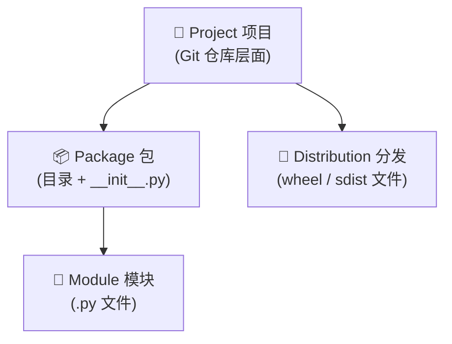
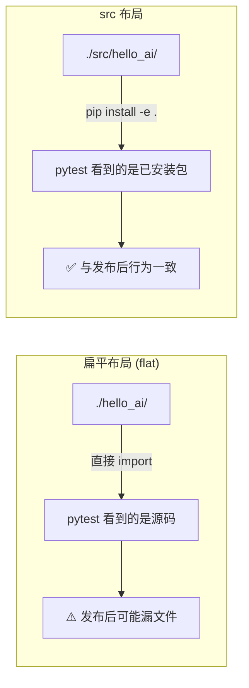

# 项目结构与规范

> **所属路径**：`01_基础能力/01_开发环境与技术英语/18_Python项目实践/01_项目结构与规范`
> **预计学习时间**：50 分钟
> **难度等级**：⭐⭐

---

## 前置知识

- [函数与模块](../../01_编程语言基础/03_函数与模块/03_函数与模块.md)
- [虚拟环境 · 创建与激活](../../13_虚拟环境/02_创建与激活/02_创建与激活.md)
- [版本控制 · 仓库与提交](../../15_版本控制/01_仓库与提交/01_仓库与提交.md)

> 如果以上内容还不熟悉，建议先完成对应课程再继续。

---

## 学习目标

完成本节后，你将能够：

1. 区分 module、package、project、distribution 四个相近概念
2. 按照 **src 布局（src-layout）** 创建标准 Python 项目骨架
3. 写出符合 PEP 518/621 的 `pyproject.toml`
4. 合理组织 `tests/`、`docs/`、`scripts/` 三类辅助目录
5. 使用 `.gitignore`、`README.md`、`LICENSE` 等惯例文件让项目"长得像一个开源项目"

---

## 正文讲解

### 1. 项目、包、模块、分发的四层概念

很多初学者会把这四个词混着用，但它们在 Python 生态中含义各不相同。先用一张图把关系理清楚：



> 📌 **图解说明**：
> - **模块**是一个 `.py` 文件，例如 `utils.py`。
> - **包**是一个带 `__init__.py` 的目录，可以嵌套包含多个模块。
> - **项目**是整个 Git 仓库，通常包含一个或多个包，加上测试、文档、配置等。
> - **分发**是你最终发布到 PyPI 供人 `pip install` 的一个压缩文件（`.whl` 或 `.tar.gz`）。

理解了这四层，后续看到 `setup.py`、`pyproject.toml`、`MANIFEST.in` 等文件时才不会被名词淹没。

### 2. 标准 src 布局:推荐的项目骨架

社区主流做法分两派——**扁平布局（flat layout）** 和 **src 布局（src-layout）**。现代 Python 项目（setuptools ≥ 61 / Hatch / PDM / Poetry 官方）**一致推荐使用 src 布局**，原因后面会说。先看一下 src 布局长什么样:

```
hello-ai/                        ← 项目根目录
├── pyproject.toml              ← 项目元数据 + 构建配置
├── README.md                   ← 项目说明
├── LICENSE                     ← 开源协议
├── .gitignore                  ← Git 忽略规则
├── .python-version             ← pyenv/asdf 读取的 Python 版本
├── src/                        ← 源代码目录（关键）
│   └── hello_ai/               ← 真正的 Python 包
│       ├── __init__.py
│       ├── __main__.py         ← 支持 python -m hello_ai 运行
│       ├── cli.py
│       ├── core.py
│       └── utils/
│           ├── __init__.py
│           └── text.py
├── tests/                      ← 测试代码
│   ├── __init__.py
│   ├── test_core.py
│   └── conftest.py
├── docs/                       ← 文档（可选）
│   └── index.md
└── scripts/                    ← 开发期辅助脚本（可选）
    └── benchmark.py
```

几个容易忽视但重要的细节：

- **包名 `hello_ai` 用下划线**，而项目名 `hello-ai` 可以用中划线。这是 Python 语法决定的（模块名不能带中划线）。
- **`__init__.py` 哪怕为空也要存在**，它把一个目录声明成 Python 包。
- **`__main__.py` 让模块可以被 `python -m hello_ai` 当作脚本运行**，非常适合做 CLI 入口。

### 3. 为什么选 src 布局而不是扁平布局

扁平布局把源代码直接放在项目根目录（例如 `hello-ai/hello_ai/__init__.py`），看起来更简单。但它有一个致命隐患:

假设你在项目根目录运行 `pytest`,由于 Python 会把"当前目录"加入搜索路径,测试脚本会**直接 import 源代码目录而不是安装后的包**。这样一来:你测的是"源码快照",而不是"用户真正 `pip install` 拿到的版本"。很多打包错误（例如忘了加某个数据文件）在本地能跑、发布后用户一装就崩溃——根源就在这里。

**src 布局天然回避了这个问题**:源代码在 `src/` 子目录,Python 默认找不到。你必须先 `pip install -e .`（可编辑安装）把包真正安装到虚拟环境里,测试和使用的都是安装后的版本。下面这张图展示差异:



> 📌 **图解说明**:src 布局强制你走一遍"构建 + 安装"流程,从第一天就和最终用户体验对齐。

### 4. pyproject.toml:新世代的项目配置中心

在 2018 年之前,Python 项目配置散落在 `setup.py`、`setup.cfg`、`MANIFEST.in`、`tox.ini` 等多个文件中,管理起来非常混乱。PEP 518（2018）和 PEP 621（2021）把它们统一到一个文件:**`pyproject.toml`**。

这是一个极简示例:

```toml
# 文件:pyproject.toml
[build-system]
requires = ["setuptools>=61", "wheel"]
build-backend = "setuptools.build_meta"

[project]
name = "hello-ai"
version = "0.1.0"
description = "A tiny CLI greeter for the AI course"
readme = "README.md"
requires-python = ">=3.10"
license = { text = "MIT" }
authors = [{ name = "张三", email = "zhangsan@example.com" }]
keywords = ["ai", "cli", "tutorial"]
dependencies = [
    "typer>=0.9",
    "rich>=13",
]

[project.optional-dependencies]
dev = ["pytest>=7", "ruff>=0.4", "mypy>=1.8"]

[project.scripts]
hello-ai = "hello_ai.cli:main"   # 安装后得到 hello-ai 命令

[tool.setuptools.packages.find]
where = ["src"]                   # 告诉构建工具去 src 找包
```

逐块解读:

- **[build-system]**:告诉 pip "构建这个项目需要什么工具"。setuptools 是最通用的选择。
- **[project]**:项目元数据——名字、版本、作者、依赖等。这部分是**工具无关的标准**,Poetry/PDM/Hatch 都读同样的字段。
- **[project.scripts]**:定义 **入口点(entry points)**。`hello-ai = "hello_ai.cli:main"` 意思是"安装后在系统 PATH 里生成一个 `hello-ai` 命令,执行它相当于调用 `hello_ai.cli` 模块的 `main()` 函数"。下一节会详细讲。
- **[tool.<工具名>]**:各工具自己的配置块。未来你会看到 `[tool.ruff]`、`[tool.mypy]`、`[tool.pytest.ini_options]` 等。

### 5. 包内的 `__init__.py` 怎么写

初学者常常留一个空 `__init__.py` 就算了。其实它是**定义包"对外门面"** 的地方。好习惯:

```python
# 文件:src/hello_ai/__init__.py
"""Hello AI - a tiny CLI greeter."""

from importlib.metadata import version

__version__ = version("hello-ai")

# 只暴露 API,隐藏内部结构
from .core import greet

__all__ = ["greet", "__version__"]
```

`__all__` 是一个约定,告诉用户"这些才是你应该 `from hello_ai import *` 时得到的东西"。`__version__` 则通过 `importlib.metadata` 从已安装的元数据里读取,**避免硬编码版本号导致多处不同步**。

### 6. 测试目录的两种组织方式

测试目录通常和源代码平级,在根目录下的 `tests/`。但包里面"要不要再放一个 `__init__.py`"是个长期争议:

- **有 `__init__.py`(推荐用 pytest 的旧默认)**:测试之间可以相互 import,适合复杂项目。
- **没有 `__init__.py`(pytest 现代默认)**:pytest 用 `rootdir` 机制自动发现测试,不要求包结构。适合简单项目。

不管选哪种,一个文件必不可少——**`conftest.py`**。它是 pytest 自动加载的钩子文件,放置 fixture、全局参数、插件配置。例如:

```python
# 文件:tests/conftest.py
import pytest

@pytest.fixture
def sample_names():
    return ["张三", "李四", "王五"]
```

### 7. 惯例文件:项目的"社交名片"

一个看起来专业的开源项目,还有几个约定俗成的文件:

| 文件 | 作用 | 最少要写什么 |
| ---- | ---- | ------------ |
| `README.md` | 门面 | 项目简介、安装方法、3 行示例 |
| `LICENSE` | 开源协议 | 原文全文,不要自己改 |
| `CHANGELOG.md` | 变更日志 | 每个版本一个小标题,简述变更 |
| `CONTRIBUTING.md` | 贡献指南 | 代码风格、PR 流程、测试要求 |
| `.gitignore` | Git 忽略 | 至少包含 `__pycache__/`、`*.pyc`、`.venv/`、`dist/`、`.pytest_cache/` |

一个常见错误:把 `__pycache__` 或 `*.egg-info/` 等构建产物提交到 Git。用好 `.gitignore` 能避免这类问题。GitHub 官方维护了一份 [Python.gitignore 模板](https://github.com/github/gitignore/blob/main/Python.gitignore),直接抄即可。

---

## 动手实践

下面是一个最小可工作的项目骨架创建脚本。请在空目录中运行,然后观察生成的结构。

```bash
# 文件:scripts/bootstrap.sh
# 用法:bash scripts/bootstrap.sh hello-ai

set -e
PROJECT=${1:-hello-ai}
PKG=$(echo "$PROJECT" | tr '-' '_')

mkdir -p "$PROJECT/src/$PKG" "$PROJECT/tests"
cd "$PROJECT"

# 最小 pyproject.toml
cat > pyproject.toml <<EOF
[build-system]
requires = ["setuptools>=61", "wheel"]
build-backend = "setuptools.build_meta"

[project]
name = "$PROJECT"
version = "0.1.0"
description = "Bootstrap project"
requires-python = ">=3.10"

[tool.setuptools.packages.find]
where = ["src"]
EOF

# 最小包
echo '__version__ = "0.1.0"' > "src/$PKG/__init__.py"
echo "def greet(name): return f'Hello, {name}!'" > "src/$PKG/core.py"

# 最小测试
cat > tests/test_core.py <<EOF
from $PKG.core import greet
def test_greet():
    assert greet("World") == "Hello, World!"
EOF

# gitignore 与 README
cat > .gitignore <<EOF
__pycache__/
*.pyc
.venv/
dist/
build/
*.egg-info/
.pytest_cache/
EOF
echo "# $PROJECT" > README.md

echo "✅ 项目骨架创建完成: $PROJECT/"
```

**运行说明**:

- 环境要求:Python 3.10+、bash
- 运行命令:`bash scripts/bootstrap.sh hello-ai`

**预期输出**:

```
✅ 项目骨架创建完成: hello-ai/
```

此时目录结构应该是:

```
hello-ai/
├── pyproject.toml
├── README.md
├── .gitignore
├── src/hello_ai/
│   ├── __init__.py
│   └── core.py
└── tests/
    └── test_core.py
```

验证一下(回到上级目录):

```bash
cd hello-ai
python -m venv .venv && source .venv/bin/activate
pip install -e ".[dev]" 2>/dev/null || pip install -e .
pip install pytest
pytest
```

你应该看到 `1 passed`。这就是一个最小但功能完整的 Python 项目。

---

## 典型误区

| 误区 | 正确理解 |
| ---- | -------- |
| 源码必须放在根目录才能直接 `import` | 用 `pip install -e .` 后,src 布局也能任意 import |
| `__init__.py` 必须是空的 | 它是定义 API 门面的关键,适合放 `__version__`、`__all__` |
| `setup.py` 是必须的 | 新项目只用 `pyproject.toml` 即可,`setup.py` 已非必需 |
| 包名可以和项目名不一致但建议对齐 | 对,但注意包名只能用下划线,项目名可用中划线 |
| `tests/` 要放到 `src/` 里 | 不要。测试必须能从"用户视角"调用安装后的包 |

---

## 练习题

### 练习 1:命名辨析(难度:⭐)

下面哪些是合法的 **Python 包名**(能被 `import` 语句使用)?哪些是合法的 **项目名**(可以写在 pyproject.toml 的 `name` 字段)?

- `scikit-learn`
- `sklearn`
- `my_project`
- `my-project`
- `2fast`

<details>
<summary>✅ 参考答案</summary>

- `scikit-learn`:❌ 非法包名(含中划线), ✅ 合法项目名。这正是为什么 `pip install scikit-learn` 但 `import sklearn` 的原因。
- `sklearn`:✅ 合法包名, ✅ 合法项目名。
- `my_project`:✅ 合法包名, ✅ 合法项目名。
- `my-project`:❌ 非法包名, ✅ 合法项目名。
- `2fast`:❌ 非法包名(数字开头), ❌ 非法项目名(PyPI 禁止)。

**规则**:包名必须满足 Python 标识符规则(字母/下划线开头,只含字母、数字、下划线)。项目名相对宽松但也不能数字开头。

</details>

### 练习 2:pyproject.toml 解读(难度:⭐⭐)

下面这段配置有什么问题?

```toml
[project]
name = "hello_ai"
version = "0.1"
dependencies = ["typer", "pandas>=2"]

[project.scripts]
hello = "hello_ai:main"
```

<details>
<summary>💡 提示</summary>

检查:名字规范、版本号规范、entry point 格式。

</details>

<details>
<summary>✅ 参考答案</summary>

三处可以改进:

1. **项目名**:`hello_ai` 不是错,但 PEP 503 规范化会把下划线转为中划线,建议写成 `hello-ai`。
2. **版本号**:`0.1` 虽然合法,但不符合 PEP 440 推荐的"语义版本"三段式,建议写成 `0.1.0`。
3. **entry point**:`"hello_ai:main"` 指向包对象的 `main` 属性,意味着 `hello_ai/__init__.py` 中必须有 `main` 函数。更清晰的做法是显式指定模块:`"hello_ai.cli:main"`。

</details>

### 练习 3:src 布局改造(难度:⭐⭐⭐)

给定以下扁平布局:

```
myapp/
├── myapp/
│   ├── __init__.py
│   └── core.py
├── tests/
│   └── test_core.py
└── pyproject.toml
```

请描述改造成 src 布局需要修改的内容。

<details>
<summary>✅ 参考答案</summary>

1. 把 `myapp/myapp/` 移动到 `myapp/src/myapp/`。
2. 在 `pyproject.toml` 中添加或修改:

```toml
[tool.setuptools.packages.find]
where = ["src"]
```

3. 重新 `pip install -e .`(否则 Python 找不到包)。
4. `tests/test_core.py` 不需要改动——它依然用 `from myapp.core import ...`,因为包已经被"安装"到虚拟环境中。

</details>

---

## 下一步学习

- 📖 下一个知识点:[命令行工具开发](../02_命令行工具开发/02_命令行工具开发.md)
- 🔗 相关知识点:[包管理 · 依赖清单与锁定文件](../../14_包管理/03_依赖清单与锁定文件/03_依赖清单与锁定文件.md)
- 📚 拓展阅读:[Python Packaging User Guide](https://packaging.python.org/)、[PEP 621](https://peps.python.org/pep-0621/)

---

## 参考资料

1. [Python Packaging User Guide](https://packaging.python.org/en/latest/tutorials/packaging-projects/) — 官方打包指南(Python 官方文档)
2. [PEP 518: Specifying Minimum Build System Requirements](https://peps.python.org/pep-0518/) — `pyproject.toml` 的起源(Python 官方标准)
3. [PEP 621: Storing Project Metadata in pyproject.toml](https://peps.python.org/pep-0621/) — 项目元数据规范(Python 官方标准)
4. [setuptools Documentation](https://setuptools.pypa.io/en/latest/userguide/pyproject_config.html) — setuptools 配置参考(开源工具官方文档)
5. [GitHub Python.gitignore](https://github.com/github/gitignore/blob/main/Python.gitignore) — GitHub 官方 .gitignore 模板(开源)
