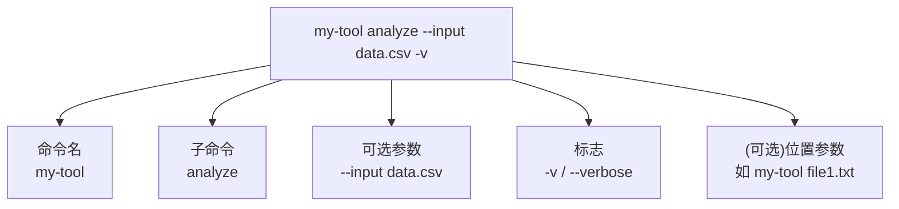

# 命令行工具开发

> **所属路径**：`01_基础能力/01_开发环境与技术英语/18_Python项目实践/02_命令行工具开发`
> **预计学习时间**：55 分钟
> **难度等级**：⭐⭐

---

## 前置知识

- [项目结构与规范](../01_项目结构与规范/01_项目结构与规范.md)
- [函数与模块](../../01_编程语言基础/03_函数与模块/03_函数与模块.md)
- [命令行 · 文件系统操作](../../12_命令行/01_文件系统操作/01_文件系统操作.md)

> 如果以上内容还不熟悉，建议先完成对应课程再继续。

---

## 学习目标

完成本节后，你将能够：

1. 用 `argparse`、`click`、`typer` 三种主流方式构建命令行工具
2. 区分位置参数、可选参数、标志、子命令四种 CLI 元素
3. 设计符合 POSIX 惯例的命令行接口（`--version`、`--help`、`-v/--verbose` 等）
4. 在 `pyproject.toml` 中正确声明 `[project.scripts]` 入口点
5. 写出友好的错误信息与退出码

---

## 正文讲解

### 1. 为什么要把脚本包装成 CLI

你很可能已经这样用过 Python:

```bash
python my_script.py
```

一旦脚本需要一点灵活性——比如不同输入文件、不同参数——你就会在代码里加一堆 `if` 判断,或者每次修改脚本里的常量。这种做法在临时实验时能用,但一旦需要分享给同事,就立刻显得笨拙。

**命令行接口(CLI,Command-Line Interface)** 是给脚本装上"嘴巴"的标准方式。装上之后,别人可以用:

```bash
my-tool --input data.csv --output result.csv --verbose
```

这种方式直观、可组合(可以用管道串联)、可自动化(写进 shell 脚本),是整个 Unix 工具生态的基础设施。本节教你用 Python 生态中最主流的三种工具实现它。

### 2. 一个标准 CLI 由哪几部分组成



> 📌 **图解说明**:这五个元素几乎覆盖了所有 CLI 工具的需求。`git commit -m "msg"`、`pip install requests -U`、`ls -la` 都可以用这个框架分析。

几个术语约定:

- **位置参数(positional)**:不带前缀,顺序重要。如 `cp src dst` 的两个参数。
- **可选参数(option)**:带 `--` 前缀,通常有值。如 `--output x.csv`。
- **标志(flag)**:带 `--` 或 `-` 前缀,无值,只表达"开/关"。如 `-v`。
- **子命令(subcommand)**:把一个大工具拆成多个子工具。如 `git commit`、`git push`。

### 3. 方式一:标准库 argparse

Python 自带的 `argparse` 功能完整,不引入任何依赖。简单 CLI 首选它。

```python
# 文件:src/hello_ai/cli_argparse.py
import argparse
import sys

def main() -> int:
    parser = argparse.ArgumentParser(
        prog="hello-ai",
        description="A tiny CLI greeter for the AI course.",
    )
    parser.add_argument("name", help="Name to greet")
    parser.add_argument("--lang", choices=["zh", "en"], default="zh",
                        help="Greeting language")
    parser.add_argument("-v", "--verbose", action="store_true",
                        help="Print extra information")
    parser.add_argument("--version", action="version", version="hello-ai 0.1.0")

    args = parser.parse_args()

    greeting = "你好" if args.lang == "zh" else "Hello"
    if args.verbose:
        print(f"[verbose] lang={args.lang}, name={args.name}", file=sys.stderr)
    print(f"{greeting},{args.name}!")
    return 0

if __name__ == "__main__":
    sys.exit(main())
```

**运行示例**:

```bash
$ python -m hello_ai.cli_argparse 张三
你好,张三!

$ python -m hello_ai.cli_argparse 张三 --lang en -v
[verbose] lang=en, name=张三
Hello,张三!

$ python -m hello_ai.cli_argparse --version
hello-ai 0.1.0

$ python -m hello_ai.cli_argparse --help
usage: hello-ai [-h] [--lang {zh,en}] [-v] [--version] name
...
```

注意几个专业细节:

- `prog="hello-ai"` 让 `--help` 输出中的工具名显示友好。
- `action="store_true"` 让 `--verbose` 无需带值。
- 函数返回 `int`,`sys.exit(main())` 把它作为进程**退出码**。0 表示成功,非 0 表示失败,这是 Unix 工具的标准约定。
- `--help` 完全自动生成,无需你手写——这是 argparse 最大的价值。

### 4. 方式二:第三方 click

Click 由 Flask 作者 Armin Ronacher 开发,比 argparse 更简洁,装饰器风格。

```python
# 文件:src/hello_ai/cli_click.py
import click

@click.command()
@click.argument("name")
@click.option("--lang", type=click.Choice(["zh", "en"]), default="zh",
              help="Greeting language.")
@click.option("-v", "--verbose", is_flag=True, help="Print extra info.")
@click.version_option("0.1.0", prog_name="hello-ai")
def main(name: str, lang: str, verbose: bool) -> None:
    """A tiny CLI greeter for the AI course."""
    greeting = "你好" if lang == "zh" else "Hello"
    if verbose:
        click.echo(f"[verbose] lang={lang}, name={name}", err=True)
    click.echo(f"{greeting},{name}!")

if __name__ == "__main__":
    main()
```

Click 的**子命令**支持特别优雅:

```python
@click.group()
def cli():
    """My tool."""

@cli.command()
@click.argument("text")
def analyze(text):
    """Analyze the text."""
    click.echo(f"Analyzing: {text}")

@cli.command()
def train():
    """Train the model."""
    click.echo("Training...")
```

用户用起来就是 `my-tool analyze "some text"` 和 `my-tool train`,像 `git` 子命令一样自然。

### 5. 方式三:现代派 typer(基于类型注解)

Typer 由 FastAPI 作者开发,最大的卖点是**直接从函数签名的类型注解推断 CLI**:

```python
# 文件:src/hello_ai/cli.py
from typing import Annotated
import typer

app = typer.Typer(help="A tiny CLI greeter for the AI course.")

@app.command()
def greet(
    name: Annotated[str, typer.Argument(help="Name to greet")],
    lang: Annotated[str, typer.Option(help="Language")] = "zh",
    verbose: Annotated[bool, typer.Option("-v", "--verbose")] = False,
) -> None:
    greeting = "你好" if lang == "zh" else "Hello"
    if verbose:
        typer.echo(f"[verbose] lang={lang}, name={name}", err=True)
    typer.echo(f"{greeting},{name}!")

def main() -> None:
    app()

if __name__ == "__main__":
    main()
```

**Typer 自动做到的事**:

- 根据 `name: str` 生成位置参数,`lang: str = "zh"` 生成带默认值的可选参数。
- `--help` 自动包含 docstring 和每个参数的 help 文本。
- 支持 Rich 彩色输出、Shell 自动补全(`typer --install-completion`)。
- 类型校验内置(传了非合法值会报清晰错误)。

### 6. 三种方式的选择建议

| 场景 | 推荐 |
| ---- | ---- |
| 极简工具(< 5 个参数),不想加依赖 | **argparse** |
| 需要子命令、功能丰富、生态成熟 | **click** |
| 新项目、重视类型注解、AI/数据科学圈 | **typer** |

我自己的经验:**临时脚本用 argparse,要发布的工具用 typer**。typer 的生态正在快速壮大,2024 年后很多 AI 工具(比如 OpenAI CLI 示例、Hugging Face Hub CLI)都用它。

### 7. 在 pyproject.toml 中声明入口点

有了 CLI 代码还不够——用户要的是输入 `hello-ai` 就能运行,而不是 `python -m hello_ai.cli`。这需要在 `pyproject.toml` 声明 **入口点(entry point)**:

```toml
[project.scripts]
hello-ai = "hello_ai.cli:main"
```

含义是:**安装后,生成一个名为 `hello-ai` 的可执行文件,内容等价于 `from hello_ai.cli import main; main()`**。

冒号前是"模块路径",冒号后是"模块里的函数名"。安装后(`pip install -e .` 或 `pip install hello-ai`),你的终端就多了一个 `hello-ai` 命令。

### 8. 友好 CLI 的五条准则

一个"专业感"的命令行工具通常遵循以下约定:

1. **提供 `--help`**:不用你手写,但要确保描述和示例完整。
2. **提供 `--version`**:方便用户和 bug report 区分版本。
3. **失败时返回非 0 退出码**:让调用方能判断是否成功。
4. **错误信息写到 stderr,正常输出写到 stdout**:方便管道重定向。`print(..., file=sys.stderr)` 或 `typer.echo(..., err=True)`。
5. **支持 `--quiet` 和 `--verbose`**:分别抑制和增加输出,好的工具默认话少。

违反任何一条,你的 CLI 都会被有经验的用户吐槽。

---

## 动手实践

继续在上节的 `hello-ai` 项目中添加 typer CLI。

**步骤 1**:安装依赖。

```bash
pip install "typer[all]"
# 或者放到 pyproject.toml:
# dependencies = ["typer[all]>=0.9"]
```

**步骤 2**:创建 `src/hello_ai/cli.py`,粘贴本节第 5 部分的完整代码。

**步骤 3**:修改 `pyproject.toml` 添加:

```toml
[project.scripts]
hello-ai = "hello_ai.cli:main"
```

**步骤 4**:重新安装项目。

```bash
pip install -e .
```

**步骤 5**:运行验证。

```bash
$ hello-ai --help
Usage: hello-ai [OPTIONS] COMMAND [ARGS]...
...

$ hello-ai greet 张三
你好,张三!

$ hello-ai greet 张三 --lang en -v
[verbose] lang=en, name=张三
Hello,张三!
```

如果最后一条命令跑通,说明你的第一个"真命令行工具"已经就位。

---

## 典型误区

| 误区 | 正确理解 |
| ---- | -------- |
| `--help` 需要自己写 | 三种工具都自动生成 `--help`,不要手写 |
| 所有输出都用 `print` | 错误信息应该写到 stderr,正常输出写到 stdout |
| 失败时 `return` 就行 | 要用非 0 退出码(`sys.exit(1)` 或 `raise typer.Exit(1)`) |
| typer 和 click 冲突 | typer 基于 click 实现,底层同源,选一个即可 |
| 每个小改动都要重装 | `pip install -e .` 是"可编辑安装",改代码后立即生效 |

---

## 练习题

### 练习 1:argparse 基础(难度:⭐)

写一个 `calc.py`,接受两个位置参数(数字)和一个可选 `--op` 参数(加减乘除,默认加),输出结果。

```bash
python calc.py 2 3                # → 5
python calc.py 2 3 --op mul       # → 6
```

<details>
<summary>✅ 参考答案</summary>

```python
import argparse, sys

def main() -> int:
    parser = argparse.ArgumentParser(prog="calc")
    parser.add_argument("a", type=float)
    parser.add_argument("b", type=float)
    parser.add_argument("--op", choices=["add", "sub", "mul", "div"], default="add")
    args = parser.parse_args()
    ops = {"add": lambda a,b: a+b, "sub": lambda a,b: a-b,
           "mul": lambda a,b: a*b, "div": lambda a,b: a/b if b else float("nan")}
    print(ops[args.op](args.a, args.b))
    return 0

if __name__ == "__main__":
    sys.exit(main())
```

</details>

### 练习 2:标志 vs 可选参数(难度:⭐⭐)

下面两条 argparse 声明有什么区别?

```python
parser.add_argument("--debug", action="store_true")
parser.add_argument("--debug", type=bool, default=False)
```

<details>
<summary>💡 提示</summary>

试着各传 `--debug` 和 `--debug false` 看行为。

</details>

<details>
<summary>✅ 参考答案</summary>

第一种是**标志**:用户只需要写 `--debug`,`args.debug` 就是 `True`;不写就是 `False`。

第二种是**可选参数**:用户必须写 `--debug <值>`,例如 `--debug true`。而且糟糕的是,`type=bool` 会把**任何非空字符串**转成 `True`,包括 `"false"`,这是一个经典坑。

**结论**:表达"开关"语义时**必须用 `action="store_true"`**,不要用 `type=bool`。

</details>

### 练习 3:子命令设计(难度:⭐⭐⭐)

使用 typer 写一个 `mytool` 工具,支持:

- `mytool hello <name>`:打招呼
- `mytool count <file>`:统计文件行数
- `mytool --version`

<details>
<summary>✅ 参考答案</summary>

```python
# 文件:src/mytool/cli.py
from pathlib import Path
import typer

app = typer.Typer()

@app.command()
def hello(name: str):
    """Greet someone."""
    typer.echo(f"Hello, {name}!")

@app.command()
def count(file: Path):
    """Count lines in a file."""
    if not file.exists():
        typer.echo(f"Error: {file} not found", err=True)
        raise typer.Exit(1)
    lines = file.read_text().count("\n")
    typer.echo(f"{file}: {lines} lines")

@app.callback()
def _main(version: bool = typer.Option(False, "--version")):
    if version:
        typer.echo("mytool 0.1.0")
        raise typer.Exit()

def main() -> None:
    app()
```

关键点:

1. 用 `@app.command()` 声明每个子命令。
2. `@app.callback()` 提供顶层选项如 `--version`。
3. 错误时 `typer.echo(err=True)` + `raise typer.Exit(1)`。
4. 路径参数用 `Path` 类型,typer 自动转换。

</details>

---

## 下一步学习

- 📖 下一个知识点:[打包与发布](../03_打包与发布/03_打包与发布.md)
- 🔗 相关知识点:[命令行 · 环境变量与脚本](../../12_命令行/03_环境变量与脚本/03_环境变量与脚本.md)
- 📚 拓展阅读:[POSIX Utility Conventions](https://pubs.opengroup.org/onlinepubs/9699919799/basedefs/V1_chap12.html)

---

## 参考资料

1. [argparse 官方文档](https://docs.python.org/3/library/argparse.html) — Python 标准库(官方文档)
2. [Click 官方文档](https://click.palletsprojects.com/) — Click 项目(BSD 3-Clause 开源)
3. [Typer 官方文档](https://typer.tiangolo.com/) — Typer 项目(MIT 开源)
4. [Command Line Interface Guidelines](https://clig.dev/) — CLI 设计最佳实践(CC BY-SA 许可社区项目)
