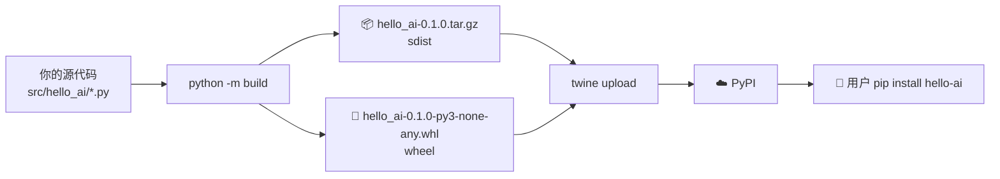

# 打包与发布

> **所属路径**：`01_基础能力/01_开发环境与技术英语/18_Python项目实践/03_打包与发布`
> **预计学习时间**：60 分钟
> **难度等级**：⭐⭐⭐

---

## 前置知识

- [项目结构与规范](../01_项目结构与规范/01_项目结构与规范.md)
- [命令行工具开发](../02_命令行工具开发/02_命令行工具开发.md)
- [包管理 · 版本约束](../../14_包管理/02_版本约束/02_版本约束.md)

> 如果以上内容还不熟悉，建议先完成对应课程再继续。

---

## 学习目标

完成本节后，你将能够：

1. 区分 sdist（源码分发）与 wheel（二进制分发）两种分发格式
2. 使用 `build` 工具把项目构建成 wheel + sdist
3. 使用 `twine` 上传到 TestPyPI 与 PyPI
4. 设计合理的语义版本号（SemVer）与发布节奏
5. 配置基本的 GitHub Actions 自动化发布流水线

---

## 正文讲解

### 1. 打包是把你的代码"快递"给别人

当你在自己电脑上运行 `python hello_ai/cli.py` 时,一切都是原始代码。但要让别人通过 `pip install hello-ai` 一键装上,你必须先把代码**打包**成一个**分发包(distribution package)**——一个标准格式的压缩文件,里面包含代码 + 元数据(版本、依赖、作者等)。

Python 生态中有两种分发格式:

- **sdist(Source Distribution,源码分发)**:`.tar.gz` 文件,含原始源代码。安装时需要在用户机器上构建。
- **wheel(二进制分发)**:`.whl` 文件,含编译好的内容。安装时解压即可,速度快得多。

下面这张图展示完整流程:



> 📌 **图解说明**:现代 Python 项目都**同时发布 sdist 和 wheel**。sdist 是"完整源码备份",wheel 是"用户默认下载的那个"。

### 2. 第一步:用 build 构建

2020 年之前社区用 `python setup.py sdist bdist_wheel`,现在推荐用 **`build`** 工具——它是 PyPA(Python Packaging Authority)维护的官方构建前端,支持 PEP 517 标准。

```bash
# 安装构建工具
pip install build

# 在项目根目录运行
python -m build
```

运行后会生成:

```
dist/
├── hello_ai-0.1.0.tar.gz              ← sdist
└── hello_ai-0.1.0-py3-none-any.whl    ← wheel
```

wheel 文件名格式:`{包名}-{版本}-{Python版本}-{ABI}-{平台}.whl`。

- `py3-none-any` 表示"纯 Python、任意 Python 3、任意平台"——你的 `hello-ai` 属于此类,一个 wheel 通吃所有系统。
- 如果项目含 C 扩展(例如 NumPy),每个操作系统和 Python 版本都要单独的 wheel(例如 `numpy-1.26.0-cp310-cp310-manylinux2014_x86_64.whl`)。

### 3. 第二步:本地验证你的 wheel

发布前永远先在干净环境中验证。这个步骤能帮你提前发现 90% 的打包问题:

```bash
# 创建一个全新的虚拟环境(重要:必须全新)
python -m venv /tmp/test-env
source /tmp/test-env/bin/activate

# 从你刚生成的 wheel 安装
pip install dist/hello_ai-0.1.0-py3-none-any.whl

# 验证命令可用
hello-ai --version
hello-ai greet 张三
```

如果这一步失败,**绝对不要发布**。常见原因:

- `pyproject.toml` 的 `[tool.setuptools.packages.find]` 配置漏了 `where = ["src"]`,导致 wheel 里压根没代码。
- 数据文件(如 `*.json`、`*.yaml`)没被打进 wheel——需要在 `pyproject.toml` 添加 `[tool.setuptools.package-data]`。
- 入口点写错了(如函数名拼错)——装完才报错。

一个快速自检技巧:

```bash
# 用 unzip 直接看 wheel 里有什么
unzip -l dist/hello_ai-0.1.0-py3-none-any.whl
```

### 4. 第三步:用 twine 上传(先去 TestPyPI)

**永远先上传到 TestPyPI,再上 PyPI**。TestPyPI 是官方的"沙盒版 PyPI",名字发布错了可以换,不会污染真 PyPI。

**准备账号**(一次性):

1. 在 <https://test.pypi.org> 注册账号
2. 在账号设置中生成 **API Token**(格式 `pypi-AgENdGVz...`)

**上传**:

```bash
# 安装上传工具
pip install twine

# 检查元数据
twine check dist/*

# 上传到 TestPyPI
twine upload --repository testpypi dist/*
# 用户名填 __token__,密码填 API Token
```

成功后会看到一个链接,打开就能看到你的包在 TestPyPI 的页面。

**从 TestPyPI 装一下验证**:

```bash
pip install --index-url https://test.pypi.org/simple/ hello-ai
```

注意 TestPyPI 依赖可能装不全(因为真依赖在正式 PyPI),所以可以加上 `--extra-index-url`:

```bash
pip install --index-url https://test.pypi.org/simple/ \
            --extra-index-url https://pypi.org/simple/ \
            hello-ai
```

### 5. 第四步:正式上传 PyPI

TestPyPI 跑通后,才上真 PyPI:

```bash
twine upload dist/*
# 默认上传到 https://upload.pypi.org/legacy/
```

**一旦发布,版本号就不能重用**。就算你立刻删除这个版本,版本号依然被占用,永远。这是 PyPI 的硬规则,目的是保证复现性。

这就是为什么"先 TestPyPI"如此重要。

### 6. 语义版本(SemVer)与发布节奏

你的版本号不是随意写的。事实标准是 **语义版本(Semantic Versioning,SemVer)**,格式 `MAJOR.MINOR.PATCH`:

| 位 | 什么时候升 |
| --- | ---------- |
| PATCH(0.1.X) | 向后兼容的 bug 修复 |
| MINOR(0.X.0) | 向后兼容的新功能 |
| MAJOR(X.0.0) | 不兼容的破坏性变更 |

例如:

- 修了一个 bug,版本 `0.1.0 → 0.1.1`
- 新增了一个 CLI 子命令,版本 `0.1.1 → 0.2.0`
- 删除了一个公开函数或改了函数签名,版本 `0.2.0 → 1.0.0`

此外,PEP 440 允许"预发布"版本号:

- `1.0.0a1` — alpha,内部测试
- `1.0.0b1` — beta,用户测试
- `1.0.0rc1` — release candidate,发布候选
- `1.0.0` — 正式版

`pip install` 默认不会装预发布版本,除非用户加了 `--pre`。

### 7. 用 GitHub Actions 自动化发布

手动 `build` + `twine upload` 几次就够烦。用 GitHub Actions 自动化:"每当我打一个 git tag `v*`,就自动打包并发布到 PyPI"。

```yaml
# 文件:.github/workflows/publish.yml
name: Publish to PyPI

on:
  push:
    tags:
      - 'v*'

jobs:
  publish:
    runs-on: ubuntu-latest
    environment: pypi
    permissions:
      id-token: write   # 关键:启用 OIDC 可信发布
    steps:
      - uses: actions/checkout@v4
      - uses: actions/setup-python@v5
        with:
          python-version: '3.11'
      - run: pip install build
      - run: python -m build
      - uses: pypa/gh-action-pypi-publish@release/v1
```

配合 PyPI 的 **Trusted Publishing(可信发布)** 功能,你甚至不需要在 GitHub 存 API Token。流程是:

1. 在 PyPI 的项目设置中添加"可信发布者"——指定 GitHub 仓库 + workflow 文件名。
2. 每次从这个仓库这个 workflow 触发的发布,PyPI 会通过 OIDC 验证来源身份,自动放行。

这样**你连 Token 都不用管**,极大减少泄露风险。

下面这张图概括了现代发布流程:


> 📌 **图解说明**:有了这套流水线后,"发布新版本" = "打个 tag 然后 push",其余全自动。

### 8. 发布清单(Release Checklist)

每次发布前都过一遍这张清单,避免踩坑:

- [ ] `pyproject.toml` 中的 `version` 已更新,且比上一版大
- [ ] `CHANGELOG.md` 已更新本版变更
- [ ] 所有测试通过(`pytest`)
- [ ] `ruff check` + `mypy` 无报错
- [ ] `python -m build` 成功生成 sdist 和 wheel
- [ ] `twine check dist/*` 通过
- [ ] 在干净虚拟环境中装好 wheel 并跑过一次核心功能
- [ ] 本地 git tag 对齐版本号(`git tag v0.1.0`)
- [ ] 发 TestPyPI 确认一次
- [ ] 再发正式 PyPI

---

## 动手实践

继续用前两节的 `hello-ai` 项目。目标:把它构建成 wheel 并上传到 **TestPyPI**(**不要真的上传 PyPI**——那个名字你可能会长期占着)。

**步骤 1**:安装工具。

```bash
pip install build twine
```

**步骤 2**:确认 `pyproject.toml` 完整(可以复制第 01 节的示例),把 `name` 改成一个独一无二的名字,比如 `hello-ai-<你的用户名>`,避免和他人冲突。

**步骤 3**:构建。

```bash
python -m build
ls dist/
# 应该看到 .whl 和 .tar.gz 两个文件
```

**步骤 4**:本地验证。

```bash
python -m venv /tmp/verify
source /tmp/verify/bin/activate
pip install dist/*.whl
hello-ai greet 张三   # 应当输出"你好,张三!"
deactivate
```

**步骤 5**(可选):上传到 TestPyPI。

```bash
twine check dist/*
twine upload --repository testpypi dist/*
```

然后在新环境中:

```bash
pip install --index-url https://test.pypi.org/simple/ hello-ai-<你的用户名>
hello-ai greet TestPyPI
```

如果这一步成功,你已经走通了 Python 包发布的完整链路。

---

## 典型误区

| 误区 | 正确理解 |
| ---- | -------- |
| 版本号可以重复上传 | PyPI 版本号不可重用,哪怕删除后也不行 |
| 只需要 wheel 就够了 | sdist 是备用方案,某些用户(比如 Alpine Linux)需要它 |
| setup.py 必须保留 | 新项目只需 pyproject.toml |
| 直接往 PyPI 发版最省事 | 永远先走 TestPyPI |
| Token 没用可以丢 | 若泄露会被人顶名发恶意包,应立即吊销 |

---

## 练习题

### 练习 1:版本号选择(难度:⭐)

你当前发布的版本是 `1.2.3`。下列变更分别应该发布成什么版本?

1. 修复一个计算错误
2. 给现有函数添加一个可选参数,旧代码不受影响
3. 重命名一个公开函数,老名字不再可用
4. 添加了一个新模块,不影响现有 API

<details>
<summary>✅ 参考答案</summary>

1. PATCH: `1.2.4`(bug 修复)
2. MINOR: `1.3.0`(新增功能,向后兼容)
3. MAJOR: `2.0.0`(破坏性变更)
4. MINOR: `1.3.0`(新增功能,向后兼容)

</details>

### 练习 2:wheel 文件名解读(难度:⭐⭐)

下列 wheel 文件名各代表什么?

1. `requests-2.31.0-py3-none-any.whl`
2. `numpy-1.26.0-cp311-cp311-manylinux_2_17_x86_64.whl`
3. `torch-2.1.0-cp310-cp310-win_amd64.whl`

<details>
<summary>✅ 参考答案</summary>

1. requests 2.31.0,**纯 Python**,适用于任意 Python 3 / 任意平台。一个文件通吃所有系统。
2. NumPy 1.26.0,**包含 C 扩展**,仅适用于 CPython 3.11 + Linux x86_64(且 glibc ≥ 2.17)。其他平台需要不同 wheel。
3. PyTorch 2.1.0,仅适用于 CPython 3.10 + Windows 64 位。

**启示**:纯 Python 项目 1 个 wheel 就够,带 C 扩展的项目需要为每个"Python 版本 × 操作系统 × CPU 架构"组合单独构建。这也是 PyTorch 下载包动辄几个 GB 的原因。

</details>

### 练习 3:发布流程设计(难度:⭐⭐⭐)

你的团队决定给一个内部 Python 工具做规范化发布。请设计一条 GitHub Actions 流水线,满足:

- 每次 push 到 main 分支时,自动跑测试 + 构建 wheel(但不发布)
- 每次打 `v*` tag 时,自动发布到公司内部 PyPI(`https://pypi.internal.company.com/`)
- 失败时在 Slack 通知

<details>
<summary>💡 提示</summary>

分两个 workflow 更清晰:一个管 CI,一个管发布。
</details>

<details>
<summary>✅ 参考答案</summary>

**ci.yml**:触发条件 `push` 到任何分支,步骤包括 `pip install -e ".[dev]"` → `pytest` → `python -m build`(仅构建不发布)。

**publish.yml**:触发条件 `push` tag `v*`,依赖 `ci.yml` 成功。步骤包括 build,然后 `twine upload --repository-url https://pypi.internal.company.com/ dist/*`,用存在 GitHub Secret 的 Token。

Slack 通知用 `slackapi/slack-github-action` 或 workflow 失败时调用 webhook。

一个关键设计点:**发布 workflow 里先跑一次测试**,哪怕 CI 已经跑过——因为"tag 那一刻的代码"理论上应该再验证一次。

</details>

---

## 下一步学习

- 📖 下一个知识点:[代码质量与风格](../04_代码质量与风格/04_代码质量与风格.md)
- 🔗 相关知识点:[版本控制 · 标签与版本管理](../../15_版本控制/04_标签与版本管理/04_标签与版本管理.md)、[包管理 · 私有源与镜像配置](../../14_包管理/04_私有源与镜像配置/04_私有源与镜像配置.md)
- 📚 拓展阅读:[Python Packaging Tutorial](https://packaging.python.org/en/latest/tutorials/packaging-projects/)、[PyPI Trusted Publishing](https://docs.pypi.org/trusted-publishers/)

---

## 参考资料

1. [PyPA Python Packaging Guide](https://packaging.python.org/) — 官方打包指南(Python 官方文档)
2. [PEP 440: Version Identification](https://peps.python.org/pep-0440/) — 版本号规范(Python 官方标准)
3. [Semantic Versioning 2.0](https://semver.org/) — 语义版本规范(CC BY 3.0 许可)
4. [PyPI Trusted Publishers](https://docs.pypi.org/trusted-publishers/) — PyPI 官方可信发布文档
5. [pypa/build](https://github.com/pypa/build) — 构建前端(MIT 开源)
6. [pypa/twine](https://github.com/pypa/twine) — 上传工具(Apache 2.0 开源)
