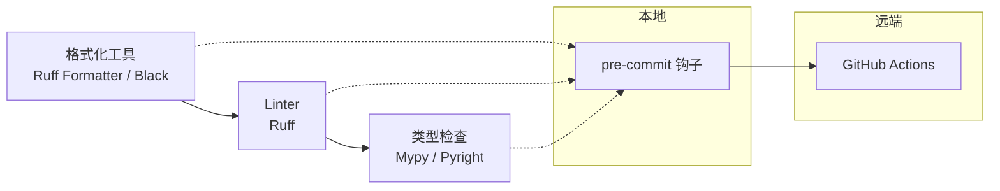

# 代码质量与风格

> **所属路径**：`01_基础能力/01_开发环境与技术英语/18_Python项目实践/04_代码质量与风格`
> **预计学习时间**：60 分钟
> **难度等级**：⭐⭐

---

## 前置知识

- [项目结构与规范](../01_项目结构与规范/01_项目结构与规范.md)
- [类型提示与静态检查](../../01_编程语言基础/08_类型提示与静态检查/08_类型提示与静态检查.md)
- [版本控制 · 协作工作流](../../15_版本控制/05_协作工作流/05_协作工作流.md)

> 如果以上内容还不熟悉，建议先完成对应课程再继续。

---

## 学习目标

完成本节后，你将能够：

1. 理解 PEP 8 代码风格规范的核心要点
2. 使用 **Ruff** 进行快速代码检查和自动格式化
3. 配置 **Black** 或 Ruff Formatter 保持一致的格式
4. 使用 **Mypy** 做静态类型检查
5. 用 **pre-commit** 建立本地"提交前自动检查"防线
6. 在 GitHub Actions 中集成质量守门

---

## 正文讲解

### 1. 为什么要统一代码质量工具

项目做到一定规模后,你会发现一件令人抓狂的事:**不同开发者的代码风格千差万别**。张三喜欢单引号,李四喜欢双引号;张三函数间空两行,李四空一行;张三写 `if x == None`,李四写 `if x is None`……如果这些细节都靠 code review 口头纠正,PR 会变成风格吵架,没人愿意参加。

解决思路是:**把风格和基础正确性交给工具**,code review 只关注设计和逻辑。现代 Python 项目通常部署三道防线:



> 📌 **图解说明**:三种工具解决三种问题——格式化工具保证"长得一样",Linter 保证"没有常见错误",类型检查保证"类型合理"。pre-commit 把它们串到 `git commit` 之前自动执行,CI 作为最后一道保险。

### 2. 核心工具:Ruff——新世代瑞士军刀

2022 年之前,Python 代码质量工具链是一堆混战:Black 格式化、isort 排 import、Flake8 linter、Pylint 深度检查、pyupgrade 升级语法……工具多、速度慢、配置散。

2023 年后,一个 Rust 写的新工具 **Ruff** 横空出世,以**比 Flake8 快 100 倍**的速度把上面大部分工具的能力整合进一个二进制。截至 2024 年底,Ruff 已经是主流项目的默认选择(FastAPI、Pydantic、Hugging Face 等都在用)。

```bash
# 安装
pip install ruff

# 检查
ruff check .

# 自动修复可修复的问题
ruff check --fix .

# 格式化(等价于 Black)
ruff format .
```

Ruff 的配置写在 `pyproject.toml` 里:

```toml
[tool.ruff]
line-length = 100
target-version = "py310"

[tool.ruff.lint]
select = [
    "E",    # pycodestyle errors
    "W",    # pycodestyle warnings
    "F",    # Pyflakes
    "I",    # isort
    "B",    # flake8-bugbear
    "UP",   # pyupgrade
    "SIM",  # flake8-simplify
]
ignore = ["E501"]  # line too long(由 formatter 负责)

[tool.ruff.format]
quote-style = "double"
```

每组规则(`E`、`W`、`F`、`I`……)对应一套检查项。新手只打开前 4 组就够;有经验后可以逐步加 `B`、`UP` 等。

### 3. PEP 8:风格的"宪法"

Ruff 的默认规则源自 **PEP 8**(Python 官方风格指南)。即便工具自动修,你也应该理解几条最核心的约定:

| 维度 | 规范 | 例子 |
| ---- | ---- | ---- |
| 缩进 | 4 个空格,不用 tab | `if x:\n    y()` |
| 行长 | ≤ 79 字符(现代放宽到 100) | 超长就换行 |
| 空行 | 顶层函数/类之间空 2 行;方法之间 1 行 | — |
| 命名 | `snake_case` 变量/函数;`PascalCase` 类;`UPPER_CASE` 常量 | `MAX_SIZE = 100` |
| import | 分三组:标准库 / 第三方 / 本地,组间空行 | 由 isort/Ruff 管 |
| 比较 | `is None` 而非 `== None` | `if x is None:` |
| 字符串 | 选一种引号并全局一致 | 默认双引号 |

> **直觉解读**:PEP 8 的核心思想不是"某种风格最好",而是"**一致比正确更重要**"。一个团队内部统一即可。

### 4. 格式化工具的哲学:不给你选择

**Black** 是 Python 社区知名的"倔强派"格式化工具,它的口号是 *"The uncompromising code formatter"*(绝不妥协的格式化工具)。它几乎没有配置项,你的代码进来,出来就是 Black 规定的样子。

Ruff Formatter 沿袭了这个哲学,和 Black 99% 兼容,但更快。现代项目通常二选一:

- 老项目已经用 Black → 继续用
- 新项目 → 直接用 Ruff Formatter(一个工具搞定 lint + format)

**效果示例**:

```python
# 输入(风格混乱)
def f(x,y,z=1):
    if x==None: return "hello"+'world'
    return x+  y +z

# ruff format 后
def f(x, y, z=1):
    if x == None:
        return "hello" + "world"
    return x + y + z
```

> 注意:formatter 只改**排版**,不会把 `x == None` 改成 `x is None`。后一种属于 Linter 的职责。

### 5. Mypy:类型检查让 bug 提前现形

静态类型检查不再是 Java/C++ 的专利。Python 3.5+ 支持的**类型提示(Type Hints)** 配合 **Mypy** 能在运行前发现大量 bug:

```python
# 文件:src/hello_ai/core.py
def greet(name: str, times: int = 1) -> str:
    return "Hello, " + name + "!" * times

# 错误用法
greet(name=123)           # Mypy: Argument "name" has incompatible type "int"
greet("Alice", times="2") # Mypy: Argument "times" has incompatible type "str"
```

配置:

```toml
[tool.mypy]
python_version = "3.10"
strict = true                    # 开启所有严格检查
ignore_missing_imports = true    # 第三方库没类型提示时忽略
```

`strict = true` 很激进,项目早期可以先 `strict = false` + 开几个关键检查,逐步收紧。

运行:

```bash
mypy src/
```

对大型项目,你也可以用 Microsoft 出品的 **Pyright**——它更快,是 VS Code 的 Pylance 底层引擎。功能类似,选一个即可。

### 6. pre-commit:提交前自动守门

上面的工具你必须每次记得手动跑。人会忘,CI 才能保证。但只有 CI 还不够——等 push 到 GitHub 再发现问题,已经浪费了一次来回。**pre-commit 框架**是把检查放到本地 `git commit` 时自动触发的机制:

```bash
pip install pre-commit
```

在项目根目录创建:

```yaml
# 文件:.pre-commit-config.yaml
repos:
  - repo: https://github.com/astral-sh/ruff-pre-commit
    rev: v0.5.0
    hooks:
      - id: ruff
        args: [--fix]
      - id: ruff-format

  - repo: https://github.com/pre-commit/mirrors-mypy
    rev: v1.10.0
    hooks:
      - id: mypy
        additional_dependencies: [types-requests]

  - repo: https://github.com/pre-commit/pre-commit-hooks
    rev: v4.6.0
    hooks:
      - id: trailing-whitespace      # 去除行尾空格
      - id: end-of-file-fixer        # 文件末尾保留换行
      - id: check-yaml               # YAML 语法检查
      - id: check-added-large-files  # 防止意外提交大文件
```

安装钩子:

```bash
pre-commit install
```

之后每次 `git commit`,这些检查会自动跑。不通过就不让你 commit——**错误在本地就被拦下**,不会污染仓库。

### 7. CI 集成:最后一道保险

即便有 pre-commit,也要在 CI 里再跑一遍——防止有人用 `--no-verify` 跳过,或提交者干脆没装 pre-commit。

```yaml
# 文件:.github/workflows/ci.yml
name: CI

on: [push, pull_request]

jobs:
  quality:
    runs-on: ubuntu-latest
    steps:
      - uses: actions/checkout@v4
      - uses: actions/setup-python@v5
        with:
          python-version: '3.11'
          cache: 'pip'
      - run: pip install -e ".[dev]"
      - run: ruff check .
      - run: ruff format --check .
      - run: mypy src/
      - run: pytest --cov
```

`ruff format --check` 不改文件,只检查是否符合格式——这个动作放在 CI 里,能保证每次 PR 都通过格式检查。

### 8. 覆盖率 + 测试:质量的闭环

最后一块拼图是**测试覆盖率**。Ruff 能告诉你"哪里写得丑",但不告诉你"哪里没测到"。**pytest-cov** 负责这一维:

```bash
pip install pytest-cov
pytest --cov=src/hello_ai --cov-report=term-missing
```

输出示例:

```
Name                       Stmts   Miss  Cover   Missing
--------------------------------------------------------
src/hello_ai/core.py          20      2    90%   15-16
src/hello_ai/cli.py           15      5    67%   8-12
--------------------------------------------------------
TOTAL                         35      7    80%
```

`Missing` 列告诉你哪几行没被测到。团队通常会设置一个覆盖率门槛(比如 80%),CI 在低于门槛时报错。

---

## 动手实践

继续用 `hello-ai` 项目,为它装上完整的质量守门。

**步骤 1**:安装开发依赖。

```bash
pip install ruff mypy pytest pytest-cov pre-commit
```

**步骤 2**:在 `pyproject.toml` 末尾追加:

```toml
[tool.ruff]
line-length = 100
target-version = "py310"

[tool.ruff.lint]
select = ["E", "W", "F", "I", "B", "UP"]

[tool.mypy]
python_version = "3.10"
ignore_missing_imports = true
```

**步骤 3**:创建 `.pre-commit-config.yaml`(复制本节第 6 部分的内容)。

**步骤 4**:激活。

```bash
pre-commit install
pre-commit run --all-files   # 在所有现有文件上跑一次,清理历史问题
```

**步骤 5**:故意引入一个问题测试。

编辑 `src/hello_ai/core.py`,改成:

```python
import os  # 没用到
def greet(name):
    if name==None:
        return "hello"
    return "Hello, "+name
```

然后:

```bash
git add -A
git commit -m "test quality gate"
```

你应该看到 pre-commit 自动运行、Ruff 报错,commit 被拦下。自动修复可修复的部分后再提交,这次就能通过。

**步骤 6**:验证完整 CI。

```bash
ruff check .
ruff format --check .
mypy src/
pytest --cov=src/hello_ai
```

四条命令都绿了,你的项目就达到了 2024 年 Python 生态的"可维护"标准线。

---

## 典型误区

| 误区 | 正确理解 |
| ---- | -------- |
| 代码风格只是个人喜好 | 团队协作时"一致"远比"好看"重要 |
| 有了 CI 就不需要 pre-commit | pre-commit 节省一次来回,体验差别很大 |
| Mypy 太严格,干脆不用 | 从宽配置开始,逐步收紧,比"全有或全无"更现实 |
| Ruff 还是新工具,不放心 | 2024 年它已是 FastAPI/Pydantic 等项目的默认选择 |
| 100% 覆盖率才算合格 | 追求有意义的覆盖率(通常 70-85% 够),100% 往往是"测试作秀" |

---

## 练习题

### 练习 1:风格诊断(难度:⭐)

下面这段代码违反了哪些 PEP 8 约定?

```python
import sys,os
def   compute(X,Y ):
    Z=X+Y
    if Z == None :return 0
    return Z
```

<details>
<summary>✅ 参考答案</summary>

问题:

1. `import sys,os` 应该每个 import 一行
2. `def compute` 函数名之后多了空格
3. 参数 `X, Y` 违反 snake_case 命名(应小写)
4. 参数列表里 `Y )` 末尾多余空格
5. `Z=X+Y` 运算符两边应该有空格
6. `Z == None` 应改成 `Z is None`
7. `if ... :return 0` 冒号和 `return` 应在不同行

Ruff 会自动修 1、2、4、5、7;规则 `E711` 会报 6;规则 `N806` 会报 3(但需要手动改或给变量重命名)。

</details>

### 练习 2:pre-commit 工作流(难度:⭐⭐)

你的同事抱怨:"我明明在 pre-commit 里加了 mypy,为什么别人 push 的代码还是能过 mypy 出错?"请给他两个可能的原因。

<details>
<summary>💡 提示</summary>

pre-commit 只在**本地**有效,而且可以被绕过。
</details>

<details>
<summary>✅ 参考答案</summary>

可能原因:

1. **那个同事没有 `pre-commit install`**:pre-commit 钩子是每个开发者本地自己注册的,如果团队某些成员没装,他们的提交就不会经过 pre-commit。
2. **使用 `git commit --no-verify` 绕过**:这个 flag 会跳过所有 git 钩子。有些人习惯性用它。

**解决方案**:在 CI 里**重新**跑一遍 mypy,把 "CI 通过" 作为合并 PR 的硬性条件。这样即便 pre-commit 被跳过,问题也会在 PR 审核阶段被拦下。

</details>

### 练习 3:配置设计(难度:⭐⭐⭐)

你接管一个存量 10000 行的老 Python 项目,它没有任何 lint 和类型检查。如果直接开启 `ruff` 的全部规则和 `mypy strict=true`,会瞬间报出上千个错误,没人愿意改。请设计一个可执行的渐进迁移计划。

<details>
<summary>✅ 参考答案</summary>

**阶段 1(第 1 周)**:只开最基础的 Ruff 规则 `["E", "F"]`(错误 + Pyflakes 核心),跑 `ruff check --fix .` 自动修复大部分。把剩余的报错逐一修复,建立 **baseline**。

**阶段 2(第 2-4 周)**:引入 `ruff format`,一次性格式化全仓(一个独立 PR,审核好后合入)。后续团队所有新代码都按这个格式来。

**阶段 3(第 2-3 月)**:加 `I`(isort)、`B`(bugbear)、`UP`(pyupgrade)等规则。此时旧代码已清理,这些规则的增量报错量不多。

**阶段 4(第 3 月+)**:给**新增模块**要求 `mypy strict=true`,旧模块可用 `[[tool.mypy.overrides]] strict = false` 豁免。随着重构,旧模块逐步迁移到 strict。

**阶段 5**:加 pre-commit 和 CI 强制。

**关键原则**:**不要在一个 PR 里改上千处**。宁可花两个月渐进,也不要一次大爆炸。

</details>

---

## 下一步学习

- 📖 下一个主题:本知识主题已完整,进入 [数学基础](../../../02_数学基础/)
- 🔗 相关知识点:[类型提示与静态检查](../../01_编程语言基础/08_类型提示与静态检查/08_类型提示与静态检查.md)、[软件工程 · 持续集成与交付](../../../03_编程与计算机基础/07_软件工程/04_持续集成与交付/04_持续集成与交付.md)
- 📚 拓展阅读:[Ruff 官方文档](https://docs.astral.sh/ruff/)、[Mypy Cheat Sheet](https://mypy.readthedocs.io/en/stable/cheat_sheet_py3.html)

---

## 参考资料

1. [PEP 8 – Style Guide for Python Code](https://peps.python.org/pep-0008/) — Python 风格指南(Python 官方标准)
2. [Ruff Documentation](https://docs.astral.sh/ruff/) — Ruff 官方文档(MIT 开源)
3. [Black Documentation](https://black.readthedocs.io/) — Black 格式化工具(MIT 开源)
4. [Mypy Documentation](https://mypy.readthedocs.io/) — Mypy 静态类型检查(MIT 开源)
5. [pre-commit Framework](https://pre-commit.com/) — pre-commit 框架(MIT 开源)
6. [pytest-cov Documentation](https://pytest-cov.readthedocs.io/) — 覆盖率插件(MIT 开源)
