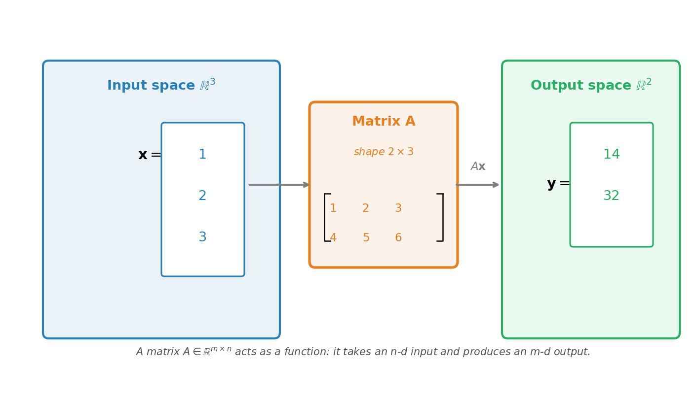

# 向量与矩阵

> **所属路径**：`01_基础能力/02_数学基础/01_线性代数/01_向量与矩阵`
> **预计学习时间**：80 分钟
> **难度等级**：⭐⭐

---

## 前置知识

- [向量表示与运算](../../../../../00_高中复习/01_数学基础/06_向量/01_向量表示与运算/01_向量表示与运算.md)——掌握二维向量的加法和数乘
- [向量坐标化](../../../../../00_高中复习/01_数学基础/06_向量/03_向量坐标化/03_向量坐标化.md)——掌握向量的坐标表示
- [线性组合与线性相关初步](../../../../../00_高中复习/01_数学基础/06_向量/04_线性组合与线性相关初步/04_线性组合与线性相关初步.md)——理解线性组合的几何意义
- [Python 编程语言基础](../../../../01_开发环境与技术英语/01_编程语言基础/)——动手实践需要

> 如果以上内容还不熟悉，建议先完成对应课程再继续。

---

## 学习目标

完成本节后，你将能够：

1. 把"向量"从二维平面的箭头，扩展为任意维度的有序数组
2. 准确写出矩阵的形状（shape），并区分行向量、列向量、矩阵、张量
3. 理解矩阵乘法的两种"读法"：**行 × 列的内积视角**和**矩阵作用于向量的变换视角**
4. 用 NumPy 熟练完成向量加法、矩阵乘法、转置等基本运算
5. 解释为什么神经网络的每一层都可以写成 $y = W x + b$ 的形式

---

## 正文讲解

### 1. 从"箭头"到"高维数组"——向量的再定义

在高中阶段，你认识的向量是一根有方向的箭头，最多画到三维。但在人工智能里，一段几百字的文章可能被表示成 768 维向量，一张 224×224 的彩色图像被压缩成 1024 维向量——这些"向量"早就画不出来了。

那它们为什么还叫向量？

因为只要一组数满足两个最基本的运算规则：

- **加法**：两个相同维度的向量逐元素相加
- **数乘**：一个数乘以向量的每个分量

它就可以被叫做向量。这是数学家从二维箭头中"抽离"出来的本质规则。维度多少、能不能画图，并不重要。

我们正式约定：一个 $n$ 维实数向量是一个有序的 $n$ 元数组，记作

$$
\mathbf{x} = (x_1, x_2, \ldots, x_n) \in \mathbb{R}^n
$$

其中 $\mathbb{R}^n$ 表示"所有 $n$ 维实数向量的集合"。

> **直觉解读**：你可以把 $\mathbb{R}^{768}$ 想象成一个有 768 根坐标轴的"超空间"。每一段文字嵌入后，就是这个空间里的一个点（或从原点指向该点的箭头）。这个空间画不出来，但所有高中向量的法则——加法、数乘、长度、夹角——依然成立。

### 2. 行向量、列向量与转置

在线性代数中，向量按"摆放方向"分两种：

**列向量（Column Vector）** 竖着写：

$$
\mathbf{x} = \begin{bmatrix} x_1 \\\\ x_2 \\\\ \vdots \\\\ x_n \end{bmatrix}
$$

**行向量（Row Vector）** 横着写：

$$
\mathbf{x}^\top = \begin{bmatrix} x_1 & x_2 & \cdots & x_n \end{bmatrix}
$$

那个肩膀上的 $\top$ 符号叫 **转置（Transpose）** ，含义是"把行变成列、把列变成行"。

> **重要约定**：在机器学习与本课程中，**默认所有向量都是列向量**。当你看到公式 $\mathbf{y} = A\mathbf{x}$ 时， $\mathbf{x}$ 默认是列向量，整个表达式才有意义。

为什么这件事重要？因为方向决定了能否做矩阵乘法。我们马上会看到。

### 3. 矩阵——数表，也是函数

**矩阵（Matrix）** 就是一张二维数表。一个 $m$ 行 $n$ 列的矩阵记作 $A \in \mathbb{R}^{m \times n}$ ：

$$
A = \begin{bmatrix} a_{11} & a_{12} & \cdots & a_{1n} \\\\ a_{21} & a_{22} & \cdots & a_{2n} \\\\ \vdots & \vdots & \ddots & \vdots \\\\ a_{m1} & a_{m2} & \cdots & a_{mn} \end{bmatrix}
$$

约定：**先写行数，再写列数**。"形状（shape）" $(m, n)$ 是矩阵最重要的元信息。在 NumPy 里，你随时都能用 `A.shape` 把它读出来。

矩阵的转置 $A^\top$ 是把行列互换得到的 $n \times m$ 矩阵：

$$
(A^\top)_{ij} = A_{ji}
$$

矩阵看似只是一张数表，但它真正的力量在于：**它是一个函数**——一个把列向量映射成新列向量的函数。这正是下一节我们要讲的。

### 4. 矩阵乘法的两种读法

矩阵乘法是整个线性代数中最重要的运算，没有之一。它有两种等价但互补的"读法"。

#### 读法一：行 × 列的内积视角（计算视角）

设 $A$ 是 $m \times k$ 矩阵， $B$ 是 $k \times n$ 矩阵，则乘积 $C = AB$ 是一个 $m \times n$ 矩阵，其中：

$$
C_{ij} = \sum_{p=1}^{k} A_{ip} B_{pj}
$$

> **直觉解读**：结果矩阵 $C$ 中位于第 $i$ 行第 $j$ 列的那个数，是 $A$ 的**第 $i$ 行**与 $B$ 的**第 $j$ 列**做内积（对应位置相乘再求和）的结果。

形状必须满足：$A$ 的列数 = $B$ 的行数。否则乘法没有定义。

$$
\underbrace{(m \times \boxed{k})}_{A} \times \underbrace{(\boxed{k} \times n)}_{B} = \underbrace{(m \times n)}_{C}
$$

中间被框住的 $k$ 必须相等，结果取首尾的 $m \times n$ 。这是判断矩阵能否相乘最快的方法。

#### 读法二：矩阵作用于向量（几何视角）

如果 $B$ 退化成一个列向量 $\mathbf{x} \in \mathbb{R}^n$ ，则 $A\mathbf{x}$ 是一个新的列向量 $\mathbf{y} \in \mathbb{R}^m$ ：

$$
\mathbf{y} = A\mathbf{x}
$$

可以把 $A$ 想象成一台机器——你输入一个 $n$ 维向量 $\mathbf{x}$ ，它输出一个 $m$ 维向量 $\mathbf{y}$ 。这台机器对输入做的操作，就叫 **线性变换（Linear Transformation）** 。

下面这张图直观展示了"矩阵作为函数"的工作过程：



> 📌 **图解说明**：左边是输入空间 $\mathbb{R}^3$ 中的一个向量 $\mathbf{x}$ ，矩阵 $A$ 是一台 $2 \times 3$ 的"映射机"，把它映射到右边的输出空间 $\mathbb{R}^2$ 中得到向量 $\mathbf{y}$ 。矩阵 $A$ 的形状决定了输入和输出空间的维度。你可以运行 `code/plot_matrix_as_function.py` 自行生成这张图。

第二种读法是 **[线性变换](../02_线性变换/02_线性变换.md)** 的核心，下一课会专门展开。

### 5. 矩阵乘法的三条关键性质

矩阵乘法继承了一些数的运算律，但也丢失了关键的一条，必须牢记：

**结合律成立**： $A(BC) = (AB)C$ 。所以 $ABC$ 这种写法没有歧义。

**分配律成立**： $A(B + C) = AB + AC$ ， $(A + B)C = AC + BC$ 。

**交换律一般不成立**： $AB \neq BA$ ！这与普通数的乘法完全不同。

> **直觉解读**：先做变换 $B$ 再做变换 $A$ ，与先做 $A$ 再做 $B$ ，结果一般不一样——就像"先穿袜子再穿鞋"和"先穿鞋再穿袜子"是不同操作。你在阅读论文时看到 $W^\top W$ 而不是 $W W^\top$ ，作者是有意为之，绝不能擅自交换。

### 6. 几个重要的特殊矩阵

后面的课程中会反复出现以下几种矩阵，建议记住它们的含义：

| 名称 | 符号 / 形式 | 直觉 |
| ---- | ---------- | ---- |
| **零矩阵（Zero Matrix）** | $O$ ，所有元素都是 0 | 把任何向量都变成零向量 |
| **单位矩阵（Identity Matrix）** | $I_n$ ，对角线为 1，其余为 0 | 不改变向量， $I\mathbf{x} = \mathbf{x}$ ，相当于"乘以 1" |
| **对角矩阵（Diagonal Matrix）** | $D$ ，只有对角线非零 | 沿坐标轴分别缩放各个分量 |
| **对称矩阵（Symmetric Matrix）** | $A = A^\top$ | 协方差矩阵、Gram 矩阵都是对称的 |
| **方阵（Square Matrix）** | 行数等于列数 | 才能讨论"逆"、"特征值"等概念 |

单位矩阵 $I$ 的作用类似于乘法中的 1：

$$
I_3 = \begin{bmatrix} 1 & 0 & 0 \\\\ 0 & 1 & 0 \\\\ 0 & 0 & 1 \end{bmatrix}, \quad I_3 \mathbf{x} = \mathbf{x}
$$

### 7. 向量与矩阵在 AI 中的角色

讲了这么多抽象规则，最后回到 AI 看看它们的实战角色：

- **数据样本**：一张 $28 \times 28$ 的灰度图像 = 一个 784 维列向量；一个数据集中的 $N$ 张图 = 一个 $N \times 784$ 的矩阵。
- **神经网络的一层**：输入 $\mathbf{x} \in \mathbb{R}^{n}$ ，权重 $W \in \mathbb{R}^{m \times n}$ ，偏置 $\mathbf{b} \in \mathbb{R}^{m}$ ，输出
  $$
  \mathbf{y} = W\mathbf{x} + \mathbf{b}
  $$
  之后再过一个非线性激活函数。这个公式就是深度学习最基础的"砖头"。
- **批处理（batch）**：实际中我们把多条数据打包成矩阵 $X \in \mathbb{R}^{B \times n}$ 一起送入网络，输出变成 $Y = X W^\top + \mathbf{b}$ 。GPU 之所以训练神经网络比 CPU 快得多，正是因为它擅长批量做矩阵乘法。
- **嵌入查找**：把一个词的 ID 映射到 768 维向量，本质上就是从嵌入矩阵 $E \in \mathbb{R}^{V \times 768}$ 中取出一行（ $V$ 是词表大小）。

到这一步，你已经具备了"看懂"现代 AI 论文公式的最基础工具。

---

## 动手实践

让我们用 NumPy 把上面的概念全部跑一遍。NumPy 是 Python 中做数值线性代数的事实标准库，几乎所有深度学习框架在底层都借鉴了它的接口。

```python
# 文件：code/vector_and_matrix.py
# 演示向量、矩阵的基本运算
# 环境要求：Python 3.10+, numpy

import numpy as np

# ---- 1. 创建向量与矩阵 ----
x = np.array([1.0, 2.0, 3.0])           # 一维数组,默认作列向量看待
A = np.array([[1, 2, 3],
              [4, 5, 6]])                 # 2 x 3 矩阵

print("向量 x:", x, "  形状:", x.shape)
print("矩阵 A:\n", A, "  形状:", A.shape)

# ---- 2. 转置 ----
print("\nA 的转置 A^T:\n", A.T, "  形状:", A.T.shape)

# ---- 3. 矩阵乘法 ----
# 形状检查: A 是 (2,3),x 是 (3,) -> 结果应该是 (2,)
y = A @ x          # @ 是 Python 中矩阵乘法的运算符
print("\nA @ x =", y, "  形状:", y.shape)

# ---- 4. 矩阵 × 矩阵 ----
B = np.array([[1, 0],
              [0, 1],
              [1, 1]])                    # 3 x 2 矩阵
C = A @ B          # (2,3) @ (3,2) -> (2,2)
print("\nA @ B =\n", C, "  形状:", C.shape)

# ---- 5. 验证交换律不成立 ----
# B @ A 是 (3,2) @ (2,3) -> (3,3),与 A @ B 形状都不同
print("\nB @ A 形状:", (B @ A).shape, "  vs  A @ B 形状:", C.shape)
print("=> 交换律不成立")

# ---- 6. 单位矩阵 ----
I3 = np.eye(3)
print("\n单位矩阵 I3:\n", I3)
print("I3 @ x =", I3 @ x, "  (与 x 完全相同)")

# ---- 7. 神经网络一层的简化版 ----
W = np.random.randn(4, 3) * 0.1   # 权重: 输入 3 维 -> 输出 4 维
b = np.zeros(4)                    # 偏置
y_layer = W @ x + b
print("\n神经网络一层输出 y = W x + b:", y_layer, "  形状:", y_layer.shape)
```

**运行说明**：

- 环境要求：Python 3.10+，numpy
- 运行命令：`python code/vector_and_matrix.py`

**预期输出**（神经网络一层的具体数值依随机种子而异）：

```
向量 x: [1. 2. 3.]   形状: (3,)
矩阵 A:
 [[1 2 3]
 [4 5 6]]   形状: (2, 3)

A 的转置 A^T:
 [[1 4]
 [2 5]
 [3 6]]   形状: (3, 2)

A @ x = [14. 32.]   形状: (2,)

A @ B =
 [[ 4  5]
 [10 11]]   形状: (2, 2)

B @ A 形状: (3, 3)   vs  A @ B 形状: (2, 2)
=> 交换律不成立

单位矩阵 I3:
 [[1. 0. 0.]
 [0. 1. 0.]
 [0. 0. 1.]]
I3 @ x = [1. 2. 3.]   (与 x 完全相同)
```

注意第 3 步的手工验证：$A\mathbf{x}$ 第一个分量 $= 1 \cdot 1 + 2 \cdot 2 + 3 \cdot 3 = 14$ ，第二个分量 $= 4 + 10 + 18 = 32$ ，与代码输出完全一致。这就是"行 × 列的内积视角"在做的事。

---

## 典型误区

| 误区 | 正确理解 |
| ---- | -------- |
| 矩阵 $A$ 和 $B$ 形状一样就能相乘 | 错。能相乘的条件是 $A$ 的**列数** = $B$ 的**行数**；形状一样的两个矩阵反而不一定能相乘（除非是方阵） |
| $AB$ 的形状是 $A$ 的形状 | 错。 $(m \times k) \times (k \times n) = (m \times n)$ ，结果取首尾两个维度 |
| 矩阵乘法可以交换顺序 | 错。 $AB \neq BA$ 是常态，相等才是特例 |
| NumPy 的 `*` 是矩阵乘法 | 错。 `*` 是逐元素乘法（Hadamard 积），矩阵乘法用 `@` 或 `np.matmul` / `np.dot` |
| 一维数组 `x = np.array([1,2,3])` 是行向量还是列向量 | NumPy 一维数组**没有**严格的行/列概念，它在矩阵乘法中会自动按需要被解释；但写代码时心里要清楚它代表的是列向量 |
| 转置后矩阵的"内容"变了 | 转置只是把行列互换，**所有元素的值不变**，只是位置变了 |

---

## 练习题

### 练习 1：形状判断（难度：⭐）

设 $A \in \mathbb{R}^{4 \times 3}$ ， $B \in \mathbb{R}^{3 \times 5}$ ， $\mathbf{x} \in \mathbb{R}^{3}$ 。下列表达式是否合法？合法的写出结果形状。

- (a) $A B$
- (b) $B A$
- (c) $A \mathbf{x}$
- (d) $A^\top B$
- (e) $B^\top A^\top$

<details>
<summary>💡 提示</summary>

逐项检查"左侧列数 = 右侧行数"，并记住转置会把 $(m, n)$ 变成 $(n, m)$ 。

</details>

<details>
<summary>✅ 参考答案</summary>

(a) 合法， $(4 \times 3)(3 \times 5) = 4 \times 5$

(b) 不合法， $B$ 是 $3 \times 5$ ， $A$ 是 $4 \times 3$ ，中间维度 $5 \neq 4$

(c) 合法， $(4 \times 3)(3) = 4$ 维列向量

(d) 不合法， $A^\top$ 是 $3 \times 4$ ， $B$ 是 $3 \times 5$ ，中间 $4 \neq 3$

(e) 合法， $(5 \times 3)(3 \times 4) = 5 \times 4$ 。注意 $(AB)^\top = B^\top A^\top$ ，这是常用恒等式

</details>

### 练习 2：手算矩阵乘法（难度：⭐⭐）

计算 $A \mathbf{x}$ 与 $A B$ ，其中

$$
A = \begin{bmatrix} 1 & 2 \\\\ 3 & 4 \end{bmatrix}, \quad \mathbf{x} = \begin{bmatrix} 5 \\\\ 6 \end{bmatrix}, \quad B = \begin{bmatrix} 0 & 1 \\\\ 1 & 0 \end{bmatrix}
$$

并观察 $B$ 对 $A$ 做了什么"变换"。

<details>
<summary>💡 提示</summary>

按行 × 列的内积公式逐元素计算。 $B$ 是著名的"交换矩阵"，看看它对 $A$ 的列产生了什么效果。

</details>

<details>
<summary>✅ 参考答案</summary>

$A\mathbf{x}$ 的第 1 个分量 $= 1 \cdot 5 + 2 \cdot 6 = 17$ ，第 2 个分量 $= 3 \cdot 5 + 4 \cdot 6 = 39$ ，所以

$$A\mathbf{x} = \begin{bmatrix} 17 \\\\ 39 \end{bmatrix}$$

$AB$ 的计算：

$$AB = \begin{bmatrix} 1 \cdot 0 + 2 \cdot 1 & 1 \cdot 1 + 2 \cdot 0 \\\\ 3 \cdot 0 + 4 \cdot 1 & 3 \cdot 1 + 4 \cdot 0 \end{bmatrix} = \begin{bmatrix} 2 & 1 \\\\ 4 & 3 \end{bmatrix}$$

观察可以发现， $AB$ 等于把 $A$ 的两列交换了顺序。所以右乘 $B$ 的几何意义是"交换列"。

</details>

### 练习 3：批处理输出形状（难度：⭐⭐）

某神经网络层的权重矩阵 $W \in \mathbb{R}^{128 \times 256}$ ，偏置 $\mathbf{b} \in \mathbb{R}^{128}$ 。如果一次输入 32 个样本，每个样本是 256 维向量（即输入张量形状 $X \in \mathbb{R}^{32 \times 256}$ ），输出张量 $Y$ 的形状应该是什么？写出合理的计算式。

<details>
<summary>💡 提示</summary>

样本沿着行排列时，常见写法是 $Y = X W^\top + \mathbf{b}$ 。

</details>

<details>
<summary>✅ 参考答案</summary>

$X$ 是 $32 \times 256$ ， $W^\top$ 是 $256 \times 128$ ，所以 $X W^\top$ 是 $32 \times 128$ 。

加上偏置 $\mathbf{b}$ （$128$ 维向量，会通过广播加到每一行）后， $Y \in \mathbb{R}^{32 \times 128}$ ，即 32 个样本的 128 维输出。

$$Y = X W^\top + \mathbf{b}, \quad Y \in \mathbb{R}^{32 \times 128}$$

</details>

### 练习 4：转置恒等式（难度：⭐⭐⭐）

证明：对任意可乘的矩阵 $A, B$ ，有 $(AB)^\top = B^\top A^\top$ 。

<details>
<summary>💡 提示</summary>

直接用元素表达式 $(AB)_{ij} = \sum_k A_{ik} B_{kj}$ ，再取转置看下标交换后的结果。

</details>

<details>
<summary>✅ 参考答案</summary>

设 $A \in \mathbb{R}^{m \times k}, B \in \mathbb{R}^{k \times n}$ 。

$(AB)^\top$ 的 $(j, i)$ 位置元素 $= (AB)_{ij} = \sum_{p=1}^{k} A_{ip} B_{pj}$

$B^\top A^\top$ 的 $(j, i)$ 位置元素 $= \sum_{p=1}^{k} (B^\top)_{jp} (A^\top)_{pi} = \sum_{p=1}^{k} B_{pj} A_{ip}$

两者相等（实数乘法可交换），且形状都是 $n \times m$ ，故 $(AB)^\top = B^\top A^\top$ 。 ✓

</details>

---

## 下一步学习

- 📖 下一个知识点：[线性变换](../02_线性变换/02_线性变换.md)——理解矩阵乘法的几何含义
- 🔗 相关知识点：[NumPy 基础](../../../04_数值计算与科学计算/01_NumPy基础/)——动手实践需要熟悉数组操作
- 📚 拓展阅读：[3Blue1Brown - Essence of linear algebra](https://www.youtube.com/playlist?list=PLZHQObOWTQDPD3MizzM2xVFitgF8hE_ab)（公开视频系列）

---

## 参考资料

1. [Gilbert Strang《Introduction to Linear Algebra》MIT 公开课讲义](https://math.mit.edu/~gs/linearalgebra/) — 经典线性代数教材，MIT OpenCourseWare 开放获取
2. [3Blue1Brown - Vectors, what even are they?](https://www.youtube.com/watch?v=fNk_zzaMoSs) — 用动画讲解向量本质（公开视频）
3. [NumPy 官方文档 - Linear algebra](https://numpy.org/doc/stable/reference/routines.linalg.html) — NumPy 线性代数模块官方参考（开源文档）
4. [Wikipedia - Matrix (mathematics)](https://en.wikipedia.org/wiki/Matrix_(mathematics)) — 矩阵的严格定义与历史（公共知识库）
