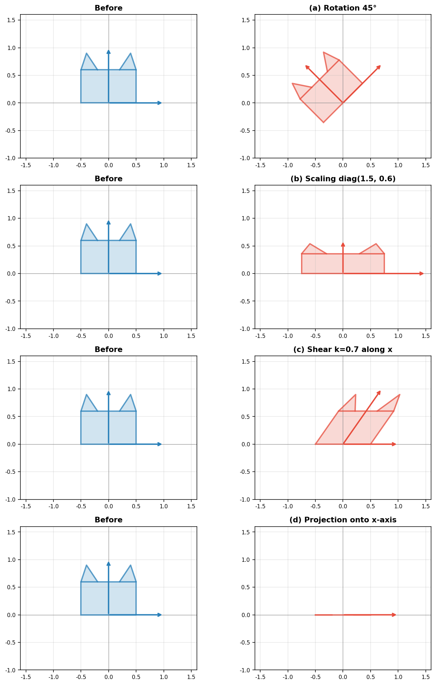
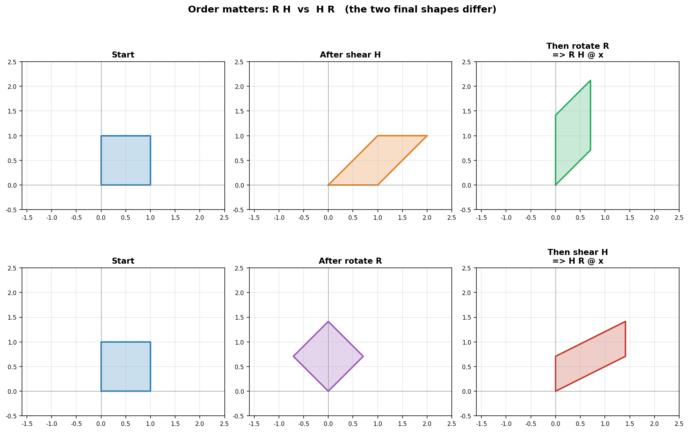

# 线性变换

> **所属路径**：`01_基础能力/02_数学基础/01_线性代数/02_线性变换`
> **预计学习时间**：90 分钟
> **难度等级**：⭐⭐⭐

---

## 前置知识

- [向量与矩阵](../01_向量与矩阵/01_向量与矩阵.md)——必须熟悉矩阵乘法的两种读法
- [向量坐标化](../../../../../00_高中复习/01_数学基础/06_向量/03_向量坐标化/03_向量坐标化.md)——理解坐标与基底的关系
- [线性组合与线性相关初步](../../../../../00_高中复习/01_数学基础/06_向量/04_线性组合与线性相关初步/04_线性组合与线性相关初步.md)——理解线性组合

> 如果以上内容还不熟悉，建议先完成对应课程再继续。

---

## 学习目标

完成本节后，你将能够：

1. 用一句话说出线性变换的两条核心性质（保加法、保数乘）
2. 把一个矩阵"读"成对空间的几何操作（旋转、缩放、剪切、投影）
3. 理解任何线性变换都由它对**基向量**的作用完全决定
4. 看懂矩阵相乘 = 变换的复合，并解释 $AB$ 与 $BA$ 不同的几何原因
5. 用行列式判断变换是否可逆、是否翻转空间方向

---

## 正文讲解

### 1. 矩阵的"灵魂"是什么？

上一节我们学会了把矩阵看作一台"映射机器"—— $A\mathbf{x}$ 把输入向量变成输出向量。但这台机器到底在做什么？是任意"乱七八糟"的映射吗？

不是。它在做的事情有一个非常优美的几何含义，叫做 **线性变换（Linear Transformation）** 。看懂线性变换，你就拿到了理解整个深度学习的"几何钥匙"——为什么神经网络要堆叠多层？为什么有"特征空间"这种说法？为什么 PCA 能找出数据的"主方向"？答案全都藏在线性变换的几何里。

### 2. 线性变换的定义——两条铁律

一个从 $\mathbb{R}^n$ 到 $\mathbb{R}^m$ 的映射 $T$ 叫做线性变换，当且仅当它满足两条性质：

**性质一（保加法）**：对任意 $\mathbf{u}, \mathbf{v} \in \mathbb{R}^n$ ，

$$
T(\mathbf{u} + \mathbf{v}) = T(\mathbf{u}) + T(\mathbf{v})
$$

**性质二（保数乘）**：对任意 $\mathbf{u} \in \mathbb{R}^n$ 和实数 $c$ ，

$$
T(c \mathbf{u}) = c \, T(\mathbf{u})
$$

> **直觉解读**：这两条性质合起来意味着 $T$ "尊重线性组合"——你**先组合再变换**和**先变换再组合**，结果一样。换句话说， $T$ 是一种"温和"的映射，它不会扭曲直线，也不会让原点跑掉。

事实上从两条性质可以推出一个非常重要的结论：**所有线性变换都把原点映射到原点**。
（证明：取 $c = 0$ 代入性质二即可得 $T(\mathbf{0}) = \mathbf{0}$ 。）

所以"平移"（加一个常数向量）**不是**线性变换。它会把原点搬走。

### 3. 矩阵 ⇔ 线性变换的等价定理

下面这个事实是整个线性代数大厦的"根基"：

> **核心定理**：每一个从 $\mathbb{R}^n$ 到 $\mathbb{R}^m$ 的线性变换 $T$ ，都恰好对应一个 $m \times n$ 矩阵 $A$ ，使得 $T(\mathbf{x}) = A\mathbf{x}$ 。反之，每一个 $m \times n$ 矩阵都定义了一个线性变换。

也就是说：**矩阵和线性变换是同一件事的两副面孔**。一个是"代数表达"（数表 + 乘法规则），一个是"几何作用"（空间的拉伸扭转）。

那这个矩阵 $A$ 到底如何由 $T$ 确定？

### 4. 关键洞见——基向量决定一切

由于线性变换"尊重线性组合"，只要我们知道 $T$ 把 **基向量** 映到了哪里，就完全知道它对任何向量做什么。

以二维为例。标准基向量是

$$
\mathbf{e}_1 = \begin{bmatrix} 1 \\ 0 \end{bmatrix}, \quad \mathbf{e}_2 = \begin{bmatrix} 0 \\ 1 \end{bmatrix}
$$

任意向量都能写成 $\mathbf{x} = x_1 \mathbf{e}_1 + x_2 \mathbf{e}_2$ 。利用线性性：

$$
T(\mathbf{x}) = T(x_1 \mathbf{e}_1 + x_2 \mathbf{e}_2) = x_1 T(\mathbf{e}_1) + x_2 T(\mathbf{e}_2)
$$

所以只要告诉我 $T(\mathbf{e}_1)$ 和 $T(\mathbf{e}_2)$ ，整张地图就完全画好了。

而对应矩阵 $A$ 的列就是这两个像：

$$
A = \begin{bmatrix} | & | \\ T(\mathbf{e}_1) & T(\mathbf{e}_2) \\ | & | \end{bmatrix}
$$

> 🔑 **请把这一段读三遍**：**矩阵 $A$ 的第 $j$ 列 = 第 $j$ 个基向量的像 $T(\mathbf{e}_j)$** 。这是阅读任何矩阵几何含义的"密钥"。下次看到一个矩阵，第一件事就是问"它把基向量送到了哪里？"

### 5. 几个最重要的几何变换

下面这张图展示了二维平面上四种最基本的线性变换。它们也是后面讲注意力机制、卷积时反复出现的"积木"：



> 📌 **图解说明**：每一行展示同一只"小猫"（用一组点构成）在不同矩阵作用下的形状。左侧蓝色为原图（带基向量 $\mathbf{e}_1, \mathbf{e}_2$），右侧红色为变换后图。可以看到旋转保形状、缩放各向异性、剪切让方格变菱形、投影把二维"压扁"为一维。你可以运行 `code/plot_linear_transforms.py` 自行生成这张图。

它们的矩阵分别是：

**(a) 旋转（Rotation）** ，逆时针转角 $\theta$ ：

$$
R_\theta = \begin{bmatrix} \cos\theta & -\sin\theta \\ \sin\theta & \cos\theta \end{bmatrix}
$$

代入 $\mathbf{e}_1 = (1, 0)^\top$ 验证：第一列就是 $(\cos\theta, \sin\theta)^\top$ ，正是 $\mathbf{e}_1$ 转过 $\theta$ 后的位置。

**(b) 缩放（Scaling）** ，沿 x 方向缩 $a$ 倍、沿 y 方向缩 $b$ 倍：

$$
S = \begin{bmatrix} a & 0 \\ 0 & b \end{bmatrix}
$$

**(c) 剪切（Shear）** ，沿 x 方向"推" $k$ 倍 y 坐标：

$$
H = \begin{bmatrix} 1 & k \\ 0 & 1 \end{bmatrix}
$$

注意 $\mathbf{e}_1$ 没动，但 $\mathbf{e}_2$ 被推到了 $(k, 1)^\top$ ——这正是矩阵的第二列。

**(d) 投影（Projection）** ，把所有向量投影到 x 轴：

$$
P = \begin{bmatrix} 1 & 0 \\ 0 & 0 \end{bmatrix}
$$

投影是不可逆的——投影到 x 轴后，无法还原 y 坐标。这一点稍后会用行列式精确判断。

### 6. 矩阵相乘 = 变换的复合

现在我们有了几何视角，可以重新理解矩阵乘法：

> **几何解读**：$AB \mathbf{x}$ 表示"先用 $B$ 变换 $\mathbf{x}$ ，再用 $A$ 变换结果"。所以 $AB$ 这个新矩阵代表"先 $B$ 后 $A$"的复合变换。

注意阅读顺序：**从右往左读**！这是因为离 $\mathbf{x}$ 最近的（最右边的）矩阵最先作用。

这也立刻解释了为什么 $AB \neq BA$ ——"先转 90° 再水平拉伸"和"先水平拉伸再转 90°"的最终形状当然不一样。

下面这张图直观演示了"先剪切再旋转"与"先旋转再剪切"的差异：



> 📌 **图解说明**：同一个单位方格在两条路径下被变换。上路径"剪切 → 旋转"和下路径"旋转 → 剪切"得到完全不同的最终形状。这就是 $AB \neq BA$ 的几何原因。你可以运行 `code/plot_composition_order.py` 自行生成这张图。

### 7. 行列式——变换的"面积放大率"

二维矩阵 $A = \begin{bmatrix} a & b \\ c & d \end{bmatrix}$ 的 **行列式（Determinant）** 定义为

$$
\det(A) = ad - bc
$$

它的几何含义极其优美：

> **直觉解读**：$|\det(A)|$ 等于"经过变换 $A$ 后，单位方格变成的平行四边形的面积"。 $\det(A)$ 的**符号**告诉我们空间是否被翻转了一次（正号保持原有手性，负号翻转）。

由此立刻得到三个判断：

| $\det(A)$ | 几何含义 | 代数后果 |
| --------- | -------- | -------- |
| $> 0$ | 保持空间方向，面积按 $\det(A)$ 缩放 | 矩阵可逆 |
| $< 0$ | 翻转空间方向（如镜像），面积按 $|\det(A)|$ 缩放 | 矩阵可逆 |
| $= 0$ | 空间被"压扁"了一个维度（如投影） | 矩阵**不可逆** |

可逆与否非常关键。 $\det(A) = 0$ 意味着多个不同的输入会被映射到同一个输出，无法"反推回去"。投影矩阵 $P = \begin{bmatrix} 1 & 0 \\ 0 & 0 \end{bmatrix}$ 的行列式 $= 1 \cdot 0 - 0 \cdot 0 = 0$ ，正符合"投影不可逆"的直觉。

更高维的行列式有类似含义（体积放大率），但计算更复杂，留给后续课程。

### 8. 在 AI 中的应用举例

回到 AI，线性变换无处不在：

- **神经网络的一层** $\mathbf{y} = W\mathbf{x} + \mathbf{b}$ ：去掉偏置 $\mathbf{b}$ 后，主体 $W\mathbf{x}$ 就是一个线性变换。整个深度网络可以理解为"线性变换 + 非线性激活"的反复堆叠——非线性是为了打破线性变换的局限（线性变换不能扭曲直线）。
- **注意力机制的 $W_Q, W_K, W_V$** ：把同一个输入向量分别映射到查询、键、值三个空间。三个矩阵 = 三个不同的线性变换 = 三种不同的"看待方式"。
- **数据增强中的旋转、缩放**：图像分类中常用的 RandomRotation、RandomScale 本质上就是对像素坐标做线性变换。
- **PCA**：找一个旋转矩阵 $V$ ，让数据在新坐标系下方差最大的方向沿着第一根坐标轴。这正是 [特征值与奇异值分解](../05_特征值与奇异值分解/05_特征值与奇异值分解.md) 要解决的问题。

---

## 动手实践

让我们用 NumPy 验证：矩阵的列就是基向量的像，而矩阵相乘就是变换复合。

```python
# 文件：code/linear_transform_demo.py
# 验证线性变换的核心性质
# 环境要求：Python 3.10+, numpy

import numpy as np

# ---- 1. 定义一个线性变换:旋转 90 度 ----
theta = np.pi / 2
R = np.array([[np.cos(theta), -np.sin(theta)],
              [np.sin(theta),  np.cos(theta)]])
print("旋转 90 度的矩阵 R:\n", R.round(3))

# 验证:R 的第 1 列应等于 e1=(1,0) 的像,即 (cos90, sin90)=(0,1)
e1 = np.array([1.0, 0.0])
e2 = np.array([0.0, 1.0])
print("\nR @ e1 =", (R @ e1).round(3), "  (应为 [0, 1])")
print("R @ e2 =", (R @ e2).round(3), "  (应为 [-1, 0])")
print("R 的两列分别是:", R[:, 0].round(3), "和", R[:, 1].round(3))

# ---- 2. 验证线性性 ----
u = np.array([2.0, 3.0])
v = np.array([1.0, -1.0])
c = 5.0

lhs = R @ (u + v)              # T(u+v)
rhs = R @ u + R @ v            # T(u) + T(v)
print("\n保加法验证: T(u+v) =", lhs.round(3), "  T(u)+T(v) =", rhs.round(3))

lhs2 = R @ (c * u)
rhs2 = c * (R @ u)
print("保数乘验证: T(c*u) =", lhs2.round(3), "  c*T(u) =", rhs2.round(3))

# ---- 3. 矩阵乘法 = 变换复合 ----
H = np.array([[1, 1],
              [0, 1]])             # 剪切
x = np.array([1.0, 1.0])

# 方法 A:先剪切,再旋转
result_A = R @ (H @ x)
# 方法 B:用复合矩阵 (R @ H) 一次性变换
result_B = (R @ H) @ x
print("\n复合验证: R @ (H @ x) =", result_A.round(3),
      "  (R @ H) @ x =", result_B.round(3))

# ---- 4. 验证 AB != BA(几何上顺序不同) ----
RH = R @ H  # 先剪切再旋转
HR = H @ R  # 先旋转再剪切
print("\nR @ H =\n", RH.round(3))
print("H @ R =\n", HR.round(3))
print("两者是否相等?", np.allclose(RH, HR))

# ---- 5. 行列式判断变换的可逆性 ----
P = np.array([[1, 0],
              [0, 0]])             # 投影到 x 轴
print("\n旋转矩阵的行列式:", round(np.linalg.det(R), 3), "  (=1, 保面积保方向)")
print("剪切矩阵的行列式:", round(np.linalg.det(H), 3), "  (=1, 保面积)")
print("投影矩阵的行列式:", round(np.linalg.det(P), 3), "  (=0, 不可逆)")
```

**运行说明**：

- 环境要求：Python 3.10+，numpy
- 运行命令：`python code/linear_transform_demo.py`

**预期输出**：

```
旋转 90 度的矩阵 R:
 [[ 0. -1.]
 [ 1.  0.]]

R @ e1 = [0. 1.]   (应为 [0, 1])
R @ e2 = [-1.  0.]   (应为 [-1, 0])
R 的两列分别是: [0. 1.] 和 [-1.  0.]

保加法验证: T(u+v) = [-2.  3.]   T(u)+T(v) = [-2.  3.]
保数乘验证: T(c*u) = [-15.  10.]   c*T(u) = [-15.  10.]

复合验证: R @ (H @ x) = [-1.  2.]   (R @ H) @ x = [-1.  2.]

R @ H =
 [[ 0. -1.]
 [ 1.  1.]]
H @ R =
 [[ 1. -1.]
 [ 1.  0.]]
两者是否相等? False

旋转矩阵的行列式: 1.0   (=1, 保面积保方向)
剪切矩阵的行列式: 1.0   (=1, 保面积)
投影矩阵的行列式: 0.0   (=0, 不可逆)
```

注意第 1 步——矩阵 $R$ 的两列 $(0, 1)$ 和 $(-1, 0)$ 正好是 $\mathbf{e}_1, \mathbf{e}_2$ 旋转 90 度后的位置。这就是"矩阵的列 = 基向量的像"在数值上的体现。

---

## 典型误区

| 误区 | 正确理解 |
| ---- | -------- |
| 平移也是线性变换 | 错。平移会把原点搬到别处，违反"$T(\mathbf{0}) = \mathbf{0}$"。它属于**仿射变换（affine）**，写作 $T(\mathbf{x}) = A\mathbf{x} + \mathbf{b}$ 才完整 |
| 行列式必须是正数 | 错。行列式可以是负数（表示空间被翻转，如镜像）或零（表示不可逆） |
| 行列式是矩阵中所有元素的和 | 错。 $\det$ 与"求和"无关，2×2 是 $ad - bc$ ，更高维有更复杂公式 |
| $AB$ 表示先 $A$ 后 $B$ | 错。 $AB\mathbf{x}$ 中 $\mathbf{x}$ 先被 $B$ 作用，再被 $A$ 作用——**从右往左读** |
| 旋转矩阵是任意 $\sin, \cos$ 的组合 | 错。旋转矩阵必须满足 $R^\top R = I$ 且 $\det(R) = 1$ ，即"正交且不翻转"，是非常特殊的一类 |
| 矩阵决定了输入空间和输出空间维度一定相同 | 错。 $m \times n$ 矩阵把 $\mathbb{R}^n$ 映到 $\mathbb{R}^m$ ， $m$ 与 $n$ 可以不同（如投影、嵌入降维） |

---

## 练习题

### 练习 1：构造线性变换的矩阵（难度：⭐⭐）

写出下列变换的矩阵：

- (a) 沿 y 轴翻转（即 $(x, y) \mapsto (-x, y)$ ）
- (b) 沿原点中心对称（即 $(x, y) \mapsto (-x, -y)$ ）
- (c) 把基向量 $\mathbf{e}_1$ 送到 $(2, 3)$ ， $\mathbf{e}_2$ 送到 $(-1, 4)$

<details>
<summary>💡 提示</summary>

利用"矩阵的第 $j$ 列就是 $T(\mathbf{e}_j)$"的核心定理，直接把基向量的像填进列里。

</details>

<details>
<summary>✅ 参考答案</summary>

(a) $\mathbf{e}_1 \mapsto (-1, 0), \mathbf{e}_2 \mapsto (0, 1)$ ，所以矩阵为 $\begin{bmatrix} -1 & 0 \\ 0 & 1 \end{bmatrix}$

(b) $\mathbf{e}_1 \mapsto (-1, 0), \mathbf{e}_2 \mapsto (0, -1)$ ，所以矩阵为 $\begin{bmatrix} -1 & 0 \\ 0 & -1 \end{bmatrix} = -I$

(c) 直接把像填进列：$\begin{bmatrix} 2 & -1 \\ 3 & 4 \end{bmatrix}$

</details>

### 练习 2：判断线性性（难度：⭐⭐）

判断下列变换是否为线性变换：

- (a) $T(x, y) = (2x + y, x - y)$
- (b) $T(x, y) = (x + 1, y)$
- (c) $T(x, y) = (xy, x + y)$
- (d) $T(x, y) = (3x, 0)$

<details>
<summary>💡 提示</summary>

线性变换可以写成 $T(\mathbf{x}) = A\mathbf{x}$ 的形式，每个分量都是输入分量的"齐次一次"组合（不能有常数项、平方项、乘积项）。

</details>

<details>
<summary>✅ 参考答案</summary>

(a) ✓ 线性。矩阵为 $\begin{bmatrix} 2 & 1 \\ 1 & -1 \end{bmatrix}$

(b) ✗ 非线性。第一个分量有常数项 $+1$ ，会把原点搬到 $(1, 0)$ ，违反 $T(\mathbf{0}) = \mathbf{0}$

(c) ✗ 非线性。第一个分量 $xy$ 是两个变量的乘积，违反保加法

(d) ✓ 线性。矩阵为 $\begin{bmatrix} 3 & 0 \\ 0 & 0 \end{bmatrix}$ ， $\det = 0$ ，是把平面"压扁"到 x 轴的不可逆变换

</details>

### 练习 3：复合变换计算（难度：⭐⭐⭐）

设 $R$ 表示逆时针旋转 90°， $H$ 表示沿 x 方向剪切 $k = 1$ 。请：

- (a) 写出 $R$ 和 $H$ 的矩阵
- (b) 计算 $RH$ 与 $HR$ ，说明哪个变换是"先剪切再旋转"
- (c) 用 $\mathbf{x} = (1, 1)$ 分别代入两个复合变换，验证结果不同

<details>
<summary>💡 提示</summary>

记住"右边的矩阵先作用"。

</details>

<details>
<summary>✅ 参考答案</summary>

(a) $R = \begin{bmatrix} 0 & -1 \\ 1 & 0 \end{bmatrix}, H = \begin{bmatrix} 1 & 1 \\ 0 & 1 \end{bmatrix}$

(b) $RH = \begin{bmatrix} 0 & -1 \\ 1 & 1 \end{bmatrix}$ 表示**先剪切再旋转**（$H$ 在右边，先作用）； $HR = \begin{bmatrix} 1 & -1 \\ 1 & 0 \end{bmatrix}$ 表示**先旋转再剪切**

(c) $RH \mathbf{x} = (0 \cdot 1 + (-1) \cdot 1,\ 1 \cdot 1 + 1 \cdot 1)^\top = (-1, 2)^\top$

$HR \mathbf{x} = (1 \cdot 1 + (-1) \cdot 1,\ 1 \cdot 1 + 0 \cdot 1)^\top = (0, 1)^\top$

两者完全不同，验证了 $RH \neq HR$ 。

</details>

### 练习 4：行列式与可逆性（难度：⭐⭐⭐）

下列矩阵中，哪些可逆？把不可逆的解释成"几何上把空间压扁了"。

- (a) $\begin{bmatrix} 2 & 0 \\ 0 & 3 \end{bmatrix}$
- (b) $\begin{bmatrix} 1 & 2 \\ 2 & 4 \end{bmatrix}$
- (c) $\begin{bmatrix} 1 & 1 \\ 1 & -1 \end{bmatrix}$
- (d) $\begin{bmatrix} \cos 30° & -\sin 30° \\ \sin 30° & \cos 30° \end{bmatrix}$

<details>
<summary>💡 提示</summary>

计算每个矩阵的 $\det = ad - bc$ ，等于零即不可逆。

</details>

<details>
<summary>✅ 参考答案</summary>

(a) $\det = 6 \neq 0$ ，可逆。沿 x 拉 2 倍、沿 y 拉 3 倍

(b) $\det = 4 - 4 = 0$ ，**不可逆**。两列 $(1, 2)$ 和 $(2, 4)$ 共线，整个平面被压扁到一条直线上

(c) $\det = -1 - 1 = -2 \neq 0$ ，可逆，但 $\det < 0$ 说明翻转了空间方向（镜像）

(d) $\det = \cos^2 30° + \sin^2 30° = 1$ ，可逆，是纯旋转，不改变面积也不翻转

</details>

---

## 下一步学习

- 📖 下一个知识点：[范数与距离](../03_范数与距离/03_范数与距离.md)——给向量赋予"长度"和"远近"
- 🔗 相关知识点：[特征值与奇异值分解](../05_特征值与奇异值分解/05_特征值与奇异值分解.md)——线性变换的"主轴"分析
- 📚 拓展阅读：[3Blue1Brown - Linear transformations and matrices](https://www.youtube.com/watch?v=kYB8IZa5AuE)（公开视频）

---

## 参考资料

1. [3Blue1Brown - Essence of linear algebra (Ch.3 Linear transformations)](https://www.youtube.com/watch?v=kYB8IZa5AuE) — 用动画讲解矩阵的几何意义（公开视频）
2. [Gilbert Strang - MIT 18.06 Linear Algebra Lecture 3](https://ocw.mit.edu/courses/18-06-linear-algebra-spring-2010/) — MIT 公开课（CC BY-NC-SA 许可）
3. [Wikipedia - Linear map](https://en.wikipedia.org/wiki/Linear_map) — 线性映射的严格定义（公共知识库）
4. [Immersive Math - Chapter 6: The Matrix](http://immersivemath.com/ila/ch06_matrices/ch06.html) — 交互式线性代数教材（开放获取）
