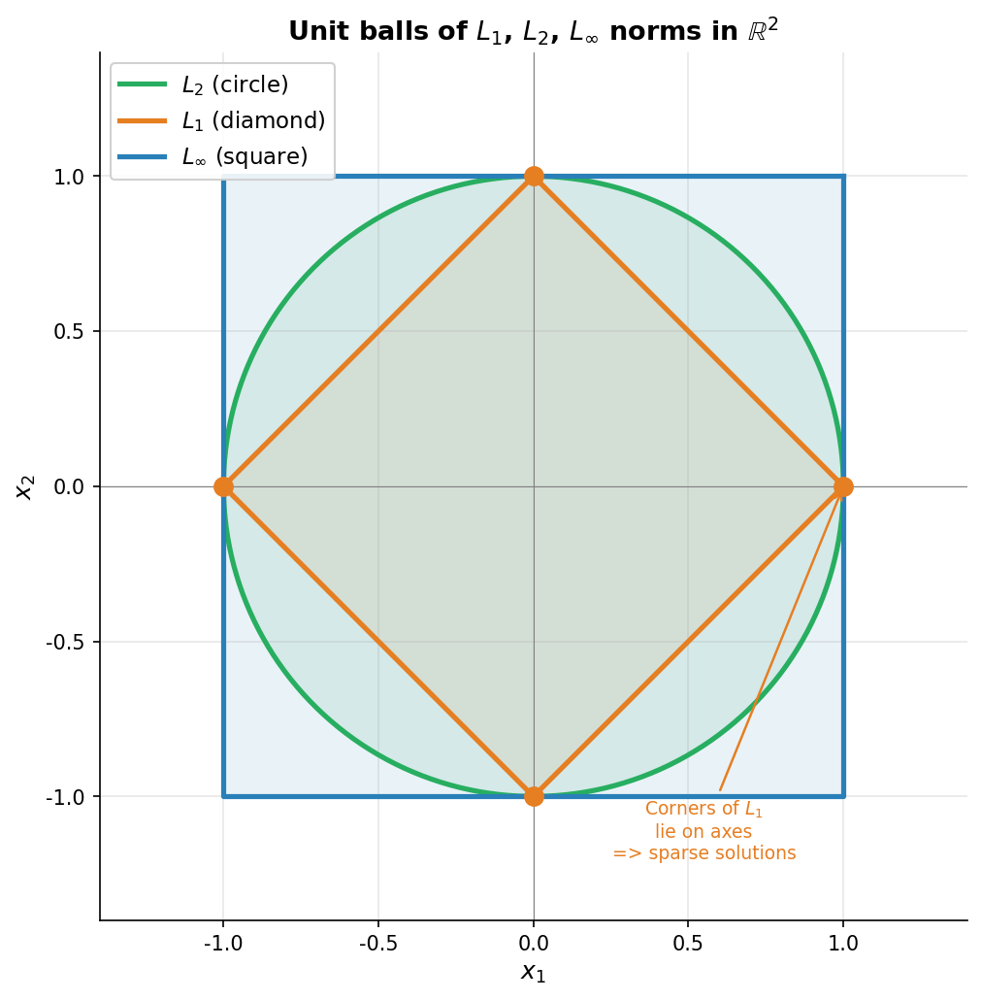

# 范数与距离

> **所属路径**：`01_基础能力/02_数学基础/01_线性代数/03_范数与距离`
> **预计学习时间**：70 分钟
> **难度等级**：⭐⭐

---

## 前置知识

- [向量与矩阵](../01_向量与矩阵/01_向量与矩阵.md)——熟悉向量的基本运算
- [向量表示与运算](../../../../../00_高中复习/01_数学基础/06_向量/01_向量表示与运算/01_向量表示与运算.md)——理解向量长度的几何含义
- [幂运算与根式](../../../../../00_高中复习/01_数学基础/03_指数与对数/)——计算 $L_p$ 范数需要

> 如果以上内容还不熟悉，建议先完成对应课程再继续。

---

## 学习目标

完成本节后，你将能够：

1. 写出 $L_1, L_2, L_\infty$ 三种最常用范数的定义并解释它们的几何含义
2. 区分 **范数（norm）** 与 **距离（distance）** 的关系
3. 解释 $L_1$ 范数为什么会带来"稀疏性"，以及它在 Lasso 回归中的作用
4. 计算两个向量之间的余弦相似度，并说明它在文本检索、推荐系统中为何如此重要
5. 理解矩阵的 Frobenius 范数与谱范数的差别

---

## 正文讲解

### 1. 一个朴素的问题——向量"多长"算长？

回到高中。如果你有一个二维向量 $\mathbf{v} = (3, 4)$ ，问它有多长，你会立刻回答：用勾股定理， $\sqrt{3^2 + 4^2} = 5$ 。

但如果维度变成 768 呢？长度还有意义吗？更"狡猾"的问题是：长度的定义**只能**这样吗？能不能换一种"测量方式"？

答案是：可以。事实上，根据应用场景的不同，人工智能里至少要熟练掌握三种"长度"。它们都被叫做 **范数（Norm）** ，记作 $\|\mathbf{x}\|$ 。

> **直觉解读**：范数是给向量"赋予一个非负实数"的函数，可以被想象成"这个向量到原点的距离"。但"距离"的含义可以根据需求灵活定义——是直线距离？是格子距离？还是最大坐标？这就引出了不同的范数家族。

### 2. $L_p$ 范数——一个统一的家族

对任意实数 $p \geq 1$ ， $n$ 维向量 $\mathbf{x} = (x_1, x_2, \ldots, x_n)$ 的 **$L_p$ 范数** 定义为：

$$
\|\mathbf{x}\|_p = \left( \sum_{i=1}^{n} |x_i|^p \right)^{1/p}
$$

不同的 $p$ 值给出不同的"测量方式"。三种最常用的特殊情况是：

**$L_1$ 范数（曼哈顿范数 / Manhattan Norm）** ， $p = 1$ ：

$$
\|\mathbf{x}\|_1 = \sum_{i=1}^{n} |x_i|
$$

直觉：在曼哈顿（街道呈方格）骑车，从 $\mathbf{0}$ 走到 $\mathbf{x}$ 必须沿格子走的总距离。

**$L_2$ 范数（欧几里得范数 / Euclidean Norm）** ， $p = 2$ ：

$$
\|\mathbf{x}\|_2 = \sqrt{\sum_{i=1}^{n} x_i^2}
$$

直觉：沿直线"穿墙"走过去的距离。这就是高中学过的勾股定理推广到 $n$ 维。这是默认范数，公式中只写 $\|\mathbf{x}\|$ 不带下标时，一般指 $L_2$ 。

**$L_\infty$ 范数（最大范数 / Maximum Norm）** ， $p \to \infty$ ：

$$
\|\mathbf{x}\|_\infty = \max_{i} |x_i|
$$

直觉：所有坐标里最大的那个绝对值。常用于鲁棒性分析（"最坏的那个偏差有多大？"）。

下面这张图展示了三种范数在二维平面上的"单位球"——也就是满足 $\|\mathbf{x}\| = 1$ 的所有点：



> 📌 **图解说明**：$L_1$ 的单位球是一个**菱形**（四个顶点在轴上）， $L_2$ 是一个**圆**， $L_\infty$ 是一个**正方形**（边平行于轴）。$p$ 介于 1 和 2 之间时，单位球介于菱形和圆之间； $p > 2$ 时介于圆和方形之间。可以运行 `code/plot_lp_balls.py` 自行生成这张图。

### 3. $L_0$ 与稀疏性的小故事

理论上，"$L_0$ 范数"指的是向量中**非零分量的个数**。它不是真正的范数（不满足齐次性），但在机器学习里被频繁使用：

$$
\|\mathbf{x}\|_0 = |\{i : x_i \neq 0\}|
$$

例如 $(0, 3, 0, -2, 0, 1)$ 的 $L_0 = 3$ 。

为什么这个"伪范数"重要？因为它衡量了向量的 **稀疏性（sparsity）** ——稀疏向量大部分元素是 0 ，只有少数有值。在特征选择中我们希望模型只用到少数几个特征（其他权重=0），就是希望解是稀疏的。

但 $L_0$ 优化是 NP 难问题。一个绝妙的发现是：**$L_1$ 范数能"代理" $L_0$ 范数**，把组合优化转化为可解的凸优化。这是 **Lasso 回归** 和 **压缩感知（Compressed Sensing）** 的理论基石。

为什么 $L_1$ 能产生稀疏解？看上面那张图：$L_1$ 的单位球是菱形，"角"恰好落在坐标轴上。当我们用一条直线（约束）去切这个菱形，最优解大概率落在某个"角"上——而那个角对应的向量有一个分量恰好为 $0$ ！相反， $L_2$ 球是光滑的圆，最优解几乎不会落在轴上。

### 4. 范数的三条公理

数学家给出了"范数"的严格定义：一个函数 $\|\cdot\|: \mathbb{R}^n \to \mathbb{R}$ 是范数，当且仅当对所有 $\mathbf{x}, \mathbf{y} \in \mathbb{R}^n$ 和 $c \in \mathbb{R}$ ：

1. **非负性**： $\|\mathbf{x}\| \geq 0$ ，且 $\|\mathbf{x}\| = 0 \Leftrightarrow \mathbf{x} = \mathbf{0}$
2. **齐次性**： $\|c \mathbf{x}\| = |c| \cdot \|\mathbf{x}\|$
3. **三角不等式**： $\|\mathbf{x} + \mathbf{y}\| \leq \|\mathbf{x}\| + \|\mathbf{y}\|$

> **直觉解读**：第三条特别有名——"两条边之和大于等于第三条边"。它告诉我们："直接走"绝不会比"绕路走"更远。

任何满足这三条的"长度定义"都是合法的范数。$L_p$ 系列、Mahalanobis 范数、矩阵的 Frobenius 范数都是范数。但 $L_0$ 不满足齐次性（ $\|2\mathbf{x}\|_0 = \|\mathbf{x}\|_0$ 而不是 $2\|\mathbf{x}\|_0$ ），所以严格来说它不是范数。

### 5. 从范数到距离

有了范数，**距离（Distance）** 就是水到渠成的事：

$$
d(\mathbf{x}, \mathbf{y}) = \|\mathbf{x} - \mathbf{y}\|
$$

不同范数诱导出不同距离：

- $L_2$ 距离 = 欧几里得距离（最常用，深度学习中默认）
- $L_1$ 距离 = 曼哈顿距离（KNN 搜索时用得很多，对异常值更稳健）
- $L_\infty$ 距离 = 切比雪夫距离（国际象棋中"国王"走 1 步能到的所有格子距离 = 1）

**马氏距离（Mahalanobis Distance）** 是另一类重要的距离：

$$
d_M(\mathbf{x}, \mathbf{y}) = \sqrt{(\mathbf{x} - \mathbf{y})^\top \Sigma^{-1} (\mathbf{x} - \mathbf{y})}
$$

它在欧几里得距离的基础上"考虑了协方差"——如果某个维度本身方差大，它在距离中的"分量权重"就会被压低。这在异常检测、聚类中很有用。

### 6. 余弦相似度——AI 中最常用的"距离"

在文本检索、推荐系统、嵌入空间比较中，最常用的不是欧氏距离，而是 **余弦相似度（Cosine Similarity）** ：

$$
\cos(\mathbf{x}, \mathbf{y}) = \frac{\mathbf{x} \cdot \mathbf{y}}{\|\mathbf{x}\|_2 \cdot \|\mathbf{y}\|_2}
$$

它就是两向量夹角的余弦值，取值范围 $[-1, 1]$ ：

- $1$ ：方向完全相同（最相似）
- $0$ ：互相垂直（毫无关系）
- $-1$ ：方向完全相反（最不相似）

> **为什么 AI 偏爱余弦？** 因为在语义嵌入中，**方向比长度更重要**。两段文章经过 BERT 编码后，向量长度往往受文章长度影响，但语义相似的文章方向接近。例如"猫吃鱼"的 100 字版和 1000 字版，欧氏距离可能很大，但夹角应该很小。

对应的 **余弦距离（Cosine Distance）** 定义为 $1 - \cos(\mathbf{x}, \mathbf{y})$ ，把"相似"转成"距离"。这就是向量数据库（如 [向量数据库](../../../03_编程与计算机基础/06_数据库/05_向量数据库/) ）中检索"最相似的 $k$ 个向量"的核心度量。

### 7. 矩阵的范数

向量有范数，矩阵也有。最常用的是 **Frobenius 范数** ：

$$
\|A\|_F = \sqrt{\sum_{i, j} A_{ij}^2}
$$

可以理解为"把矩阵当成一个长向量，再求 $L_2$ 范数"。深度学习中我们常常用它来做权重正则化（weight decay 本质上等价于 Frobenius 平方惩罚）。

另一类是 **诱导范数（Operator Norm）** ，最重要的是 **谱范数（Spectral Norm）** ：

$$
\|A\|_2 = \max_{\mathbf{x} \neq \mathbf{0}} \frac{\|A\mathbf{x}\|_2}{\|\mathbf{x}\|_2}
$$

它衡量"矩阵作用下，向量长度被放大的最大倍数"。这恰好等于 $A$ 的最大奇异值——这是 [特征值与奇异值分解](../05_特征值与奇异值分解/05_特征值与奇异值分解.md) 一课会重点讲的概念。在 GAN 训练的"谱归一化"和 LoRA 微调的稳定性分析中都会用到它。

### 8. 范数在 AI 中的应用速览

回到落地场景，范数无处不在：

- **正则化（Regularization）**：在损失函数后面加 $\lambda \|\mathbf{w}\|_2^2$ 是 **Ridge 回归**（防过拟合），加 $\lambda \|\mathbf{w}\|_1$ 是 **Lasso 回归**（同时做特征选择）
- **梯度裁剪（Gradient Clipping）**：当梯度的 $L_2$ 范数超过阈值时，按比例缩小，防止训练爆炸
- **嵌入归一化**：把 $\mathbf{x}$ 除以 $\|\mathbf{x}\|_2$ 后，余弦相似度退化为内积，加速向量检索
- **对抗鲁棒性**：评价模型的 "对 $L_\infty$ 扰动的鲁棒性"——攻击者每个像素最多改 $\epsilon$ ，模型还能不能正确分类
- **批归一化、层归一化**：本质上都是把激活值的某种范数控制在合理范围

---

## 动手实践

```python
# 文件：code/norms_demo.py
# 演示常见范数与距离的计算
# 环境要求：Python 3.10+, numpy

import numpy as np

x = np.array([3.0, 4.0])
y = np.array([0.0, 5.0])

# ---- 1. 各种 Lp 范数 ----
print("向量 x =", x)
print(f"L1 范数 = {np.linalg.norm(x, ord=1):.3f}   (= 3 + 4 = 7)")
print(f"L2 范数 = {np.linalg.norm(x, ord=2):.3f}   (= sqrt(9+16) = 5)")
print(f"L_inf 范数 = {np.linalg.norm(x, ord=np.inf):.3f}   (= max(3, 4) = 4)")

# ---- 2. 距离 ----
print("\n向量 y =", y)
print(f"L1 距离  d(x, y) = {np.linalg.norm(x - y, ord=1):.3f}")
print(f"L2 距离  d(x, y) = {np.linalg.norm(x - y, ord=2):.3f}")
print(f"L_inf 距离 = {np.linalg.norm(x - y, ord=np.inf):.3f}")

# ---- 3. 余弦相似度 ----
def cosine_sim(a, b):
    return float(a @ b / (np.linalg.norm(a) * np.linalg.norm(b)))

# 三个二维向量,前两个方向相近,第三个完全相反
v1 = np.array([1.0, 1.0])
v2 = np.array([2.0, 1.5])      # 与 v1 方向接近
v3 = np.array([-1.0, -1.0])    # 与 v1 方向相反
print(f"\ncos(v1, v2) = {cosine_sim(v1, v2):.3f}   (方向接近,接近 1)")
print(f"cos(v1, v3) = {cosine_sim(v1, v3):.3f}   (方向相反,等于 -1)")

# ---- 4. L1 vs L2 在"稀疏性"上的差异 ----
# 求满足 a + 2b = 4 且范数最小的 (a, b)
import scipy.optimize as opt

# 最小化 L2 范数
res_l2 = opt.minimize(lambda v: np.linalg.norm(v, 2),
                      x0=[0.0, 0.0],
                      constraints={'type': 'eq', 'fun': lambda v: v[0] + 2*v[1] - 4})
# 最小化 L1 范数
res_l1 = opt.minimize(lambda v: np.linalg.norm(v, 1),
                      x0=[0.1, 0.1],
                      constraints={'type': 'eq', 'fun': lambda v: v[0] + 2*v[1] - 4})
print(f"\n约束 a + 2b = 4 下,最小 L2 范数解: ({res_l2.x[0]:.3f}, {res_l2.x[1]:.3f})  -- 两个分量都非零")
print(f"约束 a + 2b = 4 下,最小 L1 范数解: ({res_l1.x[0]:.3f}, {res_l1.x[1]:.3f})  -- 第一个分量被压成 0,稀疏!")

# ---- 5. 矩阵的 Frobenius 范数 ----
M = np.array([[1, 2],
              [3, 4]], dtype=float)
print(f"\n矩阵 M 的 Frobenius 范数 = {np.linalg.norm(M, 'fro'):.3f}   (= sqrt(1+4+9+16) = sqrt(30))")
print(f"矩阵 M 的 谱范数(L2) = {np.linalg.norm(M, 2):.3f}   (= 最大奇异值)")
```

**运行说明**：

- 环境要求：Python 3.10+，numpy，scipy
- 运行命令：`python code/norms_demo.py`

**预期输出**：

```
向量 x = [3. 4.]
L1 范数 = 7.000   (= 3 + 4 = 7)
L2 范数 = 5.000   (= sqrt(9+16) = 5)
L_inf 范数 = 4.000   (= max(3, 4) = 4)

向量 y = [0. 5.]
L1 距离  d(x, y) = 4.000
L2 距离  d(x, y) = 3.162
L_inf 距离 = 3.000

cos(v1, v2) = 0.990   (方向接近,接近 1)
cos(v1, v3) = -1.000   (方向相反,等于 -1)

约束 a + 2b = 4 下,最小 L2 范数解: (0.800, 1.600)  -- 两个分量都非零
约束 a + 2b = 4 下,最小 L1 范数解: (0.000, 2.000)  -- 第一个分量被压成 0,稀疏!

矩阵 M 的 Frobenius 范数 = 5.477   (= sqrt(1+4+9+16) = sqrt(30))
矩阵 M 的 谱范数(L2) = 5.465   (= 最大奇异值)
```

第 4 步的输出特别值得关注——同一个约束下，最小 $L_2$ 解的两个分量都不为零，而最小 $L_1$ 解第一个分量被精确压成 0。这就是 Lasso 自动做特征选择的几何原理。

---

## 典型误区

| 误区 | 正确理解 |
| ---- | -------- |
| $L_2$ 范数总是比 $L_1$ 范数大 | 错。 $L_p$ 范数随 $p$ 增大而**减小**（对同一向量，对维度数 $> 1$）。 $\|(3,4)\|_1 = 7 > \|(3,4)\|_2 = 5 > \|(3,4)\|_\infty = 4$ |
| 余弦相似度的范围是 $[0, 1]$ | 错。范围是 $[-1, 1]$ ，可以为负（方向相反）。只有当向量分量都非负时才在 $[0, 1]$ |
| 余弦相似度等于 1 表示两个向量相等 | 错。只表示**方向相同**。$(1, 0)$ 和 $(100, 0)$ 余弦相似度也是 1 |
| L0 范数也是范数 | 严格来说不是。它不满足齐次性，但工程上常被借用以描述稀疏性 |
| Frobenius 范数 = 矩阵的 L2 范数 | 警告：在 NumPy 中 `np.linalg.norm(A)` 默认是 Frobenius，但 `np.linalg.norm(A, 2)` 是谱范数（最大奇异值），不要混淆 |
| 范数越小代表"更好" | 不一定。在正则化里小范数防过拟合，但权重压得太小会导致欠拟合。这是一个权衡问题 |

---

## 练习题

### 练习 1：手算各种范数（难度：⭐）

向量 $\mathbf{x} = (-1, 2, -3, 4)$ 。计算 $\|\mathbf{x}\|_1, \|\mathbf{x}\|_2, \|\mathbf{x}\|_\infty$ 。

<details>
<summary>💡 提示</summary>

注意 $L_1$ 和 $L_2$ 都要先取绝对值（或平方），再求和。

</details>

<details>
<summary>✅ 参考答案</summary>

$\|\mathbf{x}\|_1 = |-1| + |2| + |-3| + |4| = 1 + 2 + 3 + 4 = 10$

$\|\mathbf{x}\|_2 = \sqrt{1 + 4 + 9 + 16} = \sqrt{30} \approx 5.477$

$\|\mathbf{x}\|_\infty = \max(1, 2, 3, 4) = 4$

</details>

### 练习 2：余弦相似度直觉（难度：⭐⭐）

考虑三个文档的"词频向量"：

- $\mathbf{a} = (3, 0, 0, 1)$ ："猫" 出现 3 次，"鱼" 出现 1 次
- $\mathbf{b} = (6, 0, 0, 2)$ ：与 $\mathbf{a}$ 主题相同，但篇幅是 2 倍
- $\mathbf{c} = (0, 3, 1, 0)$ ：完全不同主题

分别计算 $\cos(\mathbf{a}, \mathbf{b})$ 和 $\cos(\mathbf{a}, \mathbf{c})$ ，再计算欧氏距离 $d_2(\mathbf{a}, \mathbf{b})$ 和 $d_2(\mathbf{a}, \mathbf{c})$ 。讨论：哪个距离/相似度更适合"判断主题相似"？

<details>
<summary>💡 提示</summary>

注意 $\mathbf{b} = 2\mathbf{a}$ ，所以两者方向完全相同。

</details>

<details>
<summary>✅ 参考答案</summary>

$\cos(\mathbf{a}, \mathbf{b})$ ：因为 $\mathbf{b} = 2\mathbf{a}$ ，方向相同，所以 $\cos = 1$

$\cos(\mathbf{a}, \mathbf{c}) = \dfrac{0+0+0+0}{\sqrt{10} \cdot \sqrt{10}} = 0$ （正交）

$d_2(\mathbf{a}, \mathbf{b}) = \sqrt{9 + 0 + 0 + 1} = \sqrt{10} \approx 3.16$

$d_2(\mathbf{a}, \mathbf{c}) = \sqrt{9 + 9 + 1 + 1} = \sqrt{20} \approx 4.47$

**讨论**：余弦相似度正确捕捉到 $\mathbf{a}$ 和 $\mathbf{b}$ 主题完全相同（=1），与 $\mathbf{c}$ 完全无关（=0）；而欧氏距离把 $\mathbf{a}$ 与"长篇相同主题" $\mathbf{b}$ 之间的距离算得不小，反而误导。所以**文本相似度任务用余弦相似度更合适**。

</details>

### 练习 3：单位球的几何（难度：⭐⭐）

在二维平面上，画出（或描述）下列范数下"距原点 $\leq 1$ 的点集"形状：

- (a) $L_1$ 范数下
- (b) $L_2$ 范数下
- (c) $L_\infty$ 范数下

哪一个区域**面积最大**？

<details>
<summary>💡 提示</summary>

回忆"单位球"的概念——单位球是 $\|\mathbf{x}\| = 1$ 的边界，包含在内的整体是"距原点 $\leq 1$ 的点集"。

</details>

<details>
<summary>✅ 参考答案</summary>

(a) $L_1$ ：以 $(\pm 1, 0), (0, \pm 1)$ 为顶点的菱形，面积 $= 2$

(b) $L_2$ ：单位圆，面积 $= \pi \approx 3.14$

(c) $L_\infty$ ：以 $(\pm 1, \pm 1)$ 为顶点的正方形，面积 $= 4$

**面积最大的是 $L_\infty$ 单位球**（正方形）。事实上对所有 $\mathbf{x}$ ，$\|\mathbf{x}\|_\infty \leq \|\mathbf{x}\|_2 \leq \|\mathbf{x}\|_1$ ，所以 $L_\infty$ 的单位球最大， $L_1$ 最小。

</details>

### 练习 4：三角不等式应用（难度：⭐⭐⭐）

已知 $\|\mathbf{a}\|_2 = 3$ ， $\|\mathbf{b}\|_2 = 4$ 。

- (a) 估计 $\|\mathbf{a} + \mathbf{b}\|_2$ 的最大值与最小值
- (b) 在什么条件下取到这两个极值？

<details>
<summary>💡 提示</summary>

三角不等式有两个方向： $\|\mathbf{a} + \mathbf{b}\| \leq \|\mathbf{a}\| + \|\mathbf{b}\|$ ；逆三角不等式 $\|\mathbf{a} + \mathbf{b}\| \geq \big| \|\mathbf{a}\| - \|\mathbf{b}\| \big|$ 。

</details>

<details>
<summary>✅ 参考答案</summary>

由三角不等式与逆三角不等式：

$$|\|\mathbf{a}\| - \|\mathbf{b}\|| \leq \|\mathbf{a} + \mathbf{b}\| \leq \|\mathbf{a}\| + \|\mathbf{b}\|$$

代入：

$$1 \leq \|\mathbf{a} + \mathbf{b}\|_2 \leq 7$$

最大值 $7$ 在 $\mathbf{a}, \mathbf{b}$ 同方向时取到（共线、同向）；最小值 $1$ 在反方向时取到（共线、反向）。

</details>

---

## 下一步学习

- 📖 下一个知识点：[正交化与投影](../04_正交化与投影/04_正交化与投影.md)——把向量分解到一组互相垂直的方向
- 🔗 相关知识点：[最优化](../../04_最优化/)——L1、L2 正则化的优化求解
- 📚 拓展阅读：[嵌入表示](../../../../../02_核心原理/05_现代人工智能与大模型/02_嵌入表示/)——余弦相似度在语义嵌入中的核心地位

---

## 参考资料

1. [Boyd & Vandenberghe《Convex Optimization》Chapter 2](https://web.stanford.edu/~boyd/cvxbook/) — 范数与凸集，斯坦福开源教材（自由下载）
2. [Wikipedia - Norm (mathematics)](https://en.wikipedia.org/wiki/Norm_(mathematics)) — 范数的严格定义与各种常见范数（公共知识库）
3. [scikit-learn - Cosine Similarity](https://scikit-learn.org/stable/modules/metrics.html#cosine-similarity) — 余弦相似度的工程实现（开源文档）
4. [3Blue1Brown - The cosine of two vectors](https://www.youtube.com/watch?v=LyGKycYT2v0) — 用动画讲解余弦相似度的几何（公开视频）
