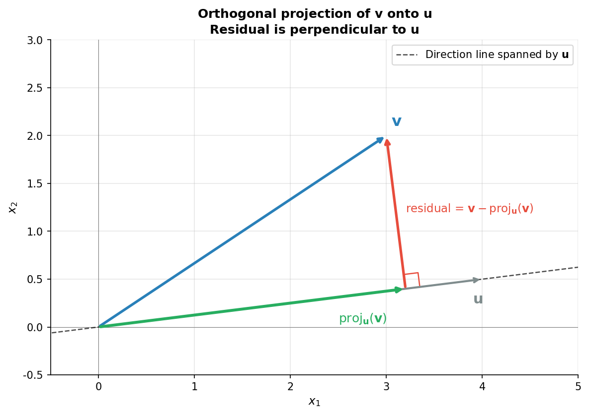
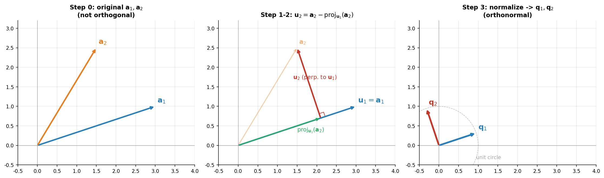

# 正交化与投影

> **所属路径**：`01_基础能力/02_数学基础/01_线性代数/04_正交化与投影`
> **预计学习时间**：80 分钟
> **难度等级**：⭐⭐⭐

---

## 前置知识

- [线性变换](../02_线性变换/02_线性变换.md)——理解矩阵的几何作用
- [范数与距离](../03_范数与距离/03_范数与距离.md)——熟悉 $L_2$ 范数
- [数量积](../../../../../00_高中复习/01_数学基础/06_向量/02_数量积/02_数量积.md)——投影的计算基础
- [线性组合与线性相关初步](../../../../../00_高中复习/01_数学基础/06_向量/04_线性组合与线性相关初步/04_线性组合与线性相关初步.md)——理解基底

> 如果以上内容还不熟悉，建议先完成对应课程再继续。

---

## 学习目标

完成本节后，你将能够：

1. 用内积公式快速计算一个向量在另一个向量方向上的投影
2. 写出正交基与标准正交基的定义，并解释它们为什么"好用"
3. 实现 Gram-Schmidt 正交化算法，把一组任意基"洗"成标准正交基
4. 理解正交矩阵的关键性质 $Q^\top Q = I$ ，以及它"保长保角"的几何意义
5. 用最小二乘法的几何视角解释"投影到列空间"为什么就是最优解

---

## 正文讲解

### 1. 为什么我们这么爱"垂直"？

线性代数里有一个反复出现的偏好——只要能用 **正交（orthogonal，互相垂直）** 的基底，就尽量用。这可不是数学家的偏执，而是因为正交基带来三大好处：

1. **坐标计算简单**：在标准正交基下，向量在各轴上的坐标 = 内积。不需要解方程组。
2. **几何关系清晰**：正交分解把一个向量"切"成几个互不干扰的部分。
3. **数值稳定**：正交矩阵的条件数为 1 ，运算时不会放大误差。

PCA、QR 分解、傅里叶变换、注意力机制中的多头投影、Transformer 的 LayerNorm 几乎都依赖于正交分解的良好性质。先把这套语言学会，后面的深度学习算法就有了清晰的几何画面。

### 2. 投影的定义——把向量"压"到一条线上

考虑一条由非零向量 $\mathbf{u}$ 决定的直线 $L = \{t\mathbf{u} : t \in \mathbb{R}\}$ 。给定平面上另一向量 $\mathbf{v}$ ，问：直线 $L$ 上**最接近** $\mathbf{v}$ 的点是哪一个？

这个最近点就叫 $\mathbf{v}$ 在 $\mathbf{u}$ 方向上的 **正交投影（Orthogonal Projection）** ，记作 $\mathrm{proj}_{\mathbf{u}}(\mathbf{v})$ 。

通过简单的几何推导（最近点连线必然垂直于 $L$ ），可以得到非常优雅的公式：

$$
\mathrm{proj}_{\mathbf{u}}(\mathbf{v}) = \frac{\mathbf{v} \cdot \mathbf{u}}{\mathbf{u} \cdot \mathbf{u}} \, \mathbf{u} = \frac{\mathbf{v} \cdot \mathbf{u}}{\|\mathbf{u}\|_2^2} \, \mathbf{u}
$$

> **直觉解读**：分数 $\dfrac{\mathbf{v} \cdot \mathbf{u}}{\|\mathbf{u}\|^2}$ 是一个标量，告诉我们"沿 $\mathbf{u}$ 方向走多远"；乘以 $\mathbf{u}$ 才把它变回向量。如果 $\mathbf{u}$ 已经是单位向量（ $\|\mathbf{u}\| = 1$ ），分母消失，公式简化为 $(\mathbf{v} \cdot \mathbf{u})\mathbf{u}$ ——这就是正交基为什么省事。

伴随的"残差" $\mathbf{v} - \mathrm{proj}_{\mathbf{u}}(\mathbf{v})$ 与 $\mathbf{u}$ 完全垂直。这一点是后面 Gram-Schmidt 算法的核心。

下面这张图把投影、残差、原向量的几何关系一次呈现：



> 📌 **图解说明**：蓝色为 $\mathbf{v}$ ，黑色虚线为方向 $\mathbf{u}$ ，绿色为投影 $\mathrm{proj}_{\mathbf{u}}(\mathbf{v})$ ，红色为残差 $\mathbf{v} - \mathrm{proj}_{\mathbf{u}}(\mathbf{v})$ 。可以清楚看到红色与蓝色虚线 $\mathbf{u}$ 完全垂直——这正是"正交"投影名字的由来。可以运行 `code/plot_projection.py` 自行生成这张图。

### 3. 正交基与标准正交基

**正交集（Orthogonal Set）** ：一组向量 $\{\mathbf{u}_1, \mathbf{u}_2, \ldots, \mathbf{u}_k\}$ ，两两内积都为 0 ：

$$
\mathbf{u}_i \cdot \mathbf{u}_j = 0, \quad \forall i \neq j
$$

**标准正交集（Orthonormal Set）** ：在正交的基础上，每个向量长度都是 1 ：

$$
\|\mathbf{u}_i\|_2 = 1, \quad \forall i
$$

如果一组标准正交向量恰好能张成整个空间 $\mathbb{R}^n$ ，它们就构成一组 **标准正交基（Orthonormal Basis）** 。

最熟悉的标准正交基就是高中学过的标准基 $\{\mathbf{e}_1, \mathbf{e}_2, \ldots, \mathbf{e}_n\}$ 。但不止它一组——任何旋转后的标准基也是。

**关键性质**：在标准正交基 $\{\mathbf{q}_1, \ldots, \mathbf{q}_n\}$ 下，任何向量 $\mathbf{v}$ 的展开式极其简洁：

$$
\mathbf{v} = (\mathbf{v} \cdot \mathbf{q}_1) \mathbf{q}_1 + (\mathbf{v} \cdot \mathbf{q}_2) \mathbf{q}_2 + \cdots + (\mathbf{v} \cdot \mathbf{q}_n) \mathbf{q}_n
$$

每个坐标就是一次内积，无需解方程组。这是傅里叶展开、PCA 重构等算法的代数基础。

### 4. Gram-Schmidt 正交化——"洗"基为正交

如果给你一组任意的线性无关向量 $\{\mathbf{a}_1, \mathbf{a}_2, \ldots, \mathbf{a}_k\}$ （它们生成的空间叫 $W$ ），你能不能"加工"出一组标准正交基也张成同一个 $W$ ？

可以。**Gram-Schmidt 算法** 给出了一个递归的构造方法。核心思想是："每加入一个新向量，就先减去它在已有正交基方向上的投影"。

算法步骤如下：

1. 第一步： $\mathbf{u}_1 = \mathbf{a}_1$
2. 第二步： $\mathbf{u}_2 = \mathbf{a}_2 - \mathrm{proj}_{\mathbf{u}_1}(\mathbf{a}_2)$
3. 第三步： $\mathbf{u}_3 = \mathbf{a}_3 - \mathrm{proj}_{\mathbf{u}_1}(\mathbf{a}_3) - \mathrm{proj}_{\mathbf{u}_2}(\mathbf{a}_3)$
4. ⋯⋯
5. 第 $k$ 步： $\mathbf{u}_k = \mathbf{a}_k - \displaystyle\sum_{j=1}^{k-1} \mathrm{proj}_{\mathbf{u}_j}(\mathbf{a}_k)$

得到正交集 $\{\mathbf{u}_1, \ldots, \mathbf{u}_k\}$ 后，再各自归一化 $\mathbf{q}_i = \mathbf{u}_i / \|\mathbf{u}_i\|_2$ 即得标准正交基。

> **直觉解读**：每一步都在做"剔除冗余"——第二个向量减去它"已经被第一个表示"的部分，剩下的纯粹是新方向；第三个向量减去它在已有两个正交方向上的"已知部分"，剩下的也只在新方向上。

下面这张图演示了二维情形下的两步过程：



> 📌 **图解说明**：从两个线性无关但不正交的向量 $\mathbf{a}_1, \mathbf{a}_2$ 出发，第一步保留 $\mathbf{a}_1$ 作 $\mathbf{u}_1$ ，第二步把 $\mathbf{a}_2$ 减去其在 $\mathbf{u}_1$ 方向上的投影得到与 $\mathbf{u}_1$ 垂直的 $\mathbf{u}_2$ 。最后归一化得到长度为 1 的标准正交基 $\mathbf{q}_1, \mathbf{q}_2$ 。可以运行 `code/plot_gram_schmidt.py` 自行生成这张图。

### 5. 正交矩阵——把正交基"打包"成矩阵

把 $n$ 个标准正交基向量当列堆起来，就得到一个 **正交矩阵（Orthogonal Matrix）** $Q \in \mathbb{R}^{n \times n}$ ，满足：

$$
Q^\top Q = Q Q^\top = I
$$

这立刻意味着 $Q^{-1} = Q^\top$ ——求逆居然只要转置！计算上极快，没有数值稳定性问题。

正交矩阵的几何意义同样优美：**它对应的线性变换"保长保角"**——既不改变向量的长度，也不改变两向量间的夹角。

证明长度不变：

$$
\|Q\mathbf{x}\|_2^2 = (Q\mathbf{x})^\top (Q\mathbf{x}) = \mathbf{x}^\top Q^\top Q \mathbf{x} = \mathbf{x}^\top I \mathbf{x} = \|\mathbf{x}\|_2^2
$$

所以 $\|Q\mathbf{x}\|_2 = \|\mathbf{x}\|_2$ 。

几何上，正交变换包括所有的"旋转 + 反射"，但不包含拉伸和剪切。这就是为什么旋转矩阵 $R_\theta$ 是正交矩阵的典型代表。

### 6. 投影到子空间与最小二乘

把"向一条线投影"推广到"向一个 $k$ 维子空间投影"，是机器学习中最重要的几何思想，没有之一——它就是 **最小二乘法（Least Squares）** 的灵魂。

设子空间 $W$ 的一组标准正交基是 $\{\mathbf{q}_1, \ldots, \mathbf{q}_k\}$ ，记 $Q = [\mathbf{q}_1 \mid \cdots \mid \mathbf{q}_k] \in \mathbb{R}^{n \times k}$ 。则任意向量 $\mathbf{v} \in \mathbb{R}^n$ 在 $W$ 上的正交投影是：

$$
\mathrm{proj}_W(\mathbf{v}) = Q Q^\top \mathbf{v}
$$

这是上一节"单方向投影"公式的多维推广（注意：这里 $Q$ 不再是方阵）。

线性回归的几何含义就在这个公式里。给定数据矩阵 $X \in \mathbb{R}^{n \times d}$ 和目标 $\mathbf{y} \in \mathbb{R}^n$ ，最小二乘问题：

$$
\min_{\mathbf{w}} \|X\mathbf{w} - \mathbf{y}\|_2^2
$$

要解的是 $X\mathbf{w}$ 与 $\mathbf{y}$ 的距离最小。 $X\mathbf{w}$ 取遍 $X$ 的所有列向量的线性组合，正好填满了"$X$ 的列空间"。距离最小的那个 $X\mathbf{w}^*$ 必然是 $\mathbf{y}$ 在列空间上的正交投影：

$$
X\mathbf{w}^* = \mathrm{proj}_{\mathrm{col}(X)}(\mathbf{y})
$$

由"残差垂直于列空间"立即得到正规方程：

$$
X^\top (X\mathbf{w}^* - \mathbf{y}) = \mathbf{0} \quad \Longrightarrow \quad \boxed{\mathbf{w}^* = (X^\top X)^{-1} X^\top \mathbf{y}}
$$

这就是回归课本里的"标准答案"。但与其死记，不如把它理解为"投影到列空间"——再复杂的线性回归推广（带正则化、加权最小二乘等）都从这个画面出发。

### 7. 在 AI 中的应用

- **PCA**：找一个旋转矩阵 $V$ （正交矩阵）让数据方差最大化的方向沿坐标轴。本质是"找一个最佳的正交基"。
- **QR 分解**：把矩阵 $A$ 拆成 $A = QR$ ，其中 $Q$ 正交、 $R$ 上三角。这就是 Gram-Schmidt 的矩阵化版本，是数值线性代数的核心工具。详见 [矩阵分解应用](../07_矩阵分解应用/07_矩阵分解应用.md) 。
- **多头注意力（Multi-Head Attention）**：每个头的 $W_Q, W_K, W_V$ 把高维空间投影到低维子空间，多头就是"从多个不同子空间观察同一个输入"。
- **正交初始化**：训练 RNN/Transformer 时，用正交矩阵初始化权重可以保持梯度的范数稳定，缓解梯度消失/爆炸。
- **检索增强生成（RAG）**：先把文档编码成向量，再用 $\mathbf{q}^\top \mathbf{q}_i$ 做余弦相似度——本质上就是"查询向量在所有文档向量上做投影"，找最大的几个。

---

## 动手实践

```python
# 文件：code/orthogonalization_demo.py
# 演示投影、Gram-Schmidt 正交化、最小二乘
# 环境要求：Python 3.10+, numpy

import numpy as np

# ---- 1. 单方向投影 ----
v = np.array([3.0, 2.0])
u = np.array([1.0, 0.0])
proj = (v @ u) / (u @ u) * u
residual = v - proj
print("v =", v, "  u =", u)
print("proj_u(v) =", proj, "  (应等于 [3, 0])")
print("residual =", residual, "  与 u 内积 =", residual @ u, "  (应等于 0)")

# ---- 2. Gram-Schmidt 正交化 ----
def gram_schmidt(A):
    """对矩阵 A 的列向量做 Gram-Schmidt 正交化,返回标准正交基矩阵 Q。"""
    A = A.astype(float)
    n_cols = A.shape[1]
    Q = np.zeros_like(A)
    for k in range(n_cols):
        v = A[:, k].copy()
        # 减去在已有正交向量上的投影
        for j in range(k):
            v -= (A[:, k] @ Q[:, j]) * Q[:, j]
        # 归一化
        Q[:, k] = v / np.linalg.norm(v)
    return Q

A = np.array([[1, 1, 0],
              [1, 0, 1],
              [0, 1, 1]], dtype=float)
Q = gram_schmidt(A)
print("\nA 的列经 Gram-Schmidt 正交化后 Q =\n", Q.round(3))
print("Q^T Q =\n", (Q.T @ Q).round(3), "  (应为单位矩阵)")

# ---- 3. 与 NumPy 内置 QR 比较 ----
Q_np, R_np = np.linalg.qr(A)
# 注意 NumPy 可能给出符号不同但等价的 Q
print("\nNumPy 的 QR 分解 Q =\n", Q_np.round(3))
print("两者每列的方向是否相同(允许整列变号):",
      [bool(np.allclose(np.abs(Q[:, i]), np.abs(Q_np[:, i]))) for i in range(3)])

# ---- 4. 投影到列空间 = 最小二乘 ----
# 模拟一个简单的线性回归: y = 2x + 1 + 噪声
np.random.seed(42)
x_data = np.linspace(0, 10, 30)
y_data = 2 * x_data + 1 + np.random.randn(30) * 0.5
# 设计矩阵 X = [x, 1]
X = np.column_stack([x_data, np.ones_like(x_data)])
# 正规方程
w = np.linalg.solve(X.T @ X, X.T @ y_data)
print(f"\n最小二乘解: 斜率={w[0]:.3f}, 截距={w[1]:.3f}   (真值: 斜率=2, 截距=1)")

# 验证残差与列空间正交
y_hat = X @ w
residual_vec = y_data - y_hat
print("残差与设计矩阵列的内积:", (X.T @ residual_vec).round(8),
      "  (应接近零向量,说明残差与列空间正交)")

# ---- 5. 正交矩阵保长 ----
theta = np.pi / 6
Q_rot = np.array([[np.cos(theta), -np.sin(theta)],
                  [np.sin(theta),  np.cos(theta)]])
x = np.array([3.0, 4.0])
print(f"\n旋转前 ||x|| = {np.linalg.norm(x):.3f}")
print(f"旋转后 ||Qx|| = {np.linalg.norm(Q_rot @ x):.3f}   (应相同)")
```

**运行说明**：

- 环境要求：Python 3.10+，numpy
- 运行命令：`python code/orthogonalization_demo.py`

**预期输出**（部分数值）：

```
v = [3. 2.]   u = [1. 0.]
proj_u(v) = [3. 0.]   (应等于 [3, 0])
residual = [0. 2.]   与 u 内积 = 0.0   (应等于 0)

A 的列经 Gram-Schmidt 正交化后 Q =
 [[ 0.707  0.408 -0.577]
 [ 0.707 -0.408  0.577]
 [ 0.     0.816  0.577]]
Q^T Q =
 [[ 1. -0.  0.]
 [-0.  1.  0.]
 [ 0.  0.  1.]]   (应为单位矩阵)
...
最小二乘解: 斜率=1.949, 截距=1.161   (真值: 斜率=2, 截距=1)
残差与设计矩阵列的内积: [-0.  0.]   (应接近零向量,说明残差与列空间正交)

旋转前 ||x|| = 5.000
旋转后 ||Qx|| = 5.000   (应相同)
```

整段代码把这一节最重要的四件事一次性演示了：投影公式、Gram-Schmidt 算法、最小二乘几何、正交变换保长。

---

## 典型误区

| 误区 | 正确理解 |
| ---- | -------- |
| 正交向量就是垂直向量 | 这两个词在欧几里得空间下基本同义。但"正交"是更广义的术语（在带内积的空间里都有定义） |
| Gram-Schmidt 输出的方向唯一 | 错。如果你交换输入向量的顺序，输出的正交基也会跟着变 |
| 正交矩阵都是旋转矩阵 | 错。正交矩阵 = 旋转 ∪ 反射。 $\det(Q) = +1$ 才是纯旋转， $\det(Q) = -1$ 是含反射 |
| $X^\top X$ 总是可逆 | 仅当 $X$ 列线性无关时才可逆。否则要用 SVD 或带正则化的 Ridge 回归 |
| 投影矩阵 $P = Q Q^\top$ 满足 $P = P^{-1}$ | 错。投影矩阵满足 $P^2 = P$ （幂等），不是 $P = P^{-1}$ 。投影通常不可逆（除非投影到全空间） |
| 经典 Gram-Schmidt 在工程中没问题 | 实际上经典 GS 数值上**不稳定**，工程中通常用"修正 Gram-Schmidt"或直接用 NumPy 的 QR 分解 |

---

## 练习题

### 练习 1：手算投影（难度：⭐）

设 $\mathbf{v} = (4, 3)$ ， $\mathbf{u} = (2, 0)$ 。计算 $\mathrm{proj}_{\mathbf{u}}(\mathbf{v})$ ，并写出残差向量。

<details>
<summary>💡 提示</summary>

直接套公式 $\mathrm{proj}_{\mathbf{u}}(\mathbf{v}) = \dfrac{\mathbf{v} \cdot \mathbf{u}}{\mathbf{u} \cdot \mathbf{u}} \mathbf{u}$ 。

</details>

<details>
<summary>✅ 参考答案</summary>

$\mathbf{v} \cdot \mathbf{u} = 8$ ， $\mathbf{u} \cdot \mathbf{u} = 4$ ，所以

$$\mathrm{proj}_{\mathbf{u}}(\mathbf{v}) = \dfrac{8}{4} \mathbf{u} = 2 \mathbf{u} = (4, 0)$$

残差 $= (4, 3) - (4, 0) = (0, 3)$ ，与 $\mathbf{u}$ 内积 $= 0$ ✓

</details>

### 练习 2：Gram-Schmidt 手算（难度：⭐⭐⭐）

对向量组 $\mathbf{a}_1 = (1, 1, 0), \mathbf{a}_2 = (1, 0, 1)$ 做 Gram-Schmidt 正交化，给出标准正交基 $\mathbf{q}_1, \mathbf{q}_2$ 。

<details>
<summary>💡 提示</summary>

按照三步走：（1）$\mathbf{u}_1 = \mathbf{a}_1$ ；（2）$\mathbf{u}_2 = \mathbf{a}_2 - \mathrm{proj}_{\mathbf{u}_1}(\mathbf{a}_2)$ ；（3）各自归一化。

</details>

<details>
<summary>✅ 参考答案</summary>

第一步： $\mathbf{u}_1 = (1, 1, 0)$ ， $\|\mathbf{u}_1\| = \sqrt{2}$ ，所以 $\mathbf{q}_1 = \dfrac{1}{\sqrt{2}}(1, 1, 0)$

第二步：$\mathbf{a}_2 \cdot \mathbf{u}_1 = 1$ ， $\mathbf{u}_1 \cdot \mathbf{u}_1 = 2$ ，

$$\mathrm{proj}_{\mathbf{u}_1}(\mathbf{a}_2) = \dfrac{1}{2}(1, 1, 0) = \left(\dfrac{1}{2}, \dfrac{1}{2}, 0\right)$$

$$\mathbf{u}_2 = (1, 0, 1) - \left(\dfrac{1}{2}, \dfrac{1}{2}, 0\right) = \left(\dfrac{1}{2}, -\dfrac{1}{2}, 1\right)$$

$\|\mathbf{u}_2\| = \sqrt{\dfrac{1}{4} + \dfrac{1}{4} + 1} = \sqrt{\dfrac{3}{2}}$ ，所以

$$\mathbf{q}_2 = \dfrac{1}{\sqrt{6}}(1, -1, 2)$$

验证 $\mathbf{q}_1 \cdot \mathbf{q}_2 = \dfrac{1}{\sqrt{12}}(1 - 1 + 0) = 0$ ✓

</details>

### 练习 3：正交矩阵的判断（难度：⭐⭐）

下列矩阵中哪些是正交矩阵？给出 $\det$ ，说明是"纯旋转"还是"含反射"。

- (a) $\begin{bmatrix} 1 & 0 \\ 0 & -1 \end{bmatrix}$
- (b) $\begin{bmatrix} \cos 60° & -\sin 60° \\ \sin 60° & \cos 60° \end{bmatrix}$
- (c) $\begin{bmatrix} 1/\sqrt{2} & 1/\sqrt{2} \\ 1/\sqrt{2} & -1/\sqrt{2} \end{bmatrix}$
- (d) $\begin{bmatrix} 2 & 0 \\ 0 & 2 \end{bmatrix}$

<details>
<summary>💡 提示</summary>

正交矩阵满足 $Q^\top Q = I$ ，等价地各列两两正交且为单位向量。

</details>

<details>
<summary>✅ 参考答案</summary>

(a) ✓ 正交。两列 $(1, 0), (0, -1)$ 互相垂直且单位长。 $\det = -1$ ，含反射

(b) ✓ 正交。 $\det = \cos^2 60° + \sin^2 60° = 1$ ，纯旋转

(c) ✓ 正交。每列长度 = $\sqrt{1/2 + 1/2} = 1$ ，两列内积 = $1/2 - 1/2 = 0$ 。 $\det = -1$ ，含反射

(d) ✗ 不是正交。每列长度 = 2 ≠ 1

</details>

### 练习 4：最小二乘的几何解释（难度：⭐⭐⭐）

回归任务中已知 $X \in \mathbb{R}^{n \times d}$ ， $\mathbf{y} \in \mathbb{R}^n$ 。证明：最小二乘最优解 $\mathbf{w}^*$ 必然满足 $X^\top (\mathbf{y} - X\mathbf{w}^*) = \mathbf{0}$ 。

<details>
<summary>💡 提示</summary>

从两个角度都可以证：（1）对损失函数 $\|X\mathbf{w} - \mathbf{y}\|^2$ 求导取 0 ；（2）几何上"残差必须垂直于列空间"。

</details>

<details>
<summary>✅ 参考答案</summary>

**几何视角**：$X\mathbf{w}^*$ 是 $\mathbf{y}$ 在 $X$ 列空间 $\mathrm{col}(X)$ 上的正交投影，所以残差 $\mathbf{r} = \mathbf{y} - X\mathbf{w}^*$ 与 $\mathrm{col}(X)$ 中**任何**向量都垂直。 $X^\top \mathbf{r}$ 的第 $i$ 个分量正是 $X$ 的第 $i$ 列与残差的内积，所以全部为零，即 $X^\top \mathbf{r} = \mathbf{0}$ 。

**代数视角**：损失函数 $L(\mathbf{w}) = (X\mathbf{w} - \mathbf{y})^\top (X\mathbf{w} - \mathbf{y})$ 对 $\mathbf{w}$ 求梯度（详见 [矩阵求导直觉](../06_矩阵求导直觉/06_矩阵求导直觉.md) ）：

$$\nabla_{\mathbf{w}} L = 2 X^\top (X\mathbf{w} - \mathbf{y})$$

最优条件 $\nabla_{\mathbf{w}} L = \mathbf{0}$ 即得 $X^\top (X\mathbf{w}^* - \mathbf{y}) = \mathbf{0}$ ，等价于 $X^\top (\mathbf{y} - X\mathbf{w}^*) = \mathbf{0}$ ✓

</details>

---

## 下一步学习

- 📖 下一个知识点：[特征值与奇异值分解](../05_特征值与奇异值分解/05_特征值与奇异值分解.md)——找出矩阵的"主轴"
- 🔗 相关知识点：[矩阵分解应用](../07_矩阵分解应用/07_矩阵分解应用.md)——QR 分解、Cholesky 分解
- 📚 拓展阅读：[回归](../../../../../02_核心原理/02_经典机器学习/01_回归/)——最小二乘的工程实践

---

## 参考资料

1. [Gilbert Strang - MIT 18.06 Lecture 17 (Orthogonal matrices, Gram-Schmidt)](https://ocw.mit.edu/courses/18-06-linear-algebra-spring-2010/) — MIT 公开课（CC BY-NC-SA）
2. [Trefethen & Bau《Numerical Linear Algebra》Chapter 7](https://people.maths.ox.ac.uk/trefethen/text.html) — 数值线性代数经典教材，作者主页提供
3. [Wikipedia - Gram-Schmidt process](https://en.wikipedia.org/wiki/Gram%E2%80%93Schmidt_process) — Gram-Schmidt 算法的严格描述（公共知识库）
4. [3Blue1Brown - Cross products in the light of linear transformations](https://www.youtube.com/watch?v=BaM7OCEm3G0) — 投影、正交的几何直觉（公开视频）
