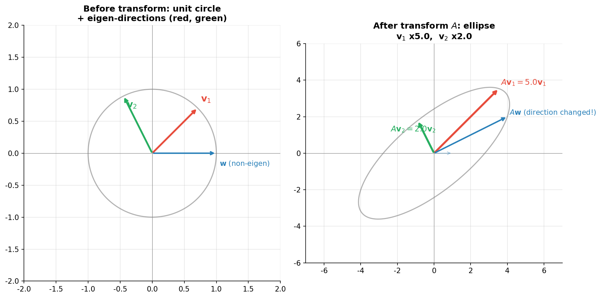
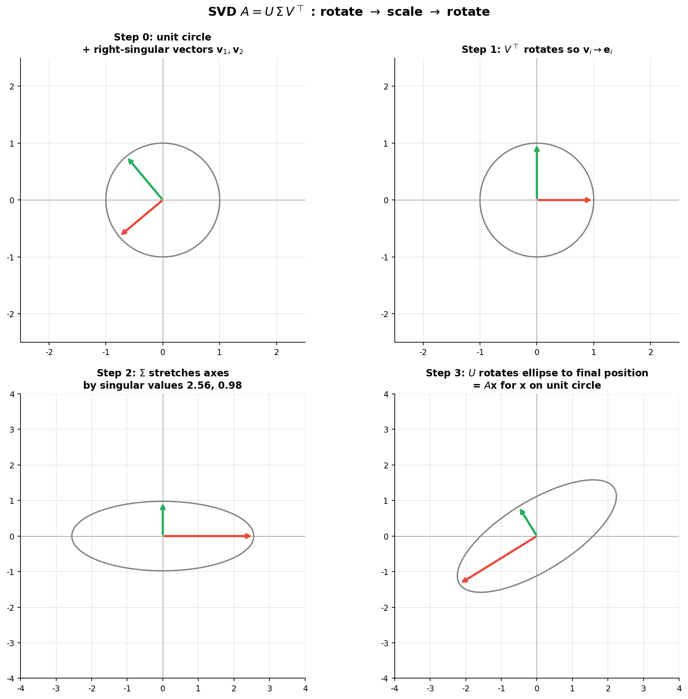
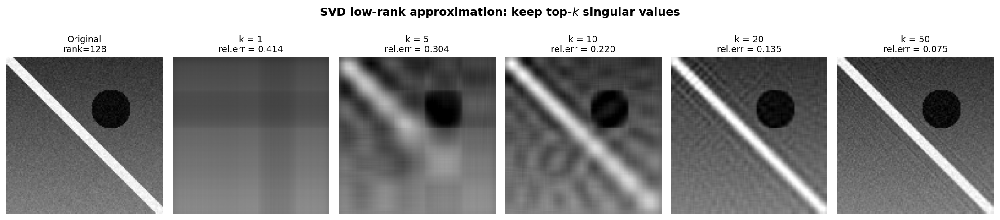

# 特征值与奇异值分解

> **所属路径**：`01_基础能力/02_数学基础/01_线性代数/05_特征值与奇异值分解`
> **预计学习时间**：120 分钟
> **难度等级**：⭐⭐⭐⭐

---

## 前置知识

- [线性变换](../02_线性变换/02_线性变换.md)——矩阵 = 几何变换
- [范数与距离](../03_范数与距离/03_范数与距离.md)——理解谱范数
- [正交化与投影](../04_正交化与投影/04_正交化与投影.md)——正交矩阵的性质
- [代数与方程](../../../../../00_高中复习/01_数学基础/01_代数与方程/)——求解多项式根

> 如果以上内容还不熟悉，建议先完成对应课程再继续。

---

## 学习目标

完成本节后，你将能够：

1. 写出特征值与特征向量的定义，并解释它们的几何含义（"被矩阵放大但不转向"的方向）
2. 用特征方程 $\det(A - \lambda I) = 0$ 求解 2×2 矩阵的特征值与特征向量
3. 写出对角化分解 $A = V \Lambda V^{-1}$ ，并解释它"换坐标系看变换"的意义
4. 写出奇异值分解 $A = U \Sigma V^\top$ 的形式，并理解三个矩阵的几何作用（旋转 → 缩放 → 旋转）
5. 解释 SVD 在 PCA、低秩近似、矩阵伪逆、推荐系统中的核心地位

---

## 正文讲解

走到这里，我们已经掌握了线性代数的两套主要工具：

- 在 [02 线性变换](../02_线性变换/02_线性变换.md) 中，我们学会了把矩阵 $A$ 看作一台几何机器，会把空间旋转、拉伸、剪切；
- 在 [04 正交化与投影](../04_正交化与投影/04_正交化与投影.md) 中，我们学会了用正交基"对齐"空间——好的基底能让计算变简单。

把这两件事合起来，一个自然的问题浮出水面：

> 既然矩阵会让大多数向量"歪七扭八"地变形，**有没有一组特别的方向，让矩阵作用上去后只发生"纯拉伸"——方向不变，只是变长或变短？** 如果有，是不是就可以拿这组方向作为正交基，把矩阵的复杂作用一下子讲清楚？

答案是肯定的。这一节我们要找的就是这组"特殊方向"——它们叫 **特征向量**，对应的拉伸倍数叫 **特征值**。当矩阵不是方阵或不能这样被"对角化"时，我们还有一个更通用的工具—— **奇异值分解（SVD）** ，它把任何矩阵分解成"旋转 → 缩放 → 旋转"三步。这两个工具是 PCA、推荐系统、谱聚类、Transformer 中权重分析等众多算法的数学骨架，也为 [07 矩阵分解应用](../07_矩阵分解应用/07_矩阵分解应用.md) 一节中的更多分解方法埋下伏笔。

### 1. 一个奇怪的问题：哪些方向"被矩阵厚爱"？

回想 [线性变换](../02_线性变换/02_线性变换.md) 一课：矩阵作用在向量上，会让向量被旋转、拉伸、剪切。大多数向量的方向都会改变。

但有一个有趣的发现：**对于很多矩阵，存在一些"特殊方向"——经过变换后方向不变，只是被拉长或压短。**

举个例子，考虑矩阵

$$A = \begin{bmatrix} 3 & 0 \\\\ 0 & 2 \end{bmatrix}$$

它把 $(1, 0)$ 映到 $(3, 0)$ ——方向不变，长度乘了 3 ；把 $(0, 1)$ 映到 $(0, 2)$ ——方向不变，长度乘了 2 。这两个方向就是矩阵 $A$ 的"特殊方向"，对应的拉伸倍数 3 和 2 就是它的"特征值"。

这种"特殊方向 + 拉伸倍数"的二元组，就叫 **特征向量（Eigenvector）** 与 **特征值（Eigenvalue）** 。它们是理解矩阵行为的"金钥匙"——只要找到这些方向，矩阵的复杂作用就被分解成"沿各方向独立缩放"的简单图像。

### 2. 严格定义与求解方法

**定义**：对方阵 $A \in \mathbb{R}^{n \times n}$ ，如果存在非零向量 $\mathbf{v}$ 与标量 $\lambda$ 使得

$$
A\mathbf{v} = \lambda \mathbf{v}
$$

则 $\mathbf{v}$ 称为 $A$ 的特征向量， $\lambda$ 称为对应的特征值。

> **直觉解读**：等式 $A\mathbf{v} = \lambda \mathbf{v}$ 在说："$A$ 作用在 $\mathbf{v}$ 上，效果等同于把 $\mathbf{v}$ 自身缩放 $\lambda$ 倍"——方向丝毫未变。

如何求？把方程改写为 $(A - \lambda I) \mathbf{v} = \mathbf{0}$ 。要有非零解， $A - \lambda I$ 必须不可逆，即：

$$
\det(A - \lambda I) = 0
$$

这就是 **特征方程（characteristic equation）** ，是关于 $\lambda$ 的 $n$ 次多项式。求解它得到所有特征值，再分别代回 $(A - \lambda I) \mathbf{v} = \mathbf{0}$ 求对应特征向量。

**示例**：求矩阵的特征分解。

$$A = \begin{bmatrix} 4 & 1 \\\\ 2 & 3 \end{bmatrix}$$

第一步：

$$
\det(A - \lambda I) = \det \begin{bmatrix} 4 - \lambda & 1 \\\\ 2 & 3 - \lambda \end{bmatrix} = (4-\lambda)(3-\lambda) - 2 = \lambda^2 - 7\lambda + 10 = 0
$$

解得 $\lambda_1 = 5, \lambda_2 = 2$ 。

第二步，对 $\lambda_1 = 5$ ：解 $(A - 5I)\mathbf{v} = \mathbf{0}$ ，得 $\mathbf{v}_1 = (1, 1)^\top$ （或任何标量倍数）。

对 $\lambda_2 = 2$ ：解 $(A - 2I)\mathbf{v} = \mathbf{0}$ ，得 $\mathbf{v}_2 = (1, -2)^\top$ 。

### 3. 特征分解的几何画面

下面这张图展示了上面这个矩阵 $A$ 的几何作用，以及两个特征方向：



> 📌 **图解说明**：左图为单位圆和两条特征方向（红、绿）；右图为 $A$ 作用后的椭圆——红色方向被拉伸 5 倍（特征值 = 5），绿色方向被拉伸 2 倍（特征值 = 2）。其他普通方向（如蓝色）的箭头方向都改变了，只有特征方向保持原向。可以运行 `code/plot_eigenvectors.py` 自行生成这张图。

### 4. 对角化——"换坐标系"看清矩阵

如果 $A$ 有 $n$ 个线性无关的特征向量 $\mathbf{v}_1, \ldots, \mathbf{v}_n$ （对应特征值 $\lambda_1, \ldots, \lambda_n$ ），把它们排成矩阵 $V = [\mathbf{v}_1 \mid \cdots \mid \mathbf{v}_n]$ ，把特征值排成对角阵 $\Lambda = \mathrm{diag}(\lambda_1, \ldots, \lambda_n)$ ，则有：

$$
A = V \Lambda V^{-1}
$$

这就是 **对角化分解（Diagonalization / Eigendecomposition）** 。它的几何含义无比优美：

> **直觉解读**：把 $\mathbf{x}$ 经过 $A$ 变换分三步走——
> 1. $V^{-1}\mathbf{x}$ ：把 $\mathbf{x}$ 表示在特征向量这组"自然坐标系"下的坐标
> 2. $\Lambda$ ：在每个坐标轴方向独立缩放对应特征值倍
> 3. $V$ ：再把缩放后的坐标变回原坐标系
>
> 一句话：**矩阵 $A$ 在它自己的特征基下，就是一组独立的轴向缩放**。

这正是为什么对角化能让计算变简单——在特征基下，矩阵的幂、矩阵指数都退化为对每个特征值做相同操作：

$$
A^k = V \Lambda^k V^{-1}
$$

### 5. 特殊情况——对称矩阵的"完美分解"

并非所有矩阵都能对角化，特征向量也未必正交。但有一类矩阵特别"友好"：

> **谱定理（Spectral Theorem）**：实对称矩阵 $A = A^\top$ 必然有 $n$ 个**实**特征值，对应的特征向量可选为**两两正交**。

记正交特征向量构成的正交矩阵为 $Q$ ，则：

$$
A = Q \Lambda Q^\top \quad (\text{当 } A = A^\top)
$$

注意是 $Q^\top$ 而不是 $Q^{-1}$ ——这两个相等是因为 $Q$ 正交。这种分解最稳定、最美。后面的 PCA、协方差分析、二次型优化全部依赖于此。

### 6. 奇异值分解（SVD）——任意矩阵的"通用语言"

特征分解只对方阵有效，且未必所有方阵都能对角化。对于一般的 $m \times n$ 矩阵呢？答案是 **奇异值分解（Singular Value Decomposition, SVD）** ——它是线性代数的"皇冠之珠"。

任何实矩阵 $A \in \mathbb{R}^{m \times n}$ 都可以写成：

$$
A = U \Sigma V^\top
$$

其中：
- $U \in \mathbb{R}^{m \times m}$ 是正交矩阵（$U^\top U = I$ ），它的列叫 **左奇异向量**
- $V \in \mathbb{R}^{n \times n}$ 是正交矩阵，它的列叫 **右奇异向量**
- $\Sigma \in \mathbb{R}^{m \times n}$ 是"对角矩阵"（仅主对角线非零，其他元素为 0 ），对角元 $\sigma_1 \geq \sigma_2 \geq \cdots \geq 0$ 叫 **奇异值**

奇异值有清晰的几何含义：



> 📌 **图解说明**：任何线性变换 $A$ 都可以分解为"旋转 → 缩放 → 旋转"三步。右上：$V^\top$ 把单位圆和右奇异向量旋转到坐标轴；右下： $\Sigma$ 把圆沿坐标轴拉伸为椭圆，半轴长度就是奇异值；左下： $U$ 把椭圆旋转到最终位置。可以运行 `code/plot_svd_geometry.py` 自行生成这张图。

> **直觉解读（一句话）**：SVD 告诉我们 **任何矩阵 = 旋转 × 缩放 × 旋转**。再复杂的线性变换都是这三种最基本的操作的组合。

奇异值的几何含义：$\sigma_1$ = 矩阵把单位圆变成椭圆后**最长半轴**的长度（也即 [范数与距离](../03_范数与距离/03_范数与距离.md) 中提到的**谱范数** $\|A\|_2$ ）。 $\sigma_n$ = 最短半轴。所有奇异值组成"椭圆的形状描述"。

### 7. SVD 的两个超能力

#### 能力一：低秩近似（Eckart-Young 定理）

把 SVD 中只保留前 $k$ 个最大奇异值（其余置零）：

$$
A_k = U \Sigma_k V^\top = \sum_{i=1}^{k} \sigma_i \mathbf{u}_i \mathbf{v}_i^\top
$$

**Eckart-Young 定理**：在所有秩为 $k$ 的矩阵中， $A_k$ 是与 $A$ 距离最近的那一个（无论用 Frobenius 范数还是谱范数衡量）。

这个定理是无数 AI 算法的基石：

- **PCA**：把数据矩阵做 SVD，只保留前 $k$ 个奇异值，就完成了 $k$ 维降维
- **图像压缩**：把图像看成矩阵做 SVD，丢掉小奇异值得到压缩版
- **LoRA 微调**：把权重更新约束为 $\Delta W = BA$ （秩 $r$），只学小矩阵 $A, B$ 即可，参数量大幅减少
- **推荐系统**：把"用户 × 物品"的稀疏评分矩阵做截断 SVD，就能预测缺失评分

下面这张图直观演示了用前 $k$ 个奇异值压缩一张图：



> 📌 **图解说明**：左侧为原图（满秩），中间从 $k=5$ 到 $k=50$ 的不同秩近似。可以看到 $k=20$ 已能保留主要内容， $k=50$ 几乎与原图无异——这就是为什么 SVD 是工程上最实用的"压缩+降维"工具。可以运行 `code/plot_svd_image_compression.py` 自行生成这张图。

#### 能力二：求伪逆，处理欠定/超定问题

对于不可逆或非方矩阵 $A$ ，定义 **Moore-Penrose 伪逆** ：

$$
A^+ = V \Sigma^+ U^\top
$$

其中 $\Sigma^+$ 把 $\Sigma$ 中所有非零奇异值取倒数，零奇异值保持为零（再转置）。

伪逆给出最小二乘问题 $\min \|A\mathbf{x} - \mathbf{b}\|_2$ 的"最稳健解" $\mathbf{x}^* = A^+ \mathbf{b}$ ，即使 $A^\top A$ 不可逆也能用。在实际工程中（病态数据、共线特征），伪逆比求逆稳健得多。

### 8. 特征分解 vs SVD——别搞混

| 维度 | 特征分解 $A = V\Lambda V^{-1}$ | SVD $A = U \Sigma V^\top$ |
| ---- | -------- | -------- |
| 适用矩阵 | 方阵，且要可对角化 | **任何**矩阵（包括非方阵） |
| 分解结果 | $V$ 一般**不正交** | $U, V$ 都是**正交矩阵** |
| 谱值符号 | 特征值可正可负甚至复数 | 奇异值**恒为非负实数** |
| 几何含义 | 找"被矩阵厚爱"的方向 | 找输入空间和输出空间的两套"主轴" |
| 数值稳定 | 一般 | 极稳定，工程首选 |
| 与 $A^\top A$ 的关系 | — | $\sigma_i^2 = \lambda_i(A^\top A)$ |

**关键联系**：当 $A$ 是对称半正定矩阵时，特征分解和 SVD 完全一致，且 $\sigma_i = \lambda_i$ 。这就是为什么 PCA 既可以"对协方差矩阵做特征分解"，也可以"对中心化数据矩阵做 SVD"——殊途同归。

### 9. 在 AI 中的应用全景

特征值与 SVD 在现代 AI 中无所不在：

- **PCA / 数据降维**：核心算法（详见 [降维](../../../../../02_核心原理/02_经典机器学习/09_降维/) ）
- **谱聚类**：对图拉普拉斯矩阵做特征分解
- **PageRank**：网页排名 = 转移矩阵的主特征向量
- **LoRA 微调**：低秩分解的工程化（详见 [低秩适配微调](../../../../../02_核心原理/05_现代人工智能与大模型/05_低秩适配微调/) ）
- **推荐系统**：矩阵分解（详见 [推荐系统基础/03_矩阵分解](../../../../../02_核心原理/02_经典机器学习/20_推荐系统基础/03_矩阵分解/) ）
- **GAN 谱归一化**：用最大奇异值约束权重，稳定训练
- **图像压缩、降噪**：保留大奇异值，丢掉小奇异值（视为噪声）
- **二次型优化、凸性分析**：通过 Hessian 的特征值正负判断函数凸性
- **Transformer 注意力分析**：用 SVD 分析 $W_Q W_K^\top$ 的"主头方向"

---

## 动手实践

```python
# 文件：code/eigen_svd_demo.py
# 演示特征分解与 SVD,以及它们在低秩近似中的应用
# 环境要求：Python 3.10+, numpy

import numpy as np

# ---- 1. 手算特征分解 ----
A = np.array([[4, 1],
              [2, 3]], dtype=float)
eigvals, eigvecs = np.linalg.eig(A)
print("矩阵 A =\n", A)
print("特征值 lambda =", eigvals)              # 应为 [5, 2]
print("特征向量(按列) =\n", eigvecs.round(3))

# 验证 A v = lambda v
for i in range(2):
    Av = A @ eigvecs[:, i]
    lam_v = eigvals[i] * eigvecs[:, i]
    print(f"A @ v{i+1} =", Av.round(3), "  lambda{i+1} * v{i+1} =", lam_v.round(3))

# ---- 2. 对角化重构 A ----
V = eigvecs
Lambda = np.diag(eigvals)
A_reconstructed = V @ Lambda @ np.linalg.inv(V)
print("\n用 V Lambda V^-1 重构 A =\n", A_reconstructed.round(3))
print("是否与 A 相等?", np.allclose(A, A_reconstructed))

# ---- 3. 对称矩阵的特征分解(正交特征向量) ----
S = np.array([[2, 1],
              [1, 3]], dtype=float)        # 对称矩阵
eigvals_s, eigvecs_s = np.linalg.eigh(S)   # eigh 专为对称/Hermitian 矩阵
print("\n对称矩阵 S 的特征值:", eigvals_s)
print("特征向量正交性 Q^T Q =\n", (eigvecs_s.T @ eigvecs_s).round(8))

# ---- 4. 奇异值分解 ----
M = np.array([[3, 1, 1],
              [-1, 3, 1]], dtype=float)    # 2x3 非方阵
U, sigmas, Vt = np.linalg.svd(M)
print("\n矩阵 M 形状:", M.shape)
print("U 形状:", U.shape, "  Sigma:", sigmas, "  V^T 形状:", Vt.shape)
print("U^T U =\n", (U.T @ U).round(8), "  (应为单位阵)")
print("V V^T =\n", (Vt @ Vt.T).round(8), "  (应为单位阵)")

# 验证 M = U Sigma V^T
Sigma_full = np.zeros_like(M)
Sigma_full[:2, :2] = np.diag(sigmas)
M_reconstructed = U @ Sigma_full @ Vt
print("U Sigma V^T =\n", M_reconstructed.round(3))
print("是否与 M 相等?", np.allclose(M, M_reconstructed))

# ---- 5. 用 SVD 做低秩近似 ----
np.random.seed(0)
# 构造一个本质上低秩的矩阵 + 噪声
true_rank = 3
m, n = 100, 50
B = np.random.randn(m, true_rank)
C = np.random.randn(true_rank, n)
A_lowrank = B @ C + 0.01 * np.random.randn(m, n)   # 本质秩=3,加点噪声

U2, s2, Vt2 = np.linalg.svd(A_lowrank, full_matrices=False)
print("\n前 6 个奇异值:", s2[:6].round(3))
# 用前 3 个奇异值重构
k = 3
A_k = U2[:, :k] @ np.diag(s2[:k]) @ Vt2[:k, :]
relative_err = np.linalg.norm(A_lowrank - A_k, 'fro') / np.linalg.norm(A_lowrank, 'fro')
print(f"用前 {k} 个奇异值重构, 相对 Frobenius 误差 = {relative_err:.4f}")
print("(噪声很小,所以 k=3 已经几乎完美重构)")

# ---- 6. SVD 求伪逆 ----
A_pinv_svd = Vt2.T @ np.diag([1/s if s > 1e-10 else 0 for s in s2]) @ U2.T
A_pinv_np = np.linalg.pinv(A_lowrank)
print("\n手算伪逆与 NumPy pinv 是否一致?", np.allclose(A_pinv_svd, A_pinv_np))
```

**运行说明**：

- 环境要求：Python 3.10+，numpy
- 运行命令：`python code/eigen_svd_demo.py`

**预期输出**（关键部分）：

```
矩阵 A =
 [[4. 1.]
 [2. 3.]]
特征值 lambda = [5. 2.]
...
对称矩阵 S 的特征值: [1.38196601 3.61803399]
特征向量正交性 Q^T Q =
 [[1. 0.]
 [0. 1.]]
...
矩阵 M 形状: (2, 3)
U 形状: (2, 2)   Sigma: [3.464 3.162]   V^T 形状: (3, 3)
...
前 6 个奇异值: [70.621 68.574 58.98   0.161  0.153  0.143]
用前 3 个奇异值重构, 相对 Frobenius 误差 = 0.0058
(噪声很小,所以 k=3 已经几乎完美重构)
```

注意第 5 步——前 3 个奇异值远大于第 4 个之后的，说明矩阵的"本质信息"集中在头 3 个方向上。这就是 SVD"压缩"的核心机制。

---

## 典型误区

| 误区 | 正确理解 |
| ---- | -------- |
| 特征值一定是实数 | 错。一般实矩阵的特征值可以是复数（成对出现）。只有**对称矩阵**保证实特征值 |
| 所有方阵都能对角化 | 错。如 Jordan 块 $A$（第 1 行为 $(1, 1)$ ，第 2 行为 $(0, 1)$ ）只有一个线性无关的特征向量，不可对角化（叫"亏损矩阵"） |
| 奇异值可以是负数 | 错。奇异值**永远非负** ，按惯例还按降序排列 |
| 特征值就是奇异值 | 仅当矩阵是**对称半正定**时两者相等。一般情况下 $\sigma_i = \sqrt{\lambda_i(A^\top A)}$ |
| SVD 中 $U, V$ 唯一确定 | 不是。如果有重复奇异值，对应的奇异向量可在子空间内任意正交基化。即使奇异值都不同，也可以整列变号 |
| Eigendecomposition 比 SVD 更基础 | 工程上**SVD 更稳定也更通用**，对任何矩阵都成立。Eigendecomposition 只是一种特殊情况（方阵且可对角化） |
| PCA 必须先求协方差矩阵再特征分解 | 等价方法：直接对中心化数据矩阵做 SVD，更快更稳。两条路得到同样的主成分方向 |

---

## 练习题

### 练习 1：手算 2×2 特征分解（难度：⭐⭐）

求下列矩阵的所有特征值与对应特征向量。

$$A = \begin{bmatrix} 2 & 1 \\\\ 1 & 2 \end{bmatrix}$$

<details>
<summary>💡 提示</summary>

先解 $\det(A - \lambda I) = 0$ 找特征值，再代回 $(A - \lambda I)\mathbf{v} = \mathbf{0}$ 求特征向量。注意 $A$ 对称，特征向量应正交。

</details>

<details>
<summary>✅ 参考答案</summary>

特征方程：

$$\det \begin{bmatrix} 2-\lambda & 1 \\\\ 1 & 2-\lambda \end{bmatrix} = (2-\lambda)^2 - 1 = 0$$

解得 $\lambda_1 = 3, \lambda_2 = 1$ 。

对 $\lambda_1 = 3$ ：$(A - 3I)\mathbf{v} = \mathbf{0}$ 得 $-v_1 + v_2 = 0$ ，特征向量 $\mathbf{v}_1 = (1, 1)^\top$

对 $\lambda_2 = 1$ ：$(A - I)\mathbf{v} = \mathbf{0}$ 得 $v_1 + v_2 = 0$ ，特征向量 $\mathbf{v}_2 = (1, -1)^\top$

验证正交：$\mathbf{v}_1 \cdot \mathbf{v}_2 = 1 - 1 = 0$ ✓

</details>

### 练习 2：对角化与矩阵幂（难度：⭐⭐⭐）

利用上一题的特征分解，计算 $A^{10}$ 的（1,1）元素，无需把 10 次矩阵乘法老老实实做完。

<details>
<summary>💡 提示</summary>

$A = V \Lambda V^{-1} \Rightarrow A^{10} = V \Lambda^{10} V^{-1}$ 。 $\Lambda^{10}$ 只是把对角元各自取 10 次方。

</details>

<details>
<summary>✅ 参考答案</summary>

$$V = \begin{bmatrix} 1 & 1 \\\\ 1 & -1 \end{bmatrix}, \quad V^{-1} = \dfrac{1}{2} \begin{bmatrix} 1 & 1 \\\\ 1 & -1 \end{bmatrix}, \quad \Lambda^{10} = \begin{bmatrix} 3^{10} & 0 \\\\ 0 & 1 \end{bmatrix} = \begin{bmatrix} 59049 & 0 \\\\ 0 & 1 \end{bmatrix}$$

$$A^{10} = V \Lambda^{10} V^{-1} = \dfrac{1}{2} \begin{bmatrix} 1 & 1 \\\\ 1 & -1 \end{bmatrix} \begin{bmatrix} 59049 & 0 \\\\ 0 & 1 \end{bmatrix} \begin{bmatrix} 1 & 1 \\\\ 1 & -1 \end{bmatrix}$$

计算得 $(A^{10})_{11} = \dfrac{59049 + 1}{2} = 29525$ 。可以用 NumPy 验证 `np.linalg.matrix_power(A, 10)[0, 0]` 。

</details>

### 练习 3：SVD 的几何含义（难度：⭐⭐）

考虑下列矩阵的 SVD：

$$A = \begin{bmatrix} 2 & 0 \\\\ 0 & 3 \\\\ 0 & 0 \end{bmatrix}$$

显然 $\Sigma = \mathrm{diag}(3, 2)$ 在合适重排下，$U, V$ 也是简单的置换矩阵。请写出完整的 $U, \Sigma, V$ ，并解释这个 $A$ 的几何含义。

<details>
<summary>💡 提示</summary>

奇异值需按**降序**排列。注意 $A$ 把 $\mathbb{R}^2$ 嵌入 $\mathbb{R}^3$ 。

</details>

<details>
<summary>✅ 参考答案</summary>

奇异值 $\sigma_1 = 3, \sigma_2 = 2$ （降序）。

$$V = \begin{bmatrix} 0 & 1 \\\\ 1 & 0 \end{bmatrix}$$

（把 $\mathbf{e}_1, \mathbf{e}_2$ 调换以让大奇异值在前）

$$\Sigma = \begin{bmatrix} 3 & 0 \\\\ 0 & 2 \\\\ 0 & 0 \end{bmatrix}$$

$$U = \begin{bmatrix} 0 & 1 & 0 \\\\ 1 & 0 & 0 \\\\ 0 & 0 & 1 \end{bmatrix}$$

几何上 $A$ 把 2D 空间"先在 $V^\top$ 下交换两轴，再沿轴拉伸 3 和 2 倍，再在 $U$ 下交换轴并嵌入 3D"。可以用 `np.linalg.svd(A)` 验证。

</details>

### 练习 4：低秩近似的应用（难度：⭐⭐⭐）

构造一个 6×4 的矩阵 $A$ ，其前两行重复三次（即第 3、5 行 = 第 1 行；第 4、6 行 = 第 2 行）。

- (a) 不计算，先猜：这个矩阵的秩是多少？非零奇异值有几个？
- (b) 实际用 `numpy.linalg.svd` 求所有奇异值，验证你的猜测
- (c) 解释这个例子如何说明"SVD 能自动发现矩阵的内在秩"

<details>
<summary>💡 提示</summary>

矩阵的秩 = 线性无关行（或列）的个数。如果有重复行，秩会显著降低。

</details>

<details>
<summary>✅ 参考答案</summary>

(a) 只有 2 个线性无关的行（第 1 行和第 2 行），所以秩 = 2 ，非零奇异值 = 2 个。

(b) 例如取 $A$ 的第 1 行 = $(1, 2, 3, 4)$ ，第 2 行 = $(2, 0, 1, 1)$ ，重复构造。运行：

```python
import numpy as np
A = np.array([[1, 2, 3, 4], [2, 0, 1, 1],
              [1, 2, 3, 4], [2, 0, 1, 1],
              [1, 2, 3, 4], [2, 0, 1, 1]], dtype=float)
print(np.linalg.svd(A, compute_uv=False).round(6))
# 应输出类似 [9.434  3.873  0.  0.] (前 2 个非零,后 2 个为 0)
```

(c) 本例中我们"知道"秩是 2 ，但 SVD 自动发现了这一点——奇异值数列的"陡降到 0"（或在带噪声情况下"陡降到很小"）位置直接告诉我们矩阵的内在维度。这正是 PCA 和"自适应秩选择"的工作原理。

</details>

---

## 下一步学习

- 📖 下一个知识点：[矩阵求导直觉](../06_矩阵求导直觉/06_矩阵求导直觉.md)——把多元微积分写成矩阵形式
- 🔗 相关知识点：[降维](../../../../../02_核心原理/02_经典机器学习/09_降维/)——PCA 的工程实现
- 🔗 相关知识点：[矩阵分解应用](../07_矩阵分解应用/07_矩阵分解应用.md)——QR、Cholesky、LU 等其他常用分解
- 📚 拓展阅读：[低秩适配微调](../../../../../02_核心原理/05_现代人工智能与大模型/05_低秩适配微调/)——SVD 思想在大模型中的应用

---

## 参考资料

1. [Gilbert Strang - MIT 18.06 Lectures 21-22 (Eigenvalues and SVD)](https://ocw.mit.edu/courses/18-06-linear-algebra-spring-2010/) — MIT 公开课（CC BY-NC-SA）
2. [3Blue1Brown - Eigenvectors and eigenvalues](https://www.youtube.com/watch?v=PFDu9oVAE-g) — 用动画讲解特征值的几何（公开视频）
3. [Wikipedia - Singular value decomposition](https://en.wikipedia.org/wiki/Singular_value_decomposition) — SVD 的严格定义与性质（公共知识库）
4. [Trefethen & Bau《Numerical Linear Algebra》Chapters 4-5](https://people.maths.ox.ac.uk/trefethen/text.html) — SVD 的数值算法与稳定性
5. [Eckart-Young theorem on Wikipedia](https://en.wikipedia.org/wiki/Low-rank_approximation) — 低秩近似的最优性证明（公共知识库）
