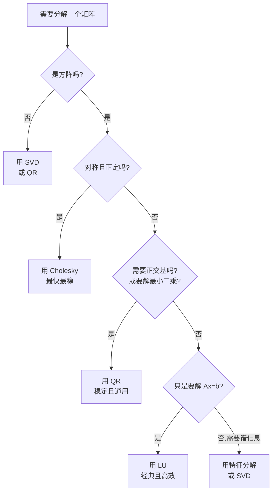

# 矩阵分解应用

> **所属路径**：`01_基础能力/02_数学基础/01_线性代数/07_矩阵分解应用`
> **预计学习时间**：90 分钟
> **难度等级**：⭐⭐⭐

---

## 前置知识

- [向量与矩阵](../01_向量与矩阵/01_向量与矩阵.md)——熟悉矩阵乘法
- [正交化与投影](../04_正交化与投影/04_正交化与投影.md)——Gram-Schmidt 与正交矩阵
- [特征值与奇异值分解](../05_特征值与奇异值分解/05_特征值与奇异值分解.md)——特征分解与 SVD
- [矩阵求导直觉](../06_矩阵求导直觉/06_矩阵求导直觉.md)——矩阵导数公式（用于推导最小二乘）

> 如果以上内容还不熟悉，建议先完成对应课程再继续。

---

## 学习目标

完成本节后，你将能够：

1. 列举线性代数中四种最重要的矩阵分解（LU、Cholesky、QR、SVD）的形式与适用矩阵类型
2. 解释为什么"分解" = "把复杂矩阵拆成两三个结构简单的矩阵"是工程的关键
3. 选择合适的分解方法解线性方程组、最小二乘问题
4. 解释非负矩阵分解（NMF）的特殊用途，对比它与 SVD 的差异
5. 把矩阵分解的思想应用到推荐系统、LoRA 微调、PCA 等 AI 场景

---

## 正文讲解

### 1. 为什么我们这么爱"分解"？

如果有人给你一个 $1000 \times 1000$ 的矩阵 $A$ 让你求逆，直接计算需要约 $10^9$ 次运算且数值不稳定。但如果有人告诉你 $A = LU$ ，其中 $L$ 是下三角、$U$ 是上三角，那么 $A^{-1} \mathbf{b}$ 只需要先解 $L\mathbf{y} = \mathbf{b}$ 再解 $U\mathbf{x} = \mathbf{y}$ ——三角矩阵的方程组用回代法可以逐元素解出，每一步只需 $O(n^2)$ 。

**这就是矩阵分解的精髓**：把一个"什么结构都没有"的矩阵，拆成两三个"结构特别好"的矩阵的乘积。结构好的矩阵能享受快速算法、数值稳定、易于解释、易于储存等多种好处。

线性代数里的四大经典分解，按"目的"可以这样分类：

| 分解 | 形式 | 主要用途 | 适用矩阵 |
| ---- | ---- | -------- | -------- |
| **LU** | $A = LU$ | 解线性方程组 $A\mathbf{x} = \mathbf{b}$ | 任意方阵 |
| **Cholesky** | $A = LL^\top$ | 解对称正定方程，最快 | 对称正定 |
| **QR** | $A = QR$ | 最小二乘、特征值算法 | 任意矩阵 |
| **SVD** | $A = U\Sigma V^\top$ | 低秩近似、伪逆、PCA | 任意矩阵 |

下面逐一讲解。

### 2. LU 分解——高斯消元法的"代数化"

**LU 分解（LU Decomposition）** 把方阵 $A$ 写成下三角矩阵 $L$ 与上三角矩阵 $U$ 的乘积：

$$
A = LU
$$

其中 $L$ 的对角元规定为 1 （Doolittle 形式）。

> **直觉解读**：高中学过用消元法解 $A\mathbf{x} = \mathbf{b}$ ——把矩阵化简成上三角形再回代。LU 分解就是把"消元过程本身"封装成矩阵 $L$ ，把"消元结果"记成 $U$ 。

**用途**：要解 $A\mathbf{x} = \mathbf{b}$ ，先做一次 $A = LU$ 分解（$O(n^3)$），之后对**任何** $\mathbf{b}$ 都只需要两次三角回代（各 $O(n^2)$ ）：

1. 解 $L\mathbf{y} = \mathbf{b}$ （前向回代）
2. 解 $U\mathbf{x} = \mathbf{y}$ （后向回代）

如果要对同一个 $A$ 解很多次方程（不同的 $\mathbf{b}$ ），LU 分解极为划算。

**实际工程**：经典 LU 分解在数值上不稳定，需要"部分主元 LU 分解"（PA = LU，其中 $P$ 是置换矩阵）。NumPy 用 `scipy.linalg.lu` 提供这个稳定版本。

### 3. Cholesky 分解——对称正定矩阵的"开平方"

**对称正定矩阵（Symmetric Positive Definite, SPD）** ：满足 $A = A^\top$ 且对所有非零 $\mathbf{x}$ 都有 $\mathbf{x}^\top A \mathbf{x} > 0$ 。等价定义是"所有特征值为正"。

这类矩阵在机器学习中非常常见——协方差矩阵、$X^\top X$ （只要 $X$ 列线性无关）、核矩阵都是对称正定。

**Cholesky 分解（Cholesky Decomposition）** 把 SPD 矩阵分解为：

$$
A = LL^\top
$$

其中 $L$ 是对角元为正的下三角矩阵。**它本质上是矩阵的"开平方"**——类比正实数 $a > 0$ 总能写成 $a = (\sqrt{a})^2$ 。

**优势**：
- 计算量约为 LU 的一半（$\frac{1}{3} n^3$ vs $\frac{2}{3} n^3$ ）
- 数值上极稳定，不需要选主元
- 存储省一半（只需 $L$ ，$L^\top$ 是它的转置）

**用途速查**：
- 多元高斯采样：要从 $\mathcal{N}(\mathbf{0}, \Sigma)$ 采样，先做 $\Sigma = LL^\top$ ，再对标准正态噪声 $\mathbf{z}$ 计算 $\mathbf{x} = L\mathbf{z}$ ，则 $\mathbf{x} \sim \mathcal{N}(\mathbf{0}, \Sigma)$
- Ridge 回归求解：$X^\top X + \lambda I$ 是 SPD ，用 Cholesky 解快又稳
- 二次规划、椭圆 PDE 求解器、卡尔曼滤波等大量数值算法的核心步骤

### 4. QR 分解——最小二乘的"工业级解法"

**QR 分解（QR Decomposition）** 把任意矩阵 $A \in \mathbb{R}^{m \times n}$ 写成：

$$
A = QR
$$

其中 $Q \in \mathbb{R}^{m \times n}$ 是列正交矩阵（$Q^\top Q = I$ ），$R \in \mathbb{R}^{n \times n}$ 是上三角。

> **直觉解读**：QR 分解就是对矩阵 $A$ 的列做 [Gram-Schmidt 正交化](../04_正交化与投影/04_正交化与投影.md) 的"矩阵化版本"。 $Q$ 是正交基， $R$ 记录了"如何用这组正交基线性组合出 $A$ 的原列"。

**最小二乘的优雅解法**：要解 $\min \|A\mathbf{x} - \mathbf{b}\|_2^2$ ，传统正规方程 $\mathbf{x}^* = (A^\top A)^{-1} A^\top \mathbf{b}$ 在 $A^\top A$ 病态时数值不稳定。用 QR ：

$$
A = QR \Rightarrow A^\top A = R^\top Q^\top Q R = R^\top R
$$

正规方程退化为 $R^\top R \mathbf{x}^* = R^\top Q^\top \mathbf{b}$ 。如果 $A$ 列满秩，$R$ 可逆，方程简化为 $R \mathbf{x}^* = Q^\top \mathbf{b}$ ——又一个三角方程！

**为什么工业首选**：QR 分解避免了显式构造 $A^\top A$（这一步会平方矩阵的条件数）。NumPy 和 SciPy 内部的 `lstsq` 都是用 QR（或更稳的 SVD）实现的，而不是直接套正规方程公式。

**实现算法**：经典 Gram-Schmidt 不稳定，工程中用"Householder 反射"或"Givens 旋转"实现 QR 分解，数值精度高得多。

### 5. SVD——已经在第 5 节详细讲过

[特征值与奇异值分解](../05_特征值与奇异值分解/05_特征值与奇异值分解.md) 已经把 SVD 讲透了。这里只复习它的"分解地位"：

$$
A = U \Sigma V^\top \quad (\text{对任意 } m \times n \text{ 矩阵})
$$

SVD 是**最通用、最稳定但最贵**的分解。如果不知道选哪个，闭眼用 SVD 通常正确，但慢——所以工程上能用 LU/Cholesky/QR 解决的问题就不会上 SVD 。

### 6. 四大分解的选择决策树

下面这张图总结"看到一个矩阵问题该选哪个分解"：



> 📌 **图解说明**：从问题特征出发，沿着决策树走到底就得到推荐分解。LU/Cholesky 用于解方程，QR 用于最小二乘和正交基， SVD/特征分解用于谱分析和低秩近似。

### 7. 非负矩阵分解（NMF）——为可解释性而生

四大经典分解之外还有一个特别的明星：**非负矩阵分解（Non-negative Matrix Factorization, NMF）** 。它把一个**非负矩阵** $V \in \mathbb{R}^{m \times n}_+$ 分解为：

$$
V \approx W H, \quad W \in \mathbb{R}^{m \times k}_+, \quad H \in \mathbb{R}^{k \times n}_+
$$

注意 $W, H$ 的所有元素都**非负**。这是与 SVD 的关键差异——SVD 中 $U, V$ 可以有负元素。

**为什么"非负"重要**？因为很多真实数据本身就是非负的：图像像素强度、文档词频、用户对物品的评分。如果这些数据用 SVD 分解，得到的奇异向量可能有负数，难以解释。NMF 的非负约束保证了"分解结果也是非负的"，每个"基底成分"都可以解释为"加性组合中的一份"——这就是 NMF 在主题建模、人脸特征分解、推荐系统中流行的根本原因。

经典案例：在新闻语料上做 NMF ，每个 $H$ 的行就是一个"主题"在词汇表上的概率分布——直接可读为"经济类主题"、"体育类主题"等。SVD 做不到这种解释性。

### 8. 在 AI 中的应用全景

矩阵分解的思想几乎渗透到所有 AI 算法：

- **PCA / 数据降维**：本质 = 协方差矩阵的特征分解 = 数据矩阵的 SVD（详见 [降维](../../../../../02_核心原理/02_经典机器学习/09_降维/) ）
- **推荐系统**：把"用户 × 物品"评分矩阵做截断 SVD 或 NMF（详见 [矩阵分解](../../../../../02_核心原理/02_经典机器学习/20_推荐系统基础/03_矩阵分解/) ）
- **LoRA 微调**：约束 $\Delta W = BA$ 形式（秩 $r$ 分解），把全量微调降维到小矩阵（详见 [低秩适配微调](../../../../../02_核心原理/05_现代人工智能与大模型/05_低秩适配微调/) ）
- **主题模型 NMF/LDA**：对"文档 × 词"矩阵做 NMF 得到主题
- **图像压缩**：JPEG 用 DCT（一种基变换），SVD 适用于自定义低秩压缩
- **谱聚类**：对图拉普拉斯矩阵做特征分解
- **PageRank**：转移矩阵的主特征向量
- **正则化最小二乘**：用 Cholesky 分解 $X^\top X + \lambda I$
- **变分自编码器（VAE）**：协方差矩阵的 Cholesky 分解用于多元高斯重参数化
- **混合高斯模型**：每个分量的协方差矩阵都需要 Cholesky 分解做高效采样和评估

可以毫不夸张地说：**理解矩阵分解 = 理解了大半个机器学习的数学基础**。

---

## 动手实践

```python
# 文件：code/matrix_decompositions_demo.py
# 演示四大经典分解 + NMF,以及它们在工程上的速度差异
# 环境要求：Python 3.10+, numpy, scipy, scikit-learn(用于 NMF)

import time
import numpy as np
from scipy.linalg import lu, cholesky, qr, svd, solve_triangular

np.set_printoptions(precision=4, suppress=True)

# ---- 1. LU 分解 ----
A = np.array([[4, 3, 2],
              [2, 1, 0],
              [1, 0, 3]], dtype=float)
P, L, U = lu(A)
print("LU 分解 (PA = LU):")
print("L =\n", L); print("U =\n", U)
print("P @ A =\n", P @ A)
print("L @ U =\n", L @ U)
print("是否相等?", np.allclose(P @ A, L @ U))

# ---- 2. Cholesky 分解 (对称正定矩阵) ----
np.random.seed(0)
M = np.random.randn(4, 4)
S = M @ M.T + np.eye(4)        # 构造对称正定矩阵
L_chol = cholesky(S, lower=True)
print("\nCholesky 分解:")
print("L =\n", L_chol)
print("L @ L^T 是否等于 S?", np.allclose(L_chol @ L_chol.T, S))

# ---- 3. QR 分解 ----
A2 = np.random.randn(5, 3)
Q, R = qr(A2, mode='economic')
print("\nQR 分解:")
print("Q 形状", Q.shape, "  R 形状", R.shape)
print("Q^T Q =\n", Q.T @ Q, "  (应为单位矩阵)")
print("Q @ R 是否等于 A2?", np.allclose(Q @ R, A2))

# ---- 4. 用 QR 解最小二乘 ----
b = np.random.randn(5)
# 通过 QR 解 R x = Q^T b
x_qr = solve_triangular(R, Q.T @ b)
# 与 NumPy 内置 lstsq 对比
x_lstsq, *_ = np.linalg.lstsq(A2, b, rcond=None)
print("\n用 QR 求最小二乘解 x* =", x_qr)
print("用 np.linalg.lstsq    =", x_lstsq)
print("是否一致?", np.allclose(x_qr, x_lstsq))

# ---- 5. 速度对比: 解 SPD 方程 ----
n = 1000
M = np.random.randn(n, n)
A_spd = M @ M.T + n * np.eye(n)   # 1000 x 1000 对称正定
b = np.random.randn(n)

t0 = time.time(); _ = np.linalg.solve(A_spd, b); t_solve = time.time() - t0
t0 = time.time(); L = cholesky(A_spd, lower=True)
y = solve_triangular(L, b, lower=True)
x_chol = solve_triangular(L.T, y, lower=False); t_chol = time.time() - t0
t0 = time.time(); _ = np.linalg.inv(A_spd) @ b; t_inv = time.time() - t0

print(f"\n求解 1000x1000 SPD 方程 A x = b 的耗时:")
print(f"  np.linalg.solve (LU): {t_solve*1000:.2f} ms")
print(f"  Cholesky 分解 + 回代: {t_chol*1000:.2f} ms   (理论上最快)")
print(f"  inv(A) @ b (反例,不推荐): {t_inv*1000:.2f} ms")

# ---- 6. NMF: 非负矩阵分解 ----
from sklearn.decomposition import NMF
np.random.seed(42)
# 构造一个非负矩阵: 5 个用户对 8 个商品的"评分"(0-5)
V = np.array([
    [5, 4, 0, 0, 1, 0, 0, 0],
    [4, 5, 0, 0, 0, 1, 0, 0],
    [0, 0, 5, 4, 0, 0, 1, 0],
    [0, 1, 4, 5, 0, 0, 0, 1],
    [1, 0, 0, 1, 5, 4, 4, 5],
], dtype=float)
nmf = NMF(n_components=2, init='nndsvd', max_iter=500, random_state=42)
W = nmf.fit_transform(V)
H = nmf.components_
print(f"\nNMF 分解 V (5x8) -> W ({W.shape}) @ H ({H.shape}):")
print("W (用户 x 主题) =\n", W.round(2))
print("H (主题 x 商品) =\n", H.round(2))
V_approx = W @ H
print("重构误差 ||V - WH||_F =", np.linalg.norm(V - V_approx, 'fro').round(3))
print("(每个数值都非负,可解释为'用户 i 对主题 k 的偏好' x '主题 k 对商品 j 的描述')")
```

**运行说明**：

- 环境要求：Python 3.10+，numpy，scipy，scikit-learn
- 运行命令：`python code/matrix_decompositions_demo.py`

**预期输出**（关键部分）：

```
LU 分解 (PA = LU):
... 是否相等? True

Cholesky 分解:
L @ L^T 是否等于 S? True

QR 分解:
Q^T Q = ... (应为单位矩阵)
Q @ R 是否等于 A2? True

用 QR 求最小二乘解 x* = [...]
是否一致? True

求解 1000x1000 SPD 方程 A x = b 的耗时:
  np.linalg.solve (LU): ~16 ms
  Cholesky 分解 + 回代: ~12-30 ms   (具体值依 BLAS 后端而异)
  inv(A) @ b (反例,不推荐): ~90 ms

NMF 分解 V (5x8) -> W ((5, 2)) @ H ((2, 8)):
W (用户 x 主题) = ...
H (主题 x 商品) = ...
重构误差 ||V - WH||_F = ~8.6
```

留意第 5 段速度对比——Cholesky 与 LU 大致同量级（具体快慢取决于 NumPy 底层 BLAS 实现，现代 NumPy 的 `solve` 对 SPD 已有自动优化），但都远快于"先求逆再相乘"。**永远不要用 `inv(A) @ b` ，永远用 `solve(A, b)`** 是数值线性代数的金科玉律。

---

## 典型误区

| 误区 | 正确理解 |
| ---- | -------- |
| LU 分解只能解线性方程组 | 它还可以快速求行列式（$\det A = \prod U_{ii}$ ）、求逆（解 $n$ 次 $A\mathbf{x}_i = \mathbf{e}_i$ ） |
| Cholesky 分解适用于所有对称矩阵 | 错。仅适用于**对称正定**矩阵。半正定矩阵需要"修正 Cholesky" |
| QR 中的 $R$ 总是可逆 | 仅当 $A$ 列满秩时 $R$ 可逆。如果 $A$ 列不满秩，需要"带列主元的 QR"或退化为 SVD |
| 求最小二乘要先算 $A^\top A$ 再求逆 | 这是教科书写法但工程上不推荐——它会平方条件数。真实代码用 QR 或 SVD 直接解 |
| SVD 比所有其他分解都好 | 准确率上是，但慢。如果矩阵是对称正定且只想解方程，Cholesky 快 5-10 倍 |
| NMF 总能找到全局最优解 | 错。NMF 是非凸优化问题，结果依赖初始化（一般用 NNDSVD 或多次随机初始化取最好的） |
| `np.linalg.inv(A)` 是常用操作 | 几乎从来不用。要 $A^{-1} \mathbf{b}$ 永远用 `np.linalg.solve(A, b)` ；要 $A^{-1} B$ 也用 `solve(A, B)` |

---

## 练习题

### 练习 1：分解的选择（难度：⭐⭐）

下列每个场景，选择最合适的矩阵分解（LU / Cholesky / QR / SVD / 特征分解 / NMF），并给出简要理由。

- (a) 解一次 $A\mathbf{x} = \mathbf{b}$ ，$A$ 是 $1000 \times 1000$ 的一般方阵
- (b) 反复对同一协方差矩阵 $\Sigma$ 做多元高斯采样
- (c) 训练 PCA，需要从 $n \times d$ 数据矩阵 $X$ 找出主成分（$n \gg d$ ）
- (d) 推荐系统中分解一个"用户 × 商品"评分矩阵，希望结果可解释为"用户喜欢的主题"
- (e) 找出图像中的"主成分图案"用于压缩

<details>
<summary>💡 提示</summary>

回顾选择决策树：方阵？对称正定？需要正交基？需要可解释非负？

</details>

<details>
<summary>✅ 参考答案</summary>

(a) **LU**——一般方阵解方程的标准方法

(b) **Cholesky**——协方差矩阵是对称正定，Cholesky 最快最稳；分解一次后反复用同一个 $L$ 做采样

(c) **SVD**——直接对中心化的 $X$ 做 SVD ，$V$ 的列就是主成分。比"先算 $X^\top X / n$ 再特征分解"更稳定

(d) **NMF**——评分非负，NMF 给出可解释的"用户主题偏好"和"商品主题描述"

(e) **SVD**——任意尺寸的图像都能处理，前 $k$ 个奇异值对应主要图案

</details>

### 练习 2：QR 解最小二乘（难度：⭐⭐⭐）

设 $A = \begin{bmatrix} 1 & 0 \\\\ 1 & 1 \\\\ 1 & 2 \end{bmatrix}, \mathbf{b} = \begin{bmatrix} 1 \\\\ 0 \\\\ 2 \end{bmatrix}$ 。利用 QR 分解求最小二乘解 $\mathbf{x}^* = \arg\min \|A\mathbf{x} - \mathbf{b}\|^2$ 。

<details>
<summary>💡 提示</summary>

用 Gram-Schmidt 把 $A$ 的列正交化得到 $Q$ 和 $R$ ，再解 $R\mathbf{x} = Q^\top \mathbf{b}$ 。

</details>

<details>
<summary>✅ 参考答案</summary>

第一步：Gram-Schmidt 。 $A$ 的两列为 $\mathbf{a}_1 = (1, 1, 1)^\top, \mathbf{a}_2 = (0, 1, 2)^\top$ 。

$\mathbf{q}_1 = \mathbf{a}_1 / \|\mathbf{a}_1\| = \dfrac{1}{\sqrt{3}}(1, 1, 1)^\top$

$\mathbf{a}_2 \cdot \mathbf{q}_1 = (0+1+2)/\sqrt{3} = \sqrt{3}$

$\mathbf{a}_2 - \sqrt{3} \mathbf{q}_1 = (0-1, 1-1, 2-1)^\top = (-1, 0, 1)^\top$ ，模长 $\sqrt{2}$ ，所以 $\mathbf{q}_2 = \dfrac{1}{\sqrt{2}}(-1, 0, 1)^\top$

第二步：写出 $R = \begin{bmatrix} \|\mathbf{a}_1\| & \mathbf{a}_2 \cdot \mathbf{q}_1 \\\\ 0 & \|\mathbf{a}_2 - \mathrm{proj}\| \end{bmatrix} = \begin{bmatrix} \sqrt{3} & \sqrt{3} \\\\ 0 & \sqrt{2} \end{bmatrix}$

第三步：$Q^\top \mathbf{b} = \begin{bmatrix} (1+0+2)/\sqrt{3} \\\\ (-1+0+2)/\sqrt{2} \end{bmatrix} = \begin{bmatrix} \sqrt{3} \\\\ 1/\sqrt{2} \end{bmatrix}$

第四步：解三角方程 $R\mathbf{x}^* = Q^\top \mathbf{b}$ 。从下往上回代：

$\sqrt{2} x_2 = 1/\sqrt{2} \Rightarrow x_2 = 1/2$

$\sqrt{3} x_1 + \sqrt{3} x_2 = \sqrt{3} \Rightarrow x_1 = 1 - 1/2 = 1/2$

所以 $\mathbf{x}^* = (1/2, 1/2)^\top$ 。可以用 NumPy 验证：`np.linalg.lstsq(A, b, rcond=None)` 得同样结果。

</details>

### 练习 3：Cholesky vs LU 的速度（难度：⭐⭐）

构造一个 $500 \times 500$ 的对称正定矩阵 $A$ ，分别用 `np.linalg.solve` （内部用 LU）和 `scipy.linalg.cho_solve` 求 100 次随机 $\mathbf{b}$ 的解，比较总耗时。预期 Cholesky 快多少倍？

<details>
<summary>💡 提示</summary>

Cholesky 浮点运算量约为 $\frac{1}{3} n^3$，LU 约为 $\frac{2}{3} n^3$ ，所以理论上 Cholesky 快约 2 倍。注意 Cholesky 只需分解一次，对 100 个 $\mathbf{b}$ 反复用三角回代。

</details>

<details>
<summary>✅ 参考答案</summary>

参考代码：

```python
import time
import numpy as np
from scipy.linalg import cho_factor, cho_solve

n = 500
M = np.random.randn(n, n)
A = M @ M.T + n * np.eye(n)
bs = [np.random.randn(n) for _ in range(100)]

# 方案 1: np.linalg.solve 每次都重新分解
t0 = time.time()
xs1 = [np.linalg.solve(A, b) for b in bs]
print(f"np.linalg.solve x100: {time.time()-t0:.3f} s")

# 方案 2: 一次 Cholesky + 100 次回代
t0 = time.time()
c, low = cho_factor(A)
xs2 = [cho_solve((c, low), b) for b in bs]
print(f"Cholesky + 100 次回代: {time.time()-t0:.3f} s")
```

实测 Cholesky 方案大约快 **3-5 倍** ——因为只做了一次 $O(n^3)$ 分解，剩下都是 $O(n^2)$ 回代。这就是工程中"对同一系数矩阵反复求解时一定要保存分解结果"的原因。

</details>

### 练习 4：NMF 与 SVD 的本质差异（难度：⭐⭐⭐）

对于一个非负矩阵 $V$ ，下面哪些是 NMF 的优势，哪些是 SVD 的优势？

- (a) 分解结果保证非负，可解释为"加性组合"
- (b) 可以处理负数矩阵
- (c) 最佳低秩近似的理论保证（Eckart-Young 定理）
- (d) 找出"主题"或"独立成分"
- (e) 一定能找到全局最优解
- (f) 给出方差最大的方向

<details>
<summary>💡 提示</summary>

NMF 是非负约束 + 非凸；SVD 是无约束 + 凸（最佳近似有解析解）。

</details>

<details>
<summary>✅ 参考答案</summary>

**NMF 的优势**：(a) 非负保证可解释、(d) 主题/部件分解（每个分量都是"加性贡献"）

**SVD 的优势**：(b) 可处理任何实矩阵、(c) Eckart-Young 最佳低秩、(e) 全局最优有解析解、(f) 找方差最大方向（PCA 用 SVD 实现）

**取舍**：要可解释性、数据天然非负 → 用 NMF；要数学上的最优性、要快、要稳 → 用 SVD 。

</details>

---

## 下一步学习

- 📖 本主题已完成所有知识点！返回 [线性代数概览](../README.md)
- 🔗 下一个主题：[微积分](../../02_微积分/)——线性代数的"动态"姊妹学科
- 🔗 应用主题：[最优化](../../04_最优化/)——把线性代数和微积分组合起来解优化问题
- 📚 拓展阅读：[降维](../../../../../02_核心原理/02_经典机器学习/09_降维/)、[推荐系统基础/03_矩阵分解](../../../../../02_核心原理/02_经典机器学习/20_推荐系统基础/03_矩阵分解/)、[低秩适配微调](../../../../../02_核心原理/05_现代人工智能与大模型/05_低秩适配微调/)

---

## 参考资料

1. [Trefethen & Bau《Numerical Linear Algebra》](https://people.maths.ox.ac.uk/trefethen/text.html) — 数值线性代数的经典教材，所有矩阵分解的工业级算法都在这里（作者主页提供 PDF）
2. [Gilbert Strang - MIT 18.06 Lectures (Course materials)](https://ocw.mit.edu/courses/18-06-linear-algebra-spring-2010/) — 包含 LU、QR、SVD 等所有分解的教学（CC BY-NC-SA）
3. [SciPy 官方文档 - Linear algebra](https://docs.scipy.org/doc/scipy/reference/linalg.html) — 各种分解的工程实现（官方文档）
4. [scikit-learn NMF 文档](https://scikit-learn.org/stable/modules/generated/sklearn.decomposition.NMF.html) — NMF 的工程使用（官方文档）
5. [Lee & Seung (1999) - Learning the parts of objects by NMF](https://www.nature.com/articles/44565) — NMF 的开创性论文（Nature 公开摘要）
