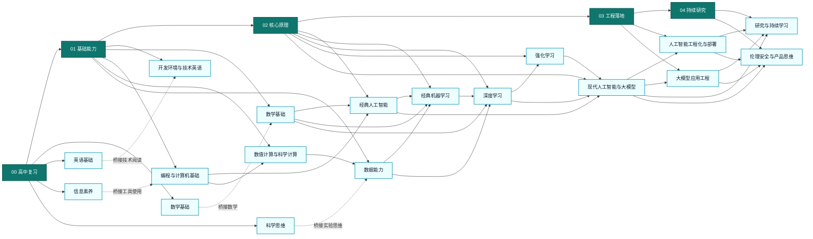

<div align="center">

# 🤖 人工智能中文教程

**从零基础到专业级的系统化人工智能学习路径**

[](#-课程体系)
[](#-课程体系)
[](#-课程体系)
[](#-课程内容规范)

<br>

*高中桥接 → 基础能力 → 核心原理 → 工程落地 → 持续研究*

*目标不是追逐短期热点，而是建立能够长期吸收新知识的能力结构。*

</div>

---

## 📖 目录

- [项目简介](#-项目简介)
- [学习哲学](#-学习哲学)
- [课程体系](#-课程体系)
- [知识图谱](#-知识图谱)
- [学习路线建议](#-学习路线建议)
- [学习里程碑](#-学习里程碑)
- [课程内容规范](#-课程内容规范)
- [参与贡献](#-参与贡献)
- [版权声明 / License](#-版权声明--license)

---

## 💡 项目简介

本项目是一个面向**高中毕业水平、零基础起步**学习者的系统化人工智能课程体系。覆盖从数学、编程、数据处理到机器学习、深度学习、大模型，再到工程部署与前沿研究的完整知识链路。

| 维度 | 说明 |
| :--- | :--- |
| 🎯 适用对象 | 高中毕业水平、零基础起步，希望系统学习人工智能的人 |
| 🏗️ 课程结构 | **5** 大阶段 · **18** 个主题模块 · **180** 个知识主题 · **556** 个知识点 |
| 📂 组织层级 | `阶段 / 主题模块 / 知识主题 / 知识点` |
| 📛 命名规则 | 全部使用中文目录名，数字前缀保持学习顺序稳定 |
| 🧭 核心原则 | 先基础后热点 · 先原理后工具 · 先验证后结论 · 先落地后扩展 |

> [!NOTE]
> 当前工作区已完成目录骨架搭建（556 个知识点目录）。课程正文内容正在**逐步填充**中，欢迎参与贡献。

---

## 🧠 学习哲学

> 本课程体系的设计基于五个核心理念，它们共同确保学习者建立**扎实、完整、可持续**的能力结构。

| 编号 | 理念 | 说明 |
| :---: | :--- | :--- |
| 1 | **底层优先** | 不从热点工具入门，而从底层能力出发 |
| 2 | **学科融合** | 不把数学、编程、数据、模型割裂成彼此无关的学科 |
| 3 | **工程内建** | 不把工程部署视为附加项，而是专业能力的核心部分 |
| 4 | **研究前置** | 不把论文阅读和趋势判断留到最后，理解原理后尽早介入 |
| 5 | **伦理贯穿** | 不把伦理、安全与产品思维当作附录，而是完整的专业判断体系 |

---

## 📚 课程体系

### 阶段 00 · 高中复习

> 补齐进入人工智能领域前最必要的基础知识桥梁。

| 主题模块 | 核心内容 |
| :--- | :--- |
| [数学基础](00_高中复习/01_数学基础) | 代数与方程、函数与图像、指数与对数、数列、三角函数、向量、解析几何、排列组合、概率、统计、集合与逻辑、导数初步、立体几何 |
| [英语基础](00_高中复习/02_英语基础) | 技术词汇、阅读报错信息、阅读文档、总结与记笔记 |
| [信息素养](00_高中复习/03_信息素养) | 文件与文件夹管理、搜索与资料检索、表格与数据处理、逻辑与问题拆解 |
| [科学思维](00_高中复习/04_科学思维) | 变量与控制、观察与假设、相关与因果、图表与证据 |

### 阶段 01 · 基础能力

> 建立可持续学习的工具链与理论底座。

| 主题模块 | 核心内容 |
| :--- | :--- |
| [开发环境与技术英语](01_基础能力/01_开发环境与技术英语) | 编程语言基础、命令行、版本控制、调试、虚拟环境、包管理、Jupyter Notebook、阅读英文文档 |
| [数学基础](01_基础能力/02_数学基础) | 线性代数、微积分、概率论与统计、最优化、信息论 |
| [编程与计算机基础](01_基础能力/03_编程与计算机基础) | 数据结构、算法、面向对象编程、操作系统、计算机网络、数据库、软件工程 |
| [数值计算与科学计算](01_基础能力/04_数值计算与科学计算) | NumPy 基础、Pandas 基础、数值稳定性 |
| [数据能力](01_基础能力/05_数据能力) | 查询语言、数据清洗、特征工程、数据可视化、实验设计、采样、数据泄漏、EDA、数据标注、文本/图像/音频预处理 |

### 阶段 02 · 核心原理

> 理解经典人工智能、机器学习、深度学习、强化学习与大模型的核心机制。

| 主题模块 | 核心内容 |
| :--- | :--- |
| [经典人工智能](02_核心原理/01_经典人工智能) | 人工智能概述、搜索策略、知识表示、确定性推理、不确定性推理、计算智能（遗传算法、粒子群、蚁群）、专家系统 |
| [经典机器学习](02_核心原理/02_经典机器学习) | 回归、分类、朴素贝叶斯、KNN、树模型、核方法、集成方法、聚类、降维、偏差与方差、评估指标、交叉验证、正则化、模型选择、概率图模型、异常检测、可解释性、时间序列、推荐系统 |
| [深度学习](02_核心原理/03_深度学习) | 神经网络、反向传播、优化器、归一化、正则化、权重初始化、损失函数、残差连接、CNN、CV 任务、序列模型、NLP 任务、注意力机制、Transformer、自编码器、生成模型、GNN、调参排错 |
| [强化学习](02_核心原理/04_强化学习) | MDP、价值函数、TD 与 Q 学习、策略梯度、探索与利用、深度 RL、基于模型的 RL、多智能体 RL、离线 RL、逆 RL |
| [现代人工智能与大模型](02_核心原理/05_现代人工智能与大模型) | 表示学习、嵌入、预训练、微调、LoRA、RAG、对齐、推理优化、智能体、多模态、评测、安全与可信、提示工程、MoE、知识蒸馏、长上下文、代码生成、语音大模型、视频生成、世界模型 |

### 阶段 03 · 工程落地

> 将模型训练、部署、监控和运维串成完整工程系统。

| 主题模块 | 核心内容 |
| :--- | :--- |
| [人工智能工程化与部署](03_工程落地/01_人工智能工程化与部署) | 深度学习框架、实验管理、数据管道、模型服务、容器、云平台、GPU 使用、监控、A/B 测试、成本优化、MLOps、特征存储、边缘部署、工作流编排、版本控制、部署安全、分布式训练、模型测试 |
| [大模型应用工程](03_工程落地/02_大模型应用工程) | 提示管理与版本控制、应用链与智能体部署、大模型 API 网关、向量数据库运维、RAG 工程 |

### 阶段 04 · 持续研究

> 建立持续更新知识与做专业判断的能力。

| 主题模块 | 核心内容 |
| :--- | :--- |
| [研究与持续学习](04_持续研究/01_研究与持续学习) | 论文阅读、复现、基线对比、误差分析、基准测试跟踪、源码阅读、顶会跟踪、技术博客、趋势判断、开源社区参与、技术写作、跨学科应用 |
| [伦理安全与产品思维](04_持续研究/02_伦理安全与产品思维) | 隐私、公平性、鲁棒性、对抗风险、版权、合规、用户价值、业务场景、落地决策、可解释性与透明度、环境影响 |

---

## 🗺️ 知识图谱

### 阶段与模块推进关系



### 🔍 完整交互式知识图谱

上面的总览图只展示阶段与主题模块的推进关系。如需查看全部 **556 个知识点**及其层级与跨分支依赖，请使用交互式可视化页面：

👉 **[打开交互式知识图谱](知识图谱可视化/index.html)**（纯前端，直接在浏览器打开即可）

<details>
<summary>📝 交互式知识图谱使用说明</summary>

- 双击 `知识图谱可视化/index.html` 即可在浏览器中打开，无需任何服务器
- 首页默认展示四大核心模块及其直接关系
- 单击任意节点可进入水平分层的聚焦视图（上游在上层，下游在下层）
- 所有可见连线都会展示中文关系说明
- 支持搜索定位、缩放平移、悬浮提示与图例辅助浏览

</details>

---

## 🧭 学习路线建议

根据你的背景和目标，选择最适合的学习路线：

### 🔰 零基础顺序学习

> 基础较弱的学习者，建议按阶段顺序学习。

**推荐路线**：[00 高中复习](00_高中复习) → [01 基础能力](01_基础能力)（开发环境 → 数学 → 编程 → 数值计算 → 数据）→ [02 核心原理](02_核心原理) → [03 工程落地](03_工程落地) → [04 持续研究](04_持续研究)

### 🚀 大模型应用路线

> 目标是大模型应用的学习者，不建议直接从提示工程入手。

**推荐路线**：[自注意力架构](02_核心原理/03_深度学习/14_自注意力架构) → [预训练](02_核心原理/05_现代人工智能与大模型/03_预训练) → [微调](02_核心原理/05_现代人工智能与大模型/04_微调) → [RAG](02_核心原理/05_现代人工智能与大模型/06_检索增强生成) → [对齐](02_核心原理/05_现代人工智能与大模型/07_对齐) → [提示工程与智能体](02_核心原理/05_现代人工智能与大模型/09_智能体) → [大模型应用工程](03_工程落地/02_大模型应用工程)

### 🔧 问题导向学习

> 已经在做项目的学习者，可以反向查找前置知识。

**推荐路线**：从 [03 工程落地](03_工程落地) 或 [04 持续研究](04_持续研究) 出发，反查前置知识 → 回到 [02 核心原理](02_核心原理) 补足原理

> [!TIP]
> - 从核心原理阶段开始后，建议同步学习 [持续研究](04_持续研究) 中的论文阅读、复现、技术写作与趋势判断能力。
> - 遇到公式、代码、数据或实验设计问题时，优先沿知识图谱向前回溯，而不是直接寻找临时答案。
> - 学习到一定阶段后，结合[跨学科应用意识](04_持续研究/01_研究与持续学习)模块，探索 AI 在具体行业中的落地方式。

---

## 🏁 学习里程碑

<table>
<tr>
<td width="120"><strong>里程碑 1</strong></td>
<td>🛠️ <strong>环境就绪</strong>：独立配置开发环境、Jupyter、命令行、版本控制和虚拟环境，完成基础练习。</td>
</tr>
<tr>
<td><strong>里程碑 2</strong></td>
<td>📐 <strong>数理基础</strong>：使用 NumPy 和 Pandas 进行数值计算，读懂线性代数、微积分、概率统计、信息论和最优化在模型训练中的作用。</td>
</tr>
<tr>
<td><strong>里程碑 3</strong></td>
<td>📊 <strong>经典 ML</strong>：独立完成从 EDA、特征工程到评估的经典机器学习项目，理解偏差方差权衡、交叉验证和模型选择流程。</td>
</tr>
<tr>
<td><strong>里程碑 4</strong></td>
<td>🧬 <strong>深度学习</strong>：使用深度学习框架完成训练、调参、排错，理解经典 CV 和 NLP 任务的建模思路，掌握生成模型与表示学习基本原理。</td>
</tr>
<tr>
<td><strong>里程碑 5</strong></td>
<td>🤖 <strong>大模型应用</strong>：理解并实现提示工程、RAG、基础对齐和部署流程，掌握大模型应用工程的核心环节。</td>
</tr>
<tr>
<td><strong>里程碑 6</strong></td>
<td>🔬 <strong>前沿研究</strong>：围绕强化学习进阶、前沿大模型和工程系统持续阅读论文、复现结果、评估趋势，判断新方法的真实价值与适用边界。</td>
</tr>
<tr>
<td><strong>里程碑 7</strong></td>
<td>🌍 <strong>专业闭环</strong>：能够进行技术写作与知识输出，具备跨学科应用意识，在具体行业场景中完成 AI 方案的端到端设计与落地评估。</td>
</tr>
</table>

---

## 📝 课程内容规范

每个知识点目录的课程内容遵循统一规范，确保风格一致、质量稳定：

```
知识点目录/
├── README.md          ← 课程主文件（必须）
├── assets/            ← 图片、图表资源（按需）
├── code/              ← 示例代码文件（按需）
└── exercises/         ← 练习题与参考答案（按需）
```

<details>
<summary>📋 课程内容要求</summary>

- 每个知识点至少包含：**前置知识**、**学习目标**、**正文讲解**、**动手实践**、**练习题**、**参考资料**
- 正文采用叙事引导式教学，而非概念罗列
- 遵循「先直觉后形式 → 先简单后复杂 → 先具体后抽象」的渐进策略
- 代码示例默认使用 **Python 3.10+**，必须可直接运行
- 数学公式使用 LaTeX 语法，关键公式附"直觉解读"
- 首次出现的术语使用中文全称并括注英文：如 **梯度下降（Gradient Descent）**

> 完整的生成指南与质量检查清单请参阅 [AGENTS.MD](AGENTS.MD)。

</details>

---

## 🤝 参与贡献

欢迎参与课程内容建设！无论是撰写新的知识点课程、修正已有内容的错误，还是改进排版和示例代码，都非常欢迎。

**贡献方式**：

1. **Fork** 本仓库
2. 在对应的知识点目录中创建或编辑 `README.md`
3. 遵循 [AGENTS.MD](AGENTS.MD) 中的教程文档生成指南和质量标准
4. 提交 **Pull Request**，附上变更说明

> [!IMPORTANT]
> - 提交信息使用中文，格式：`[阶段编号/主题模块] 动作：知识点名称`
> - 示例：`[02/深度学习] 新增：01_神经网络课程内容`
> - 课程内容创建后，删除对应的 `.gitkeep` 占位文件
> - 请勿修改 `知识图谱可视化/` 目录下的文件（该模块独立维护）

---

## ⚖️ 版权声明 / License

### 许可协议 / License

<a href="https://github.com/qq940500529/Artificial_Intelligence_Tutorial_CN">Artificial_Intelligence_Tutorial_CN</a> © 2026 by <a href="https://github.com/qq940500529">Lucky(qq940500529)</a> is licensed under <a href="https://creativecommons.org/licenses/by-nc-nd/4.0/">CC BY-NC-ND 4.0</a> 

<a href="https://github.com/qq940500529/Artificial_Intelligence_Tutorial_CN">Artificial_Intelligence_Tutorial_CN</a> © 2026 由 <a href="https://github.com/qq940500529">Lucky(qq940500529)</a> 创作，采用 <a href="https://creativecommons.org/licenses/by-nc-nd/4.0/">知识共享 署名—非商业性使用—禁止演绎 4.0 国际许可协议</a> 进行许可。

<details>
<summary>📋 许可协议说明 / License Details</summary>

**中文**：您可以自由地共享本项目内容（以任何媒介或格式复制、发行），但须遵守以下条件：
- **署名（BY）**：须注明原作者及来源，并提供本许可协议的链接。
- **非商业性使用（NC）**：不得将本内容用于商业目的。
- **禁止演绎（ND）**：不得对本内容进行修改、改编或以本内容为基础进行再创作。

**English**: You are free to share (copy and redistribute) this material in any medium or format, under the following terms:
- **Attribution (BY)**: You must give appropriate credit, provide a link to the license, and indicate the source.
- **NonCommercial (NC)**: You may not use the material for commercial purposes.
- **NoDerivatives (ND)**: You may not remix, transform, or build upon the material.

</details>

### AI 生成内容声明 / AI-Generated Content Notice

> [!CAUTION]
> **中文**：本项目中的课程内容（包括但不限于文本、代码示例、图表）均由 **AI（人工智能）辅助生成**。尽管我们在生成过程中力求准确与原创，但无法完全排除内容与已有作品存在相似或引用不当的情况。如果您发现本项目中的任何内容涉及**侵权**或存在版权争议，请通过以下方式联系仓库维护者，我们将在核实后第一时间进行修改或删除：
>
> **English**: The course content in this project (including but not limited to text, code examples, and diagrams) is **AI-assisted**. While we strive for accuracy and originality, we cannot fully exclude the possibility of unintentional similarity to existing works. If you find any content that infringes upon your rights, please contact the repository maintainer via the following channels and we will promptly modify or remove it upon verification:
>
> - 📧 Submit an [Issue](../../issues) in this repository / 在本仓库提交 Issue
> - 💬 Contact via the maintainer's GitHub profile / 通过仓库维护者的 GitHub 主页联系
>
> 感谢您的理解与支持。/ Thank you for your understanding and support.

---

<div align="center">

**如果这个项目对你有帮助，欢迎点一个 ⭐ Star 支持！**

</div>
