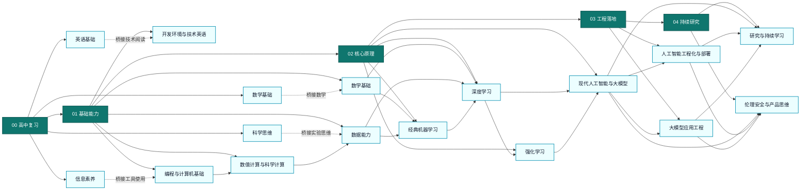

# 人工智能学习工作区

> 一个面向零基础到专业级进阶的系统化人工智能课程骨架。
> 学习顺序遵循“高中桥接 -> 基础能力 -> 核心原理 -> 工程落地 -> 持续研究”，目标不是追逐短期热点，而是建立能够长期吸收新知识的能力结构。

## 目录索引

1. [项目概览](#项目概览)
2. [学习哲学](#学习哲学)
3. [阅读入口](#阅读入口)
4. [知识图谱](#知识图谱)
5. [关键依赖关系](#关键依赖关系)
6. [使用建议](#使用建议)
7. [课程落地约定](#课程落地约定)
8. [建议里程碑](#建议里程碑)

## 项目概览

| 维度 | 说明 |
| --- | --- |
| 适用对象 | 高中毕业水平、零基础起步，希望系统学习人工智能的人 |
| 学习目标 | 从数学、编程、数据、模型、工程到研究建立完整能力闭环 |
| 当前结构 | 5 大阶段、17 个主题模块、531 个知识点目录 |
| 组织方式 | 阶段 -> 课程主题 -> 知识点 |
| 命名规则 | 全部使用中文目录名，并通过数字前缀保留学习顺序 |
| 本次修订 | 重排经典机器学习与深度学习知识点顺序，补充数值计算、时间序列、推荐系统、CV/NLP任务概览、强化学习进阶、语音/视频/世界模型、大模型应用工程、分布式训练、技术写作与跨学科应用等模块 |
| 核心原则 | 先基础后热点，先原理后工具，先验证后结论，先落地后扩展 |

## 学习哲学

1. 不从热点工具入门，而从底层能力出发。
2. 不把数学、编程、数据、模型割裂成彼此无关的学科。
3. 不把工程部署视为附加项，而把它视为专业能力的一部分。
4. 不把论文阅读和趋势判断留到最后，而是在理解原理后尽早介入。
5. 不把伦理、安全与产品思维当作附录，而把它们纳入完整的专业判断体系。

## 阅读入口

| 阶段 | 目录 | 核心任务 | 主要主题 |
| --- | --- | --- | --- |
| 00 | [00_高中复习](00_高中复习) | 补齐进入人工智能前最必要的基础 | 数学基础、英语基础、信息素养、科学思维 |
| 01 | [01_基础能力](01_基础能力) | 建立可持续学习的工具链与理论底座 | 开发环境与技术英语、数学基础、编程与计算机基础、数值计算与科学计算、数据能力 |
| 02 | [02_核心原理](02_核心原理) | 理解机器学习、深度学习、强化学习与大模型的核心机制 | 经典机器学习、深度学习、强化学习、现代人工智能与大模型 |
| 03 | [03_工程落地](03_工程落地) | 将模型训练、部署、监控和运维串成系统 | 人工智能工程化与部署、大模型应用工程 |
| 04 | [04_持续研究](04_持续研究) | 建立持续更新知识与做专业判断的能力 | 研究与持续学习、伦理安全与产品思维 |

## 知识图谱

本节保留总览关系图作为全局导航；完整的层级与跨分支关系改由交互式页面承载，避免 README 过长且静态树难以浏览。

### 总览关系图

### 完整交互式知识图谱

上面的总览图只展示阶段与主题模块的推进关系。如需查看全部 531 个知识点及其层级与跨分支依赖，请打开交互式可视化页面：

👉 [打开交互式知识图谱](知识图谱可视化/index.html)

> 纯前端实现，双击 `知识图谱可视化/index.html` 即可在浏览器中打开，无需任何服务器。首页默认展示四大核心模块及其直接关系，单击任意节点即可进入水平分层的聚焦视图；聚焦对象居中，上游在上层平铺，下游在下层平铺，所有可见连线都会展示中文关系说明，并继续支持搜索定位、缩放平移、悬浮提示与图例辅助浏览。

## 关键依赖关系

- 高中复习补入集合与逻辑、导数初步和空间想象后，能更平滑地衔接线性代数、微积分与最优化。
- 基础能力新增数值计算与科学计算模块（NumPy、Pandas、数值稳定性），桥接编程基础与数据能力，为后续模型实现提供必要工具。
- 基础能力中的开发环境、技术英语、信息论、概率统计和数据能力，共同支撑经典机器学习、深度学习与大模型实践。
- 数据能力补齐图像数据预处理和音频数据预处理，与已有的文本数据预处理并列，使多模态数据基础更完整。
- 经典机器学习重排知识点顺序：朴素贝叶斯与K近邻前移至分类之后，偏差与方差、评估指标前移至交叉验证之前，形成"模型→评估→选择"的连贯学习链。
- 经典机器学习新增时间序列分析和推荐系统基础，覆盖金融、物联网和推荐等最常见的工业应用场景。
- 深度学习重排知识点顺序：权重初始化、损失函数设计和残差连接前移至卷积网络之前，形成紧凑的"训练基础"板块。
- 深度学习新增经典计算机视觉任务和经典自然语言处理任务，避免从网络架构直接跳到大模型，补齐任务层衔接。
- 偏差与方差、评估指标已归入核心原理层，和数据清洗、标注、预处理等数据工作流明确区分。
- 强化学习已独立为核心模块，承接深度学习，并为对齐、智能体和序列决策任务提供前置知识。
- 强化学习新增基于模型的强化学习、多智能体强化学习、离线强化学习和逆强化学习，使理论覆盖更完整，并与大模型对齐技术形成直接关联。
- 深度学习补齐自编码器、残差连接、损失函数、权重初始化、生成模型和图神经网络，避免从局部架构直接跳到应用层。
- 现代人工智能与大模型新增语音大模型、视频生成与理解和世界模型，覆盖语音、视频等多模态前沿方向。
- 现代人工智能与大模型保留提示工程、混合专家、知识蒸馏、长上下文和代码生成，使应用层、压缩层与推理层链路更完整。
- 工程落地新增大模型应用工程模块，覆盖提示管理、应用链与智能体部署、大模型API网关、向量数据库运维和检索增强生成工程。
- 工程落地新增分布式训练和模型测试与质量保障，补齐大规模训练和上线前系统化测试的知识空白。
- 工程落地与持续研究补齐特征存储、版本控制、部署安全、可解释性、环境影响和开源协作，形成更完整的专业闭环。
- 持续研究新增技术写作与知识输出和跨学科应用意识，强调知识输出能力和找到AI落地方向的能力。

## 使用建议

1. 顺序学习：如果当前基础较弱，优先从 [00_高中复习](00_高中复习) 和 [01_基础能力](01_基础能力) 开始，先完成开发环境、Jupyter、数值计算、信息论和数据基础，再进入模型层。
2. 大模型路线：如果目标是大模型应用，不建议直接从提示工程开始；应先完成自注意力架构、预训练、微调、检索增强生成和对齐，再进入提示工程与智能体；工程层面还需掌握大模型应用工程中的提示管理与向量数据库运维。
3. 问题导向阅读：如果已经在做项目，可以从 [03_工程落地](03_工程落地) 或 [04_持续研究](04_持续研究) 反查前置知识，再回到 [02_核心原理](02_核心原理) 补足原理。
4. 交叉学习：从 [02_核心原理](02_核心原理) 开始后，建议同步引入 [04_持续研究](04_持续研究) 中的论文阅读、复现、开源协作、技术写作与趋势判断能力。
5. 知识回溯：遇到公式、代码、数据或实验设计问题时，优先沿知识图谱向前回溯，而不是直接寻找工具层面的临时答案。
6. 行业应用：在核心原理和工程落地学习到一定阶段后，建议结合跨学科应用意识模块，探索AI在具体行业中的落地方式。

## 课程落地约定

- 当前工作区已经细化到知识点层级，后续可以直接在对应知识点目录中放置完整课程内容。
- 建议每个知识点目录后续至少包含课程概览、核心概念、示例代码、练习题和参考资料五类内容。
- 新增课程内容时，优先写清楚该知识点的前置知识、典型误区和下一跳学习方向。
- 如果某个知识点未来需要拆成多讲，建议继续使用数字前缀保持阅读顺序稳定。

## 建议里程碑

1. 里程碑 1：能够独立配置开发环境、Jupyter、命令行、版本控制和虚拟环境完成基础练习。
2. 里程碑 2：能够使用 NumPy 和 Pandas 进行数值计算，读懂线性代数、微积分、概率统计、信息论和最优化在模型训练中的作用。
3. 里程碑 3：能够独立完成一个从探索性数据分析、特征工程到评估的经典机器学习项目，理解偏差方差权衡、交叉验证和模型选择流程。
4. 里程碑 4：能够使用深度学习框架完成训练、调参、排错，理解经典CV和NLP任务的建模思路，并掌握生成模型与表示学习的基本原理。
5. 里程碑 5：能够理解并实现提示工程、检索增强生成、基础对齐和部署流程，掌握大模型应用工程的核心环节。
6. 里程碑 6：能够围绕强化学习进阶（多智能体、离线RL、逆RL）、前沿大模型（语音/视频/世界模型）和工程系统持续阅读论文、复现结果、评估趋势，并判断新方法的真实价值与适用边界。
7. 里程碑 7：能够进行技术写作与知识输出，具备跨学科应用意识，在具体行业场景中完成AI方案的端到端设计与落地评估。